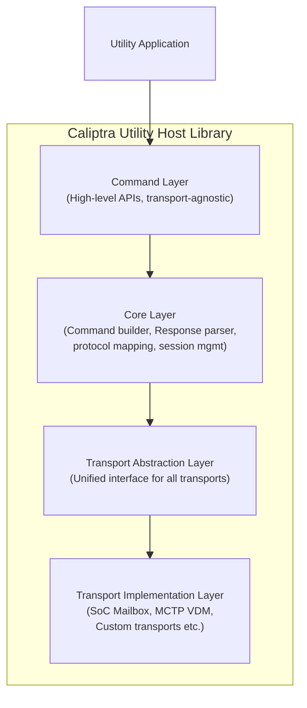
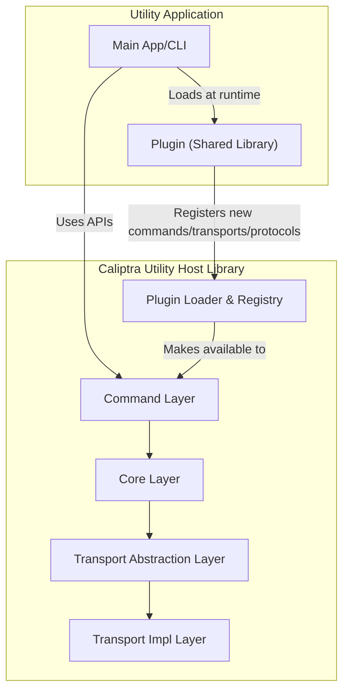

# Caliptra Utility Host Library Design

## Overview

The Caliptra Utility host library is a modular, extensible and transport-agnostic C library designed to enable the development of utility tools that can run on both BMC and host systems. These utilities facilitate both in-band and out-of-band communication with the Caliptra subsystem on the device, supporting a variety of transport interfaces such as MCU mailbox and MCTP VDM etc. The library provides a unified API for all supported Caliptra commands, making it easy to build robust management, provisioning, and diagnostic tools for diverse deployment environments.

### Design Goals

- **Modularity**: Clear separation between transport layer, command processing, and application logic
- **Extensibility**: Easy addition of new commands and transport mechanisms
- **Transport Agnostic**: Support multiple communication channels without changing application code
- **Type Safety**: Strong typing for command structures and responses
- **Thread Safety**: Safe for use in multi-threaded environments

### Use Cases

- **Device Identification and Capabilities**
    - Retrieve firmware versions, unique device identifiers, and device capabilities to ensure compatibility and proper configuration.
    - Query device-specific information such as chip identifiers or subsystem details.
- **Debugging and Diagnostics**
    - Retrieve debug logs to analyze device behavior, diagnose issues, and monitor runtime states.
    - Clear logs to reset diagnostic data and maintain storage efficiency.
- **Certificate Management**
    - Export Certificate Signing Requests (CSRs) for device keys to facilitate secure provisioning.
    - Import signed certificates to establish a trusted certificate chain for device authentication.
- **Debug Unlock Mechanisms**
    - Facilitate secure debugging in production environments
    - Ensure controlled access to debugging features
- **Cryptographic Services**
    - AES encryption and decryption
    - SHA hashing
    - Random number generation
    - Digital signing
    - Signature verification
    - Key exchange

## Architecture

### Layered framework



### Component Descriptions

#### Command Layer
- **Purpose**: Provides high-level, transport-agnostic APIs for Caliptra commands
- **Functionality**:
  - Exposes simple function calls for each Caliptra command (e.g., `caliptra_get_device_id()`)
  - Manages stateful operations like multi-part SHA/AES computations
  - Maintains command contexts across multiple related operations
  - Handles command-specific validation and parameter checking
  - Abstracts complex command sequences into simple APIs
- **Data Flow**: Receives API calls → Validates parameters → Passes to Core Layer for execution

#### Core Layer
- **Purpose**: Handles the mechanics of command execution and protocol management
- **Functionality**:
  - Builds properly formatted command packets with headers and checksums
  - Parses and validates responses from the device
  - Implements retry logic for transient failures
  - Manages command sequencing and state machines
  - Handles protocol-level error recovery
- **Data Flow**: Receives command requests → Formats packets → Uses Transport Layer → Parses responses

#### Transport Abstraction Layer
- **Purpose**: Provides a unified interface to different physical transport mechanisms
- **Functionality**:
  - Defines standard operations (open, close, send, receive)
  - Manages connection lifecycle and readiness checks
  - Handles transport-level timeouts and flow control
  - Provides both synchronous and asynchronous operation modes
  - Maps transport-specific errors to common error codes
- **Data Flow**: Receives formatted packets → Routes to appropriate transport → Returns raw responses

#### Transport Implementation Layer
- **Purpose**: Implements actual communication with hardware interfaces
- **Functionality**:
  - **SoC Mailbox**: Direct memory-mapped I/O operations to mailbox registers
  - **MCTP VDM**: Socket-based communication over MCTP protocol
  - **Future transports**:
  - Handles hardware-specific initialization and configuration
  - Manages low-level data transfer and synchronization
- **Data Flow**: Receives bytes to send → Writes to hardware → Reads response bytes

## Interface Design

### Transport Implementation Layer

Each transport implementation shall provide these functions:

```c
// Transport implementation context (opaque, transport-specific)
typedef void* caliptra_transport_impl_context_t;

// Error code type for all Caliptra APIs
typedef enum {
    CALIPTRA_SUCCESS = 0,
    CALIPTRA_ERROR_UNKNOWN = 1,
    CALIPTRA_ERROR_INVALID_ARGUMENT = 2,
    CALIPTRA_ERROR_TIMEOUT = 3,
    CALIPTRA_ERROR_NOT_SUPPORTED = 4,
    CALIPTRA_ERROR_TRANSPORT = 5,
    CALIPTRA_ERROR_PROTOCOL = 6,
    CALIPTRA_ERROR_DEVICE = 7,
    CALIPTRA_ERROR_MEMORY = 8,
    CALIPTRA_ERROR_BUSY = 9,
    CALIPTRA_ERROR_STATE = 10,
    CALIPTRA_ERROR_IO = 11,
    // ... add more as needed
} caliptra_error_t;

// Transport implementation operations
typedef struct {
    // Initialize the transport implementation context with parameters
    caliptra_error_t (*init)(caliptra_transport_impl_context_t* context, const char* params);

    // Clean up and release resources for the transport context
    caliptra_error_t (*cleanup)(caliptra_transport_impl_context_t context);

    // Send data over the transport
    caliptra_error_t (*send)(caliptra_transport_impl_context_t context, const uint8_t* data, size_t len);

    // Receive data from the transport with timeout
    caliptra_error_t (*receive)(caliptra_transport_impl_context_t context, uint8_t* buffer, size_t* buffer_len, uint32_t timeout_ms);

    // Flush any pending data or buffers in the transport
    caliptra_error_t (*flush)(caliptra_transport_impl_context_t context);

    // Check if the transport is ready for communication
    bool (*is_ready)(caliptra_transport_impl_context_t context);

    // Get the maximum payload size supported by the transport
    size_t (*get_max_payload_size)(caliptra_transport_impl_context_t context);
} caliptra_transport_impl_ops_t;

// Transport implementation descriptor
typedef struct {
    const char* name;
    const char* description;
    size_t context_size;
    const caliptra_transport_impl_ops_t* ops;
} caliptra_transport_impl_t;
```

### Transport Abstraction Layer

```c
// Opaque transport handle
typedef struct caliptra_transport caliptra_transport_t;

// Transport operations interface
typedef struct {
    // Send data over the transport
    caliptra_error_t (*send)(caliptra_transport_t* transport, const uint8_t* data, size_t len);

    // Receive data from the transport
    caliptra_error_t (*receive)(caliptra_transport_t* transport, uint8_t* buffer, size_t* buffer_len, uint32_t timeout_ms);

    // Check if the transport is ready for communication
    bool (*is_ready)(caliptra_transport_t* transport);

    // Flush any pending data or buffers
    caliptra_error_t (*flush)(caliptra_transport_t* transport);

    // Get the maximum payload size supported by the transport
    size_t (*get_max_payload_size)(caliptra_transport_t* transport);
} caliptra_transport_ops_t;

// Transport descriptor
typedef struct {
    const char* name;
    const char* description;
    const caliptra_transport_ops_t* ops;
    void* impl_context;
} caliptra_transport_desc_t;

// Register a transport implementation
caliptra_error_t caliptra_transport_register(const caliptra_transport_impl_t* impl);

// Unregister a transport implementation
caliptra_error_t caliptra_transport_unregister(const char* transport_name);

// List registered transports
caliptra_error_t caliptra_transport_list(const char** names, size_t* count);

// Create transport instance
caliptra_error_t caliptra_transport_create(const char* transport_name, const char* params, caliptra_transport_t** transport);

// Destroy transport instance
caliptra_error_t caliptra_transport_destroy(caliptra_transport_t* transport);

// Get transport descriptor (including ops)
const caliptra_transport_desc_t* caliptra_transport_get_descriptor(caliptra_transport_t* transport);
```

### Core Layer

```c
// Session handle (opaque)
typedef struct caliptra_session caliptra_session_t;

// Protocol types supported by the core layer
typedef enum {
    CALIPTRA_PROTOCOL_MAILBOX,
    CALIPTRA_PROTOCOL_MCTP_VDM,
    CALIPTRA_PROTOCOL_CUSTOM
} caliptra_protocol_type_t;

// Session configuration options
typedef enum {
    CALIPTRA_SESSION_OPT_TIMEOUT_MS,
    CALIPTRA_SESSION_OPT_MAX_RETRIES,
    CALIPTRA_SESSION_OPT_VALIDATE_CHECKSUM,
    CALIPTRA_SESSION_OPT_LOG_COMMANDS,
} caliptra_session_option_t;

// Create session with protocol type
caliptra_error_t caliptra_session_create_with_protocol(caliptra_transport_t* transport, caliptra_protocol_type_t protocol_type, caliptra_session_t** session);

// Destroy session
caliptra_error_t caliptra_session_destroy(caliptra_session_t* session);

// Configure session options
caliptra_error_t caliptra_session_set_option(caliptra_session_t* session, caliptra_session_option_t option, const void* value);

// Get session options
caliptra_error_t caliptra_session_get_option(caliptra_session_t* session, caliptra_session_option_t option, void* value);

// Generic command IDs (protocol-agnostic)
typedef enum {
    // Caliptra FIPS self test command
    CALIPTRA_CMD_FIPS_SELF_TEST = 0x0000,

    // Device Information Commands (0x0001 - 0x00FF)
    CALIPTRA_CMD_GET_FIRMWARE_VERSION    = 0x0001,
    CALIPTRA_CMD_GET_DEVICE_CAPABILITIES = 0x0002,
    CALIPTRA_CMD_GET_DEVICE_ID          = 0x0003,
    CALIPTRA_CMD_GET_DEVICE_INFO        = 0x0004,

    // Certificate Management Commands (0x0100 - 0x01FF)
    CALIPTRA_CMD_EXPORT_CSR             = 0x0101,
    CALIPTRA_CMD_IMPORT_CERTIFICATE     = 0x0102,

    // SHA Commands (0x0200 - 0x020F)
    CALIPTRA_CMD_SHA_INIT               = 0x0201,
    CALIPTRA_CMD_SHA_UPDATE             = 0x0202,
    CALIPTRA_CMD_SHA_FINAL              = 0x0203,

    // AES Basic Commands (0x0210 - 0x021F)
    CALIPTRA_CMD_AES_ENCRYPT_INIT       = 0x0211,
    CALIPTRA_CMD_AES_ENCRYPT_UPDATE     = 0x0212,
    CALIPTRA_CMD_AES_DECRYPT_INIT       = 0x0213,
    CALIPTRA_CMD_AES_DECRYPT_UPDATE     = 0x0214,

    // AES GCM Commands (0x0220 - 0x022F)
    CALIPTRA_CMD_AES_GCM_ENCRYPT_INIT   = 0x0221,
    CALIPTRA_CMD_AES_GCM_ENCRYPT_UPDATE = 0x0222,
    CALIPTRA_CMD_AES_GCM_ENCRYPT_FINAL  = 0x0223,
    CALIPTRA_CMD_AES_GCM_DECRYPT_INIT   = 0x0224,
    CALIPTRA_CMD_AES_GCM_DECRYPT_UPDATE = 0x0225,
    CALIPTRA_CMD_AES_GCM_DECRYPT_FINAL  = 0x0226,

    // Random Number Commands (0x0230 - 0x023F)
    CALIPTRA_CMD_RANDOM_STIR            = 0x0231,
    CALIPTRA_CMD_RANDOM_GENERATE        = 0x0232,

    // Key Exchange Commands (0x0240 - 0x024F)
    CALIPTRA_CMD_ECDH_GENERATE          = 0x0241,
    CALIPTRA_CMD_ECDH_FINISH            = 0x0242,

    // Signature Commands (0x0250 - 0x025F)
    CALIPTRA_CMD_ECDSA384_SIG_VERIFY    = 0x0251,
    CALIPTRA_CMD_LMS_SIG_VERIFY         = 0x0252,
    CALIPTRA_CMD_ECDSA_SIGN             = 0x0253,
    CALIPTRA_CMD_MLDSA_SIGN             = 0x0254,

    // Key Management Commands (0x0260 - 0x026F)
    CALIPTRA_CMD_IMPORT                 = 0x0261,
    CALIPTRA_CMD_DELETE                 = 0x0262,

    // Debug Commands (0x0300 - 0x03FF)
    CALIPTRA_CMD_GET_LOG                = 0x0301,
    CALIPTRA_CMD_CLEAR_LOG              = 0x0302,
    CALIPTRA_CMD_PRODUCTION_DEBUG_UNLOCK_REQ   = 0x0303,
    CALIPTRA_CMD_PRODUCTION_DEBUG_UNLOCK_TOKEN = 0x0304,

    // Fuse Commands (0x0400 - 0x04FF)
    CALIPTRA_CMD_FUSE_READ              = 0x0401,
    CALIPTRA_CMD_FUSE_WRITE             = 0x0402,
    CALIPTRA_CMD_FUSE_LOCK_PARTITION    = 0x0403,

    // Custom command range
    CALIPTRA_CMD_CUSTOM_BASE            = 0x8000
} caliptra_command_id_t;

// Core command execution (used by Command Layer)
caliptra_error_t caliptra_core_execute_command(
    caliptra_session_t* session,
    caliptra_command_id_t command_id,  // Generic command ID
    const void* request,
    size_t request_size,
    void* response,
    size_t* response_size
);

// Protocol handler interface for custom protocol support.
typedef struct {
    // Format generic command into protocol-specific packet.
    caliptra_error_t (*format_packet)(caliptra_command_id_t command_id, const void* request, size_t request_size, uint8_t* packet, size_t* packet_size);

    // Parse protocol-specific packet into generic response.
    caliptra_error_t (*parse_packet)(const uint8_t* packet, size_t packet_size, uint32_t* fips_status, void* response, size_t* response_size);

    // Get protocol-specific command code.
    uint32_t (*get_command_code)(caliptra_command_id_t command_id);

    // Validate packet integrity.
    caliptra_error_t (*validate_packet)(const uint8_t* packet, size_t packet_size);
} caliptra_protocol_handler_t;

// Register custom protocol handler.
caliptra_error_t caliptra_register_protocol_handler(caliptra_protocol_type_t protocol_type, const caliptra_protocol_handler_t* handler);

// Session statistics structure.
typedef struct {
    uint64_t commands_sent;
    uint64_t commands_successful;
    uint64_t commands_failed;
    uint64_t retries;
    uint64_t checksum_errors;
    uint64_t transport_errors;
    uint64_t protocol_errors;
} caliptra_session_stats_t;

// Get session statistics.
caliptra_error_t caliptra_session_get_stats(caliptra_session_t* session, caliptra_session_stats_t* stats);

// Reset session statistics.
caliptra_error_t caliptra_session_reset_stats(caliptra_session_t* session);

// Error context with extended information.
typedef struct {
    caliptra_error_t error_code;
    caliptra_command_id_t command_id;      // Generic command that failed
    uint32_t protocol_command_code;        // Protocol-specific code
    const char* error_message;
    uint32_t device_error;
    uint32_t transport_error;
    struct {
        const char* file;
        int line;
        const char* function;
    } location;
} caliptra_error_context_t;

// Get last error context for the session.
caliptra_error_t caliptra_session_get_last_error(caliptra_session_t* session, caliptra_error_context_t* error_context);

// Session state enumeration.
typedef enum {
    CALIPTRA_SESSION_STATE_IDLE,
    CALIPTRA_SESSION_STATE_BUSY,
    CALIPTRA_SESSION_STATE_ERROR,
    CALIPTRA_SESSION_STATE_RECOVERING
} caliptra_session_state_t;

// Get current session state.
caliptra_session_state_t caliptra_session_get_state(caliptra_session_t* session);

// Reset session to clear error state.
caliptra_error_t caliptra_session_reset(caliptra_session_t* session);

// Get session protocol type.
caliptra_protocol_type_t caliptra_session_get_protocol_type(caliptra_session_t* session);

// Get transport associated with session.
caliptra_transport_t* caliptra_session_get_transport(caliptra_session_t* session);
```
### Command Layer

#### Device Information Commands

```c
// Get firmware version
caliptra_error_t caliptra_cmd_get_firmware_version(caliptra_session_t* session, caliptra_fw_index_t index, caliptra_fw_version_t* version);

// Get device capabilities
caliptra_error_t caliptra_cmd_get_device_capabilities(caliptra_session_t* session, caliptra_capabilities_t* caps);

// Get device ID
caliptra_error_t caliptra_cmd_get_device_id(caliptra_session_t* session, caliptra_device_id_t* device_id);

// Get device info
caliptra_error_t caliptra_cmd_get_device_info(caliptra_session_t* session, uint32_t info_index, uint8_t* buffer, size_t* buffer_size);
```

#### Certificate Management Commands

```c
// Export CSR
caliptra_error_t caliptra_cmd_export_csr(caliptra_session_t* session, caliptra_csr_type_t csr_type, uint8_t* csr_buffer, size_t* csr_size);

// Import certificate
caliptra_error_t caliptra_cmd_import_certificate(caliptra_session_t* session, caliptra_csr_type_t cert_type, const uint8_t* cert_data, size_t cert_size);
```

#### Cryptographic Commands

```c
// Initialize SHA context
caliptra_error_t caliptra_cmd_sha_init(caliptra_session_t* session, caliptra_sha_type_t sha_type, caliptra_sha_ctx_t** ctx);

// Update SHA context with data
caliptra_error_t caliptra_cmd_sha_update(caliptra_sha_ctx_t* ctx, const uint8_t* data, size_t data_len);

// Finalize SHA and get hash
caliptra_error_t caliptra_cmd_sha_final(caliptra_sha_ctx_t* ctx, uint8_t* hash, size_t* hash_len);

// Destroy SHA context
caliptra_error_t caliptra_cmd_sha_destroy(caliptra_sha_ctx_t* ctx);

// Initialize AES context
caliptra_error_t caliptra_cmd_aes_init(caliptra_session_t* session, caliptra_aes_mode_t mode, bool encrypt, const uint8_t* key, size_t key_len, const uint8_t* iv, size_t iv_len, caliptra_aes_ctx_t** ctx);

// Update AES context with input data
caliptra_error_t caliptra_cmd_aes_update(caliptra_aes_ctx_t* ctx, const uint8_t* input, size_t input_len, uint8_t* output, size_t* output_len);

// Finalize AES and get output/tag
caliptra_error_t caliptra_cmd_aes_final(caliptra_aes_ctx_t* ctx, uint8_t* output, size_t* output_len, uint8_t* tag, size_t tag_len);

// Destroy AES context
caliptra_error_t caliptra_cmd_aes_destroy(caliptra_aes_ctx_t* ctx);

// Get random bytes
caliptra_error_t caliptra_cmd_get_random(caliptra_session_t* session, uint8_t* buffer, size_t len);

// Verify ECDSA signature
caliptra_error_t caliptra_cmd_ecdsa_verify(caliptra_session_t* session, const caliptra_ecdsa_pubkey_t* pubkey, const uint8_t* hash, size_t hash_len, const caliptra_ecdsa_signature_t* signature);

// Sign hash with ECDSA
caliptra_error_t caliptra_cmd_ecdsa_sign(caliptra_session_t* session, const uint8_t* hash, size_t hash_len, caliptra_ecdsa_signature_t* signature, caliptra_ecdsa_pubkey_t* pubkey);
```

#### Telemetry Commands (WIP)

```c
// Get log data
caliptra_error_t caliptra_cmd_get_log(caliptra_session_t* session, caliptra_log_type_t log_type, uint8_t* buffer, size_t* buffer_size);

// Clear log data
caliptra_error_t caliptra_cmd_clear_log(caliptra_session_t* session, caliptra_log_type_t log_type);
```

## Extensibility with Plugin Architecture

The Caliptra Utility host library is designed to be highly extensible, supporting the dynamic addition of new commands, protocols, and transport mechanisms at runtime through a **plugin architecture**. This approach enables third-party developers and system integrators to extend the library’s capabilities without modifying or recompiling the core library.



- **Plugins** are shared libraries (e.g., `.so` or `.dll` files) that implement new commands, protocol handlers, or transport mechanisms.
- The core library provides APIs to **dynamically load, register, and discover** these plugins at runtime.
- This design preserves the existing layered architecture, while enabling runtime extensibility and modularity.

### How Plugins Work

1. **Plugin Interface**
   Each plugin implements a standard interface and exports a descriptor structure. For example:
   ```c
   typedef struct {
       const char* name;
       const char* version;
       caliptra_error_t (*register_plugin)(void);
   } caliptra_plugin_descriptor_t;
   ```
   The plugin’s `register_plugin` function is called by the core library to register new commands, transports, or protocol handlers.

2. **Dynamic Loading**
   The core library provides APIs such as:

   ```c
   caliptra_error_t caliptra_plugin_load(const char* path);
   caliptra_error_t caliptra_plugin_unload(const char* name);
   ```
   These use platform mechanisms (`dlopen`/`dlsym` on Linux, `LoadLibrary` on Windows) to load plugins at runtime.

3. **Dynamic Registration**

Plugins use registration and unregistration APIs to add or remove features:

```c
// Register new features
caliptra_error_t caliptra_command_register(const caliptra_command_desc_t* desc);
caliptra_error_t caliptra_transport_register(const caliptra_transport_impl_t* impl);
caliptra_error_t caliptra_register_protocol_handler(
    caliptra_protocol_type_t protocol_type,
    const caliptra_protocol_handler_t* handler
);

// Unregister features when plugin is unloaded
caliptra_error_t caliptra_command_unregister(const char* command_name);
caliptra_error_t caliptra_transport_unregister(const char* transport_name);
caliptra_error_t caliptra_unregister_protocol_handler(
    caliptra_protocol_type_t protocol_type
);
```

The library maintains internal registries of available commands, transports, and protocol handlers. When a plugin is unloaded, it should call the appropriate unregister functions to cleanly remove its features and release resources.

4. **Discovery and Usage**
   Applications can enumerate available commands and transports at runtime:
   ```c
   size_t caliptra_command_list(const caliptra_command_desc_t** out_array);
   size_t caliptra_transport_list(const caliptra_transport_impl_t** out_array);
   ```
   This enables dynamic feature discovery and flexible application logic.
