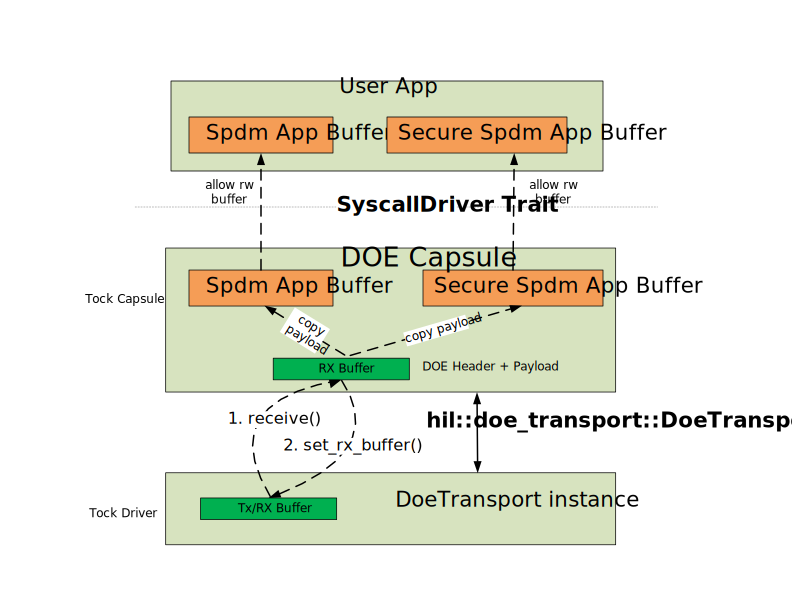
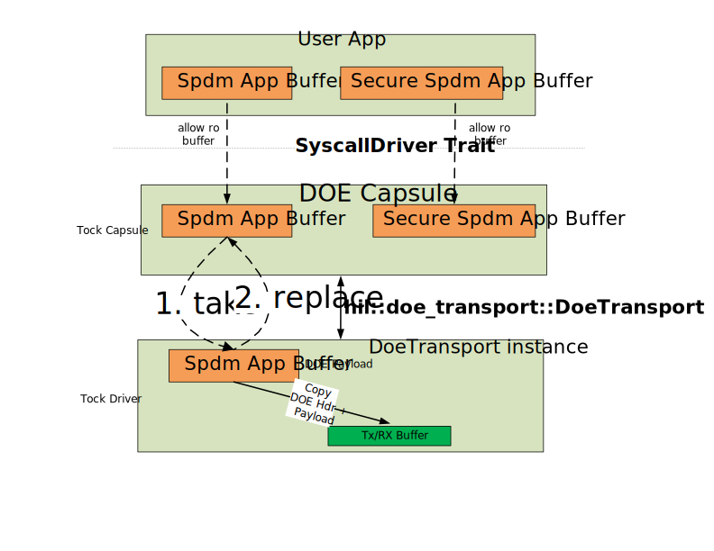
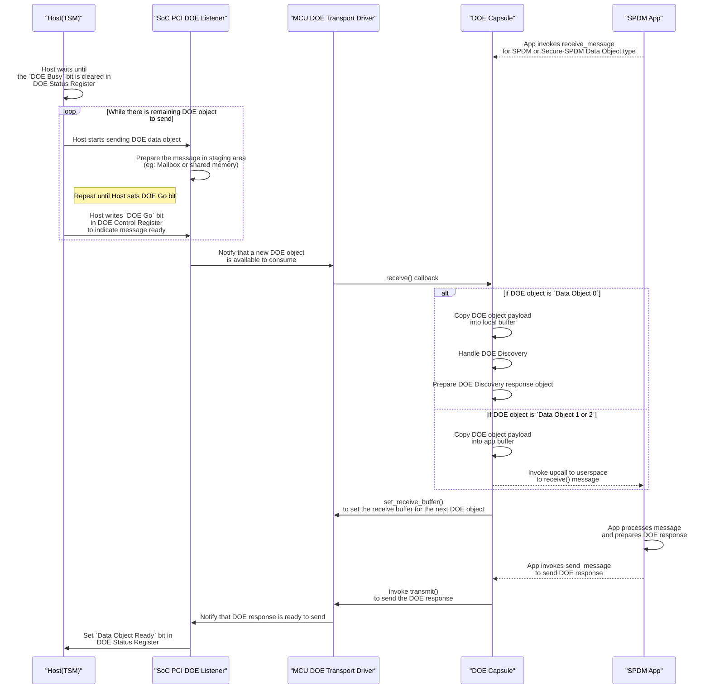

# DOE Stack
The Caliptra subsystem supports SPDM, Secure-SPDM over PCI Data Object Exchange (DOE) mailbox protocol. The following diagram gives the over view of the DOE send and receive stack.

DOE Receive stack:




DOE Send stack:




## DOE Capsule
The DOE capsule implements the system calls for the user space applications to send and receive the DOE data objects.

During board initialization, a `DoeDriver` instance is created and registered with a unique driver number. This instance manages the handling of DOE Discovery (Data Object Type 0), SPDM (Data Object Type 1), and Secure-SPDM (Data Object Type 2) data objects.


```Rust

/// PCI-SIG Vendor ID that defined the data object type
const PCI_SIG_VENDOR_ID: u16 = 0x0001;
/// Data Object Protocol
const DATA_OBJECT_PROTOCOL_DOE_DISCOVERY: u8 = 0x00;
const DATA_OBJECT_PROTOCOL_CMA_SPDM: u8 = 0x01;
const DATA_OBJECT_PROTOCOL_SECURE_CMA_SPDM: u8 = 0x02;


/// IDs for subscribe calls
mod upcall {
    /// Callback for when the message is received
    pub const RECEIVED_SPDM_MESSAGE: usize = 0;
    pub const RECEIVED_SECURE_SPDM_MESSAGE: usize = 1;

    /// Callback for when the message is transmitted.
    pub const MESSAGE_TRANSMITTED: usize = 2;

    /// Number of upcalls
    pub const COUNT: u8 = 3;
}

/// IDs for read-only allow buffers
mod ro_allow {
    /// Buffer for the message to be transmitted
    pub const MESSAGE_WRITE: usize = 0;

    /// Number of read-only allow buffers
    pub const COUNT: u8 = 1;
}

/// IDs for read-write allow buffers
mod rw_allow {
    /// Buffer for the message to be received
    pub const SPDM_MESSAGE: u32 = 0;
    pub const SECURE_SPDM_MESSAGE: u32 = 1;

    /// Number of read-write allow buffers
    pub const COUNT: u8 = 2;
}

#[derive(Default)]
pub struct App {
    pending_rx_spdm: Option<bool>, // Indicates if a SPDM message is pending
    pending_rx_secure_spdm: Option<bool>, // Indicates if a Secure-SPDM message is pending
    pending_tx: Option<bool>, // Indicates if a message is pending to be sent
}

pub struct DoeDriver {
    doe_transport: & dyn DoeTransport,
    apps: Grant<
        App,
        UpcallCount<{ upcall::COUNT }>,
        AllowRoCount<{ ro_allow::COUNT }>,
        AllowRwCount<{ rw_allow::COUNT }>,
    >,
    kernel_msg_buf: MapCell<SubSliceMut<'static, u8>>, // For DOE Discovery handling
    current_app: Cell<Option<ProcessId>>,
}

```

## DOE Transport Trait
The DOE Transport trait defines a platform-agnostic interface for sending and receiving DOE data objects. Integrators must provide a SoC-specific implementation of this trait to enable PCI-DOE communication with the host.

```Rust
/// MAX PCI-DOE DATA OBJECT LENGTH
const MAX_PCI_DOE_LEN: usize = 1 << 18; // In DWORDS
const MAX_PCI_DOE_LEN_BYTES: usize = MAX_PCI_DOE_LEN * 4; // In Bytes

pub trait DoeTransportTxClient {
    /// Called when the DOE data object transmission is done.
    fn send_done(&self, tx_buf: &'static mut [u8], result: Result<(), ErrorCode>);
}

pub trait DoeTransportRxClient {
    /// Called when a DOE data object is received. 
    fn receive(&self, rx_buf: &'static mut [u8], len: usize) -> Result<(), ErrorCode>;
}


pub trait DoeTransport {
    /// Sets the transmit and receive clients for the DOE transport instance
    fn set_tx_client(&self, client: &'static dyn DoeTransportTxClient);
    fn set_rx_client(&self, client: &'static dyn DoeTransportRxClient);

    /// Sets the buffer used for receiving incoming DOE Objects.
    /// This function should be called by the Rx client upon receiving the `receive()` callback.
    fn set_receive_buffer(&self, rx_buf: &'static mut [u8]);

    /// Gets the maximum size of the data object that can be sent or received over DOE Transport.
    fn max_data_object_size(&self) -> usize;

    /// Enable the DOE transport driver instance.
    fn enable(&self) -> Result<(), ErrorCode>;

    /// Disable the DOE transport driver instance.
    fn disable(&self) -> Result<(), ErrorCode>;

    /// Send DOE Object to be transmitted over SoC specific DOE transport.
    /// 
    /// # Arguments
    /// * `doe_hdr` - A reference to the DOE header
    /// * `doe_payload` - A reference to the DOE payload
    /// * `payload_len` - The length of the payload in bytes
    fn transmit(&self, doe_hdr: &'static [u8; 8], doe_payload: &'static mut [u8], payload_len: usize) -> Result<(), (ErrorCode, &'static mut [u8])>;
}
