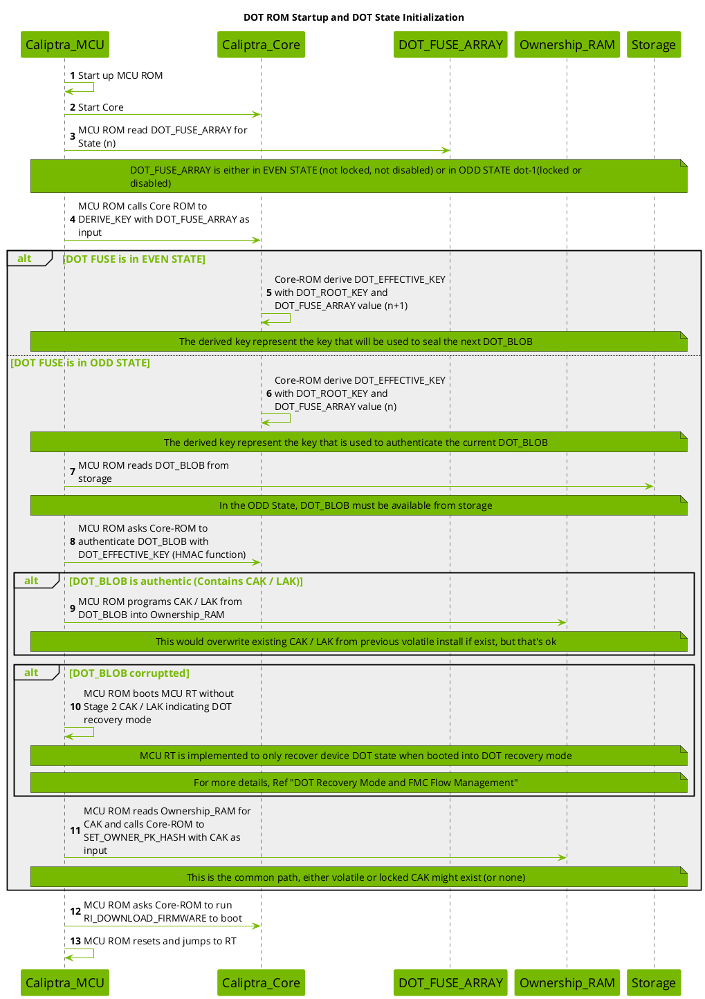
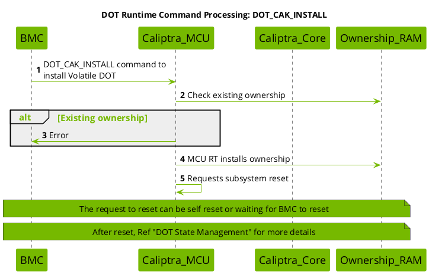
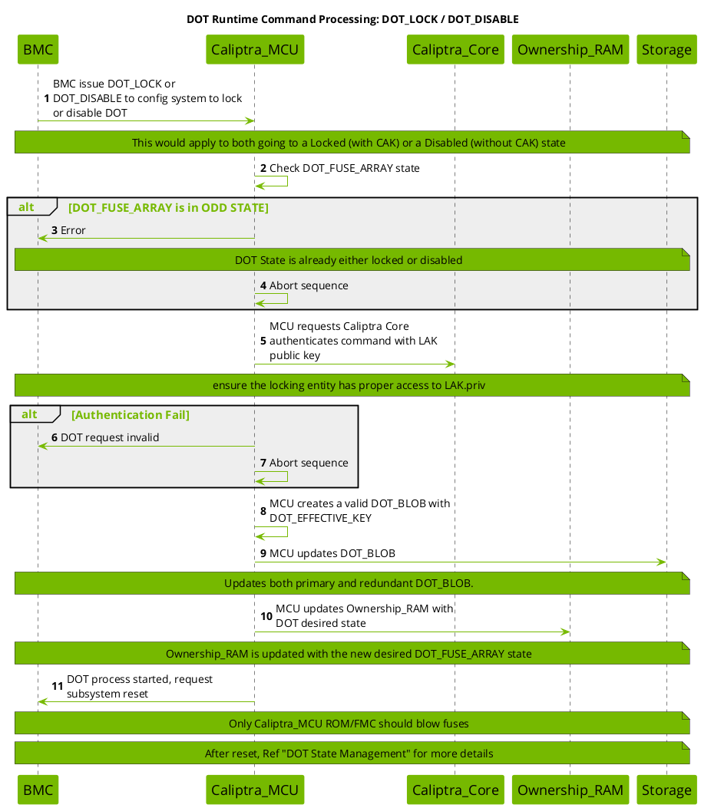
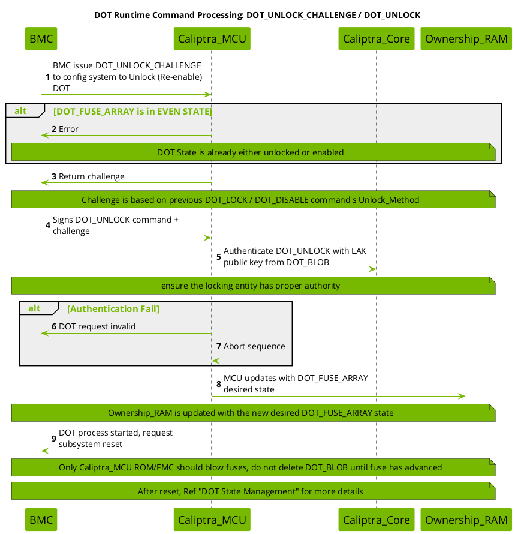
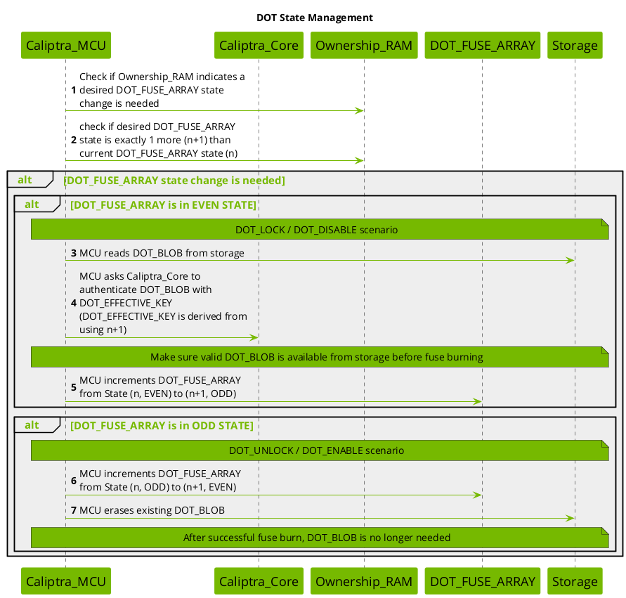
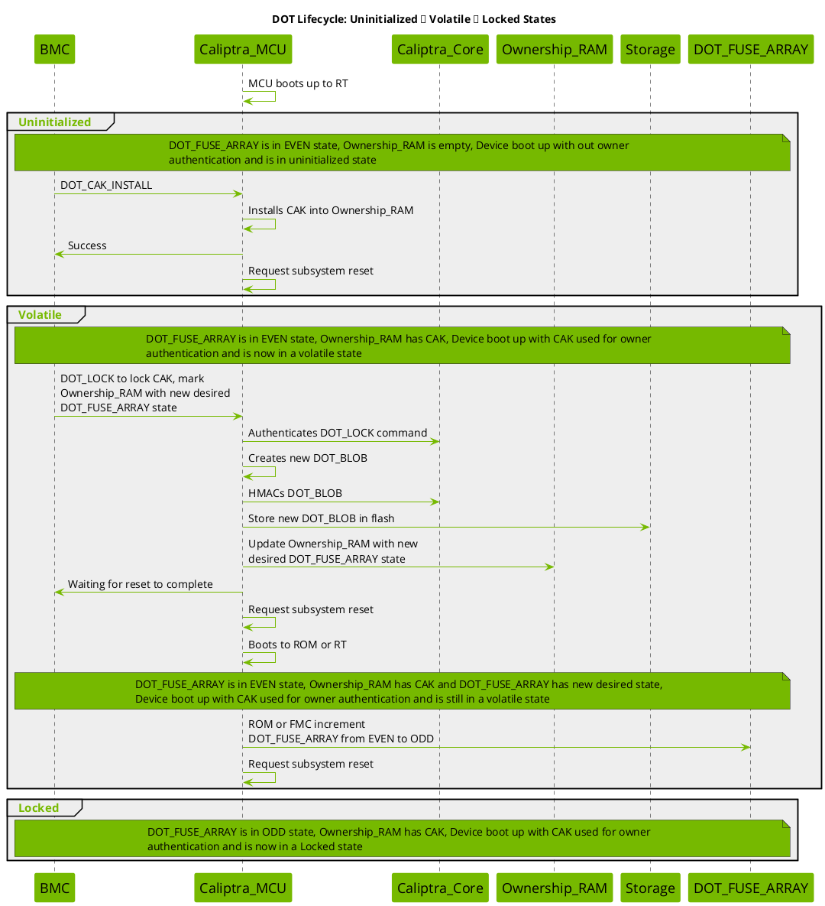
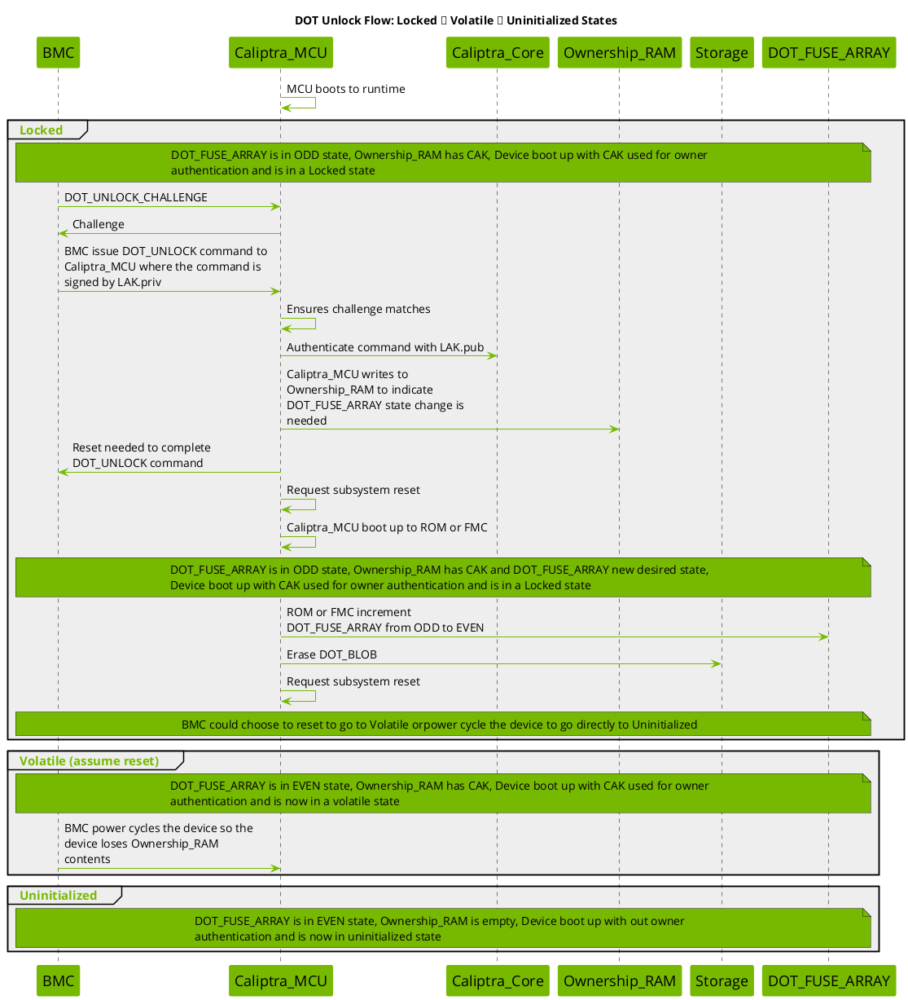
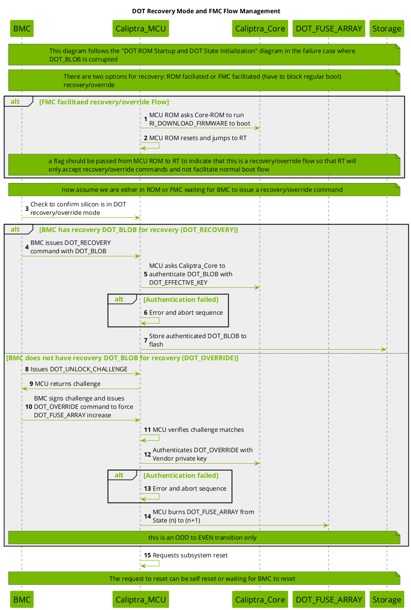
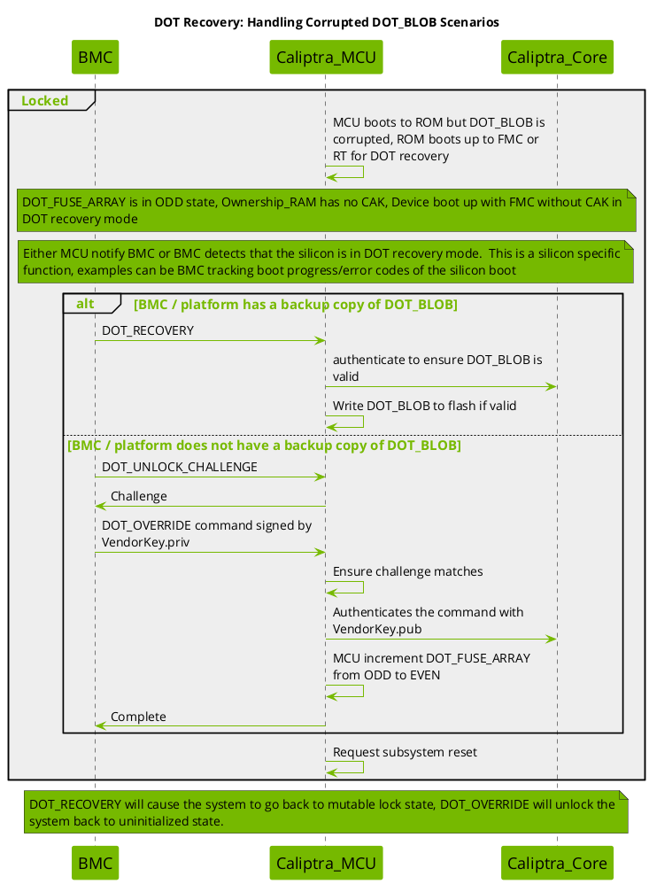

# Device Ownership Transfer

This contains details about the Caliptra implementation of Device Ownership Transfer (DOT) with MCU to assist.

Device Ownership Transfer (DOT) is a security mechanism implemented in Caliptra that enables device owners to establish code signing capabilities rooted in the hardware root of trust without permanently burning the Code Authentication Key (CAK) into fuses. This provides flexibility in ownership management while maintaining strong security guarantees.

Reference: [OCP Device Ownership Transfer specification](https://opencomputeproject.github.io/Security/device-ownership-transfer/HEAD/).

## Table of Contents
1. [Diagrams](#diagrams)
1. [Glossary](#glossary)
1. [DOT Modes](#dot-modes)
1. [Cryptographic Binding Mechanism](#cryptographic-binding-mechanism)
1. [System Components](#system-components)
1. [State Machine](#state-machine)
1. [Initialization Flow](#initialization-flow)
1. [Runtime Commands](#runtime-commands)
1. [Lifecycle Transitions](#lifecycle-transitions)
1. [Recovery Mechanisms](#recovery-mechanisms)
1. [Security Considerations](#security-considerations)


## Diagrams

* [ROM Startup and DOT State Initialization](#dot-1-init)
* [Recovery Mode and FMC Flow Management](#dot-2-recovery)
* [State Management](#dot-3-state)
* [Runtime Command: DOT_CAK_INSTALL](#dot-4-command-cak-install)
* [Runtime Commands: DOT_LOCK / DOT_DISABLE](#dot-5-command-lock)
* [Runtime Commands: DOT_UNLOCK_CHALLENGE / DOT_UNLOCK](#dot-6-command-unlock)
* [Lifecycle: Uninitialized → Volatile → Locked](#dot-7-install-lock)
* [Unlock Flow: Locked → Volatile → Uninitialized](#dot-8-unlock-flow)
* [Recovery: Handling Corrupted DOT_BLOB](#dot-9-recovery-corrupted-blob)

---

## Glossary

**BMC (Baseboard Management Controller)**: System management controller that interfaces with Caliptra to issue DOT commands and manage recovery procedures.

**CAK (Code Authentication Key)**: The public key used to authenticate firmware and code running on the device. This is the owner's code signing key rooted in Caliptra.

**Caliptra**: Hardware root of trust providing secure boot and cryptographic services.

**Caliptra_Core**: Component within Caliptra that performs cryptographic operations offload (key derivation, HMAC, signature verification), derives DOT_EFFECTIVE_KEY, authenticates DOT_BLOBs and commands, and manages owner public key hash.

**Caliptra_MCU**: Microcontroller component that manages DOT state machine, handles runtime commands, controls fuse burning operations, coordinates with Caliptra_Core, and manages Ownership_RAM.

**DOT (Device Ownership Transfer)**: Security mechanism for flexible ownership management that enables device owners to establish code signing capabilities rooted in hardware without permanently burning keys into fuses.

**DOT_BLOB**: A cryptographically authenticated data structure containing the CAK and LAK, sealed with the DOT_EFFECTIVE_KEY via HMAC. Stored in external flash storage.

**DOT_EFFECTIVE_KEY**: A key derived from DOT_ROOT_KEY and the DOT_FUSE_ARRAY value, used to authenticate DOT_BLOBs via HMAC. The derivation varies based on EVEN/ODD state.

**DOT_FUSE_ARRAY**: A minimal fuse array using 1 bit per state change to track DOT state transitions. The fuse value acts as a counter that increments with each state change (one-time programmable).

**DOT_ROOT_KEY**: A hardware-derived secret key unique to the silicon, used as the basis for deriving DOT_EFFECTIVE_KEY. Provides silicon binding.

**EVEN STATE**: Uninitialized/Volatile state (fuse value % 2 == 0) where no persistent ownership is bound to the silicon.

**FMC (First Mutable Code)**: First stage of mutable firmware. In Caliptra MCU architecture, FMC and RT are not differentiated as separate binaries (FMC is RT).

**HMAC (Hash-based Message Authentication Code)**: Cryptographic authentication method used to seal and verify DOT_BLOBs.

**LAK (Lock Authentication Key)**: The private key used to lock/unlock the DOT state and control the Disabled state. The entity possessing LAK.priv has the authority to:
- Lock ownership to the device (DOT_LOCK)
- Disable DOT while maintaining ownership (DOT_DISABLE)
- Unlock and release ownership (DOT_UNLOCK)

**ODD STATE**: Locked/Disabled state (fuse value % 2 == 1) where ownership is cryptographically bound to the silicon via DOT_BLOB.

**Ownership_RAM**: Volatile memory (e.g., FLOP-based register or SRAM) that stores the current CAK and LAK during runtime. Cleared on power cycle. Also stores desired DOT_FUSE_ARRAY state for pending transitions.

**ROM (Read-Only Memory)**: Immutable boot code that executes first on device startup.

**RT (Runtime)**: Main operating firmware that executes after ROM and FMC initialization.

**VendorKey**: Vendor master key used for DOT_OVERRIDE operations in catastrophic recovery scenarios. Highest privilege key in the system.

**Volatile DOT**: Operating mode where CAK is installed per boot cycle and ownership is lost on power cycle. No fuse burning required.

**Mutable Locking DOT**: Operating mode where ownership is locked and bound to silicon via cryptographic binding using DOT_FUSE_ARRAY. Persists across power cycles.

### Goals
- Enable owner-specific code signing rooted in Caliptra (the root of trust)
- Avoid permanent fuse programming for ownership keys
- Support both temporary (volatile) and persistent (mutable locking) ownership models
- Provide secure ownership transfer mechanisms
- Enable recovery from corrupted states

---

## DOT Modes

### 1. Volatile DOT

**Characteristics:**
- CAK is installed per boot cycle
- Ownership information is stored only in Ownership_RAM
- Power cycle clears ownership
- No fuse burning required
- DOT_FUSE_ARRAY remains in EVEN state

**Use Cases:**
- Temporary ownership scenarios

**Flow:**
```
Uninitialized (EVEN) → [DOT_CAK_INSTALL] → Volatile (EVEN) → [Power Cycle] → Uninitialized (EVEN)
```

### 2. Mutable Locking DOT

**Characteristics:**
- CAK is locked and bound to silicon via cryptographic binding
- Uses DOT_FUSE_ARRAY to create cryptographic binding (1 bit per state change)
- Ownership persists across power cycles
- Requires LAK authentication for lock/unlock/disable operations
- DOT_BLOB stored in external storage (flash)
- State transitions require fuse burning
- Supports both Locked (with CAK) and Disabled (without CAK) states

**Use Cases:**
- Long-term ownership binding

**Flow:**
```
Uninitialized (EVEN) → Volatile (EVEN) → [DOT_LOCK] → Locked (ODD) → [DOT_UNLOCK] → Volatile (EVEN) → Uninitialized (EVEN)
                     ↘ [DOT_DISABLE] → Disabled (ODD) → [DOT_UNLOCK] → Uninitialized (EVEN)
```

---

## Cryptographic Binding Mechanism

The mutable locking DOT mechanism achieves secure binding without secure storage through a clever cryptographic construction:

### Key Derivation

The DOT_EFFECTIVE_KEY is derived as follows:

```
DOT_EFFECTIVE_KEY = KDF(DOT_ROOT_KEY, DOT_FUSE_ARRAY_VALUE)
```

### State-Dependent Derivation

**In EVEN STATE (n):**
- DOT_EFFECTIVE_KEY is derived using DOT_FUSE_ARRAY value (n+1)
- This represents the key that will seal the NEXT DOT_BLOB
- Allows pre-computation before fuse burning

**In ODD STATE (n):**
- DOT_EFFECTIVE_KEY is derived using DOT_FUSE_ARRAY value (n)
- This represents the key that authenticates the CURRENT DOT_BLOB
- Used to verify the stored DOT_BLOB on boot

### DOT_BLOB Authentication

```
DOT_BLOB = {CAK, LAK, metadata}
HMAC_TAG = HMAC(DOT_EFFECTIVE_KEY, DOT_BLOB)
```

The DOT_BLOB is authenticated on every boot in ODD state to ensure the CAK and LAK is authentic.

### Security Properties

1. **Binding to Silicon**: DOT_ROOT_KEY is unique per device, preventing DOT_BLOB portability
2. **Binding to State**: Fuse value is incorporated into key derivation, preventing rollback attacks
3. **Forward Security**: Unlocking increments fuses, invalidating old DOT_BLOBs
4. **No Secure Storage Required**: Cryptographic binding replaces need for secure non-volatile storage

---

## System Components

### Caliptra_MCU
- Manages DOT state machine
- Handles runtime commands
- Controls fuse burning operations
- Coordinates with Caliptra_Core for cryptographic operations
- Manages Ownership_RAM

### Caliptra_Core
- Performs cryptographic operations offload(key derivation, HMAC, signature verification)
- Derives DOT_EFFECTIVE_KEY
- Authenticates DOT_BLOBs and commands
- Manages owner public key hash (SET_OWNER_PK_HASH)

### DOT_FUSE_ARRAY
- Hardware fuse array
- Stores state counter (increments from 0 to maximum)
- Read during initialization
- Written during state transitions
- One-time programmable (OTP) per bit

### Ownership_RAM
- Volatile storage for current CAK and LAK (ex, FLOP based register or SRAM)
- Cleared on power cycle
- Updated during DOT_CAK_INSTALL, parsing DOT_BLOB on boot
- Stores desired DOT_FUSE_ARRAY state for pending transitions

### Storage (Flash)
- Non-volatile external storage
- Stores DOT_BLOB (with redundancy)
- Not assumed to be secure

### BMC (Baseboard Management Controller)
- Issues DOT commands
- Manages recovery procedures
- Handles reset coordination
- May maintain backup DOT_BLOBs

---

## State Machine

### States

#### 1. Uninitialized (EVEN State)
- DOT_FUSE_ARRAY is in EVEN state
- No CAK in Ownership_RAM
- Device boots without owner authentication
- No DOT_BLOB exists

#### 2. Volatile (EVEN State)
- DOT_FUSE_ARRAY is in EVEN state
- CAK present in Ownership_RAM
- Device boots with owner authentication
- Ownership lost on power cycle
- No DOT_BLOB present

#### 3. Locked (ODD State)
- DOT_FUSE_ARRAY is in ODD state
- CAK present in Ownership_RAM (retrieved from DOT_BLOB)
- DOT_BLOB authenticated
- Device boots with owner authentication
- Ownership persists across power cycles
- DOT_BLOB present in storage

#### 4. Disabled (ODD State)
- DOT_FUSE_ARRAY is in ODD state
- LAK present in DOT_BLOB, but no CAK
- Device boots without code authentication enforcement
- Ownership is locked to silicon (via LAK) preventing unauthorized takeover
- Useful when owner doesn't want code signing but wants to prevent others from claiming ownership

#### 5. Corrupted (ODD State)
- DOT_FUSE_ARRAY is in ODD state
- DOT_BLOB is corrupted or missing
- Device boots into recovery mode (ROM or FMC)
- No CAK available
- Special recovery or override commands accepted

### State Transitions

```
         ┌─────────────────┐
         │ Uninitialized   │ (EVEN, n)
         │ No CAK          │
         └────────┬────────┘
                  │
                  ├─────────────────────────────────────┐
                  │ DOT_CAK_INSTALL + Reset             │ DOT_DISABLE + Reset + Fuse Burn
                  ▼                                     ▼
         ┌─────────────────┐                  ┌─────────────────┐
         │ Volatile        │ (EVEN, n)        │ Disabled        │ (ODD, n+1)
         │ CAK in RAM      │                  │ LAK from BLOB   │
         └────────┬────────┘                  │ No CAK          │
                  │ DOT_LOCK + Reset          └────────┬────────┘
                  │ + Fuse Burn                        │ DOT_UNLOCK + Reset + Fuse Burn
                  ▼                                    │
         ┌─────────────────┐                           │
         │ Locked          │ (ODD, n+1)                │
         │ CAK from BLOB   │                           │
         └────────┬────────┘                           │
                  │ DOT_UNLOCK + Reset + Fuse Burn     │
                  ▼                                    │
         ┌─────────────────┐                           │
         │ Volatile        │ (EVEN, n+2)               │
         │ CAK in RAM      │                           │
         └────────┬────────┘                           │
                  │ Power Cycle                        │
                  └─────────────┬──────────────────────┘
                                ▼
                       ┌─────────────────┐
                       │ Uninitialized   │ (EVEN, n+2)
                       │ No CAK          │
                       └─────────────────┘
```

---

## Initialization Flow

### Boot Sequence (DOT ROM Startup)

<a id="dot-1-init"></a>




1. **MCU ROM Startup**
   - Caliptra_MCU boots and starts MCU ROM
   - MCU ROM initializes Caliptra_Core

2. **Read DOT_FUSE_ARRAY State**
   - MCU ROM reads current DOT_FUSE_ARRAY value (n)
   - Determines if state is EVEN or ODD

3. **Derive DOT_EFFECTIVE_KEY**
   - MCU ROM calls Caliptra_Core ROM to derive key
   - **If EVEN state**: Derive with (n+1) for next DOT_BLOB sealing
   - **If ODD state**: Derive with (n) for current DOT_BLOB authentication

4. **ODD State Processing**
   - Read DOT_BLOB from storage
   - Authenticate DOT_BLOB using HMAC with DOT_EFFECTIVE_KEY
   - **If authentic**: Extract CAK/LAK and program into Ownership_RAM
   - **If corrupted**: Boot into DOT recovery mode (recovery flow documented in [later diagram](#dot-2-recovery))

5. **Set Owner Public Key**
   - Read CAK from Ownership_RAM (if present)
   - Call Caliptra_Core ROM SET_OWNER_PK_HASH with CAK

6. **Boot Firmware**
   - Call Caliptra_Core ROM RI_DOWNLOAD_FIRMWARE
   - MCU ROM resets and jumps to RT (Runtime)

### State Determination Logic

```
if (DOT_FUSE_ARRAY % 2 == 0) {
    // EVEN STATE - Unlocked/Disabled
    DOT_EFFECTIVE_KEY = Derive(DOT_ROOT_KEY, n+1)
    // Ready to seal new DOT_BLOB
} else {
    // ODD STATE - Locked/Enabled
    DOT_EFFECTIVE_KEY = Derive(DOT_ROOT_KEY, n)
    DOT_BLOB = Read_Storage()
    if (Authenticate(DOT_BLOB, DOT_EFFECTIVE_KEY)) {
        CAK, LAK = Extract(DOT_BLOB)
        Write_Ownership_RAM(CAK, LAK)
    } else {
        Boot_Recovery_Mode()
    }
}
```

---

## Runtime Commands

### 1. DOT_CAK_INSTALL

<a id="dot-4-command-cak-install"></a>



**Purpose:** Install CAK for volatile DOT ownership.

**Preconditions:**
- No existing ownership (Ownership_RAM empty)
- DOT_FUSE_ARRAY is in EVEN state

**Flow:**
1. BMC issues DOT_CAK_INSTALL command with CAK (and optionally LAK)
2. MCU RT checks Ownership_RAM for existing ownership
   - If ownership exists: Return error
3. MCU RT writes CAK/LAK to Ownership_RAM
4. Request subsystem reset (lower level reset that should not clear out Ownership_RAM)
5. On next boot, CAK will be active for firmware authentication

**Result:** Device enters Volatile state with CAK active until power cycle.

### 2. DOT_LOCK

<a id="dot-5-command-lock"></a>



**Purpose:** Lock current volatile ownership to silicon, creating mutable locking DOT.

**Preconditions:**
- DOT_FUSE_ARRAY in EVEN state
- CAK present in Ownership_RAM

**Flow:**
1. BMC issues DOT_LOCK command (signed with LAK.priv)
2. MCU RT checks DOT_FUSE_ARRAY state
   - If ODD state: Return error (already locked)
3. MCU RT authenticates command with LAK.pub
   - If authentication fails: Return error
4. MCU RT creates DOT_BLOB containing CAK and LAK
5. MCU RT seals DOT_BLOB with HMAC(DOT_EFFECTIVE_KEY, DOT_BLOB)
   - DOT_EFFECTIVE_KEY was derived with (n+1) during boot
6. Write DOT_BLOB to storage (primary and redundant copies)
7. Update Ownership_RAM with desired DOT_FUSE_ARRAY state = (n+1)
8. Return success and request subsystem reset
9. **On next boot** (see State Management, diagram reference: `dot-3-state`):
   - ROM/FMC reads Ownership_RAM desired state
   - Verifies DOT_BLOB is valid in storage
   - Burns DOT_FUSE_ARRAY from (n) to (n+1)
   - Requests another reset
10. **On subsequent boot**:
    - Device boots in ODD state (n+1)
    - DOT_BLOB is authenticated and CAK/LAK retrieved
    - Device is now in Locked state

**Result:** Device enters Locked state with ownership persisting across power cycles.

### 3. DOT_DISABLE

Diagram is [above](#dot-5-command-lock).

**Purpose:** Lock DOT mechanism in disabled state directly from uninitialized state, maintaining ownership control without code authentication requirements.

**Use Case:** When the owner does not want to sign code with CAK but also does not want to leave the system in an uninitialized state where others could take over ownership. This provides a secure "parked" state where:
- The device remains under the owner's control (via LAK)
- No code authentication is enforced (no CAK)
- Unauthorized parties cannot install their own CAK or disable the device
- The owner can later unlock to return to uninitialized state

**Preconditions:**
- DOT_FUSE_ARRAY in EVEN state
- Device in Uninitialized state (no ownership in Ownership_RAM)
- LAK provided in command

**Flow:**
1. BMC issues DOT_DISABLE command with LAK (signed with LAK.priv)
2. MCU RT checks DOT_FUSE_ARRAY state
   - If ODD state: Return error (already locked or disabled)
3. MCU RT checks Ownership_RAM is empty (Uninitialized state)
   - If ownership exists: Return error
4. MCU RT authenticates command with LAK.pub
   - If authentication fails: Return error
5. MCU RT creates DOT_BLOB containing LAK but no CAK
6. MCU RT seals DOT_BLOB with HMAC(DOT_EFFECTIVE_KEY, DOT_BLOB)
7. Write DOT_BLOB to storage (primary and redundant copies)
8. Update Ownership_RAM with desired DOT_FUSE_ARRAY state = (n+1)
9. Return success and request subsystem reset
10. **On next boot** (see [State Management](#dot-3-state)):
    - ROM/FMC reads Ownership_RAM desired state
    - Verifies DOT_BLOB is valid in storage
    - Burns DOT_FUSE_ARRAY from (n) to (n+1)
    - Requests another reset
11. **On subsequent boot**:
    - Device boots in ODD state (n+1)
    - DOT_BLOB is authenticated and LAK recovered (but no CAK)
    - Device is now in Disabled state

**Result:** Device enters Disabled state - ownership is locked to the silicon (preventing takeover) but no code authentication is active. The owner retains authority to unlock via LAK.priv, which will return the device to Uninitialized state.

### 4. DOT_UNLOCK_CHALLENGE / DOT_UNLOCK

<a id="dot-6-command-unlock"></a>



**Purpose:** Unlock and unbind ownership from silicon, returning to volatile or uninitialized state.

**Preconditions:**
- DOT_FUSE_ARRAY in ODD state (Locked or Disabled)
- Valid DOT_BLOB in storage (for LAK.pub)

**Flow:**
1. BMC issues DOT_UNLOCK_CHALLENGE
2. MCU RT checks DOT_FUSE_ARRAY state
   - If EVEN state: Return error (already unlocked)
3. MCU RT generates and returns challenge
   - Challenge based on Unlock_Method from previous LOCK/DISABLE
4. BMC provides signed challenge with LAK.priv
5. BMC issues DOT_UNLOCK command with signed challenge
6. MCU RT verifies challenge matches
7. MCU RT authenticates command using LAK.pub from DOT_BLOB
   - If authentication fails: Return error
8. MCU RT updates Ownership_RAM with desired DOT_FUSE_ARRAY state = (n+1)
9. Return success and request subsystem reset
10. **On next boot** (see [State Management](#dot-3-state)):
    - ROM/FMC reads Ownership_RAM desired state
    - Burns DOT_FUSE_ARRAY from (n) to (n+1)
    - Erases DOT_BLOB from storage (no longer needed)
    - Requests another reset
11. **On subsequent boot**:
    - Device boots in EVEN state (n+1)
    - **If unlocked from Locked state:** CAK still in Ownership_RAM → enters Volatile state
    - **If unlocked from Disabled state:** No CAK in Ownership_RAM → enters Uninitialized state

**Result:**
- **From Locked:** Device enters Volatile state. Power cycle will return to Uninitialized.
- **From Disabled:** Device enters Uninitialized state immediately (no CAK was present).

---

## State Management

<a id="dot-3-state"></a>



State transitions require fuse burning, which is performed by ROM/FMC (not RT) for security reasons. The Ownership_RAM is used to communicate the desired state change from RT to ROM/FMC.

### State Transition Protocol

**Executed by ROM/FMC on boot:**

1. Check Ownership_RAM for desired DOT_FUSE_ARRAY state
2. Verify desired state is exactly (n+1) where n is current state
3. **If transition from EVEN to ODD (LOCK/DISABLE):**
   - Read DOT_BLOB from storage
   - Authenticate DOT_BLOB with DOT_EFFECTIVE_KEY
   - **If invalid:** Abort (should not happen if RT did its job)
   - Increment DOT_FUSE_ARRAY from (n) to (n+1)
4. **If transition from ODD to EVEN (UNLOCK/ENABLE):**
   - Increment DOT_FUSE_ARRAY from (n) to (n+1)
   - Erase DOT_BLOB from storage
5. Request subsystem reset

### ROM vs FMC Implementation Options

The DOT specification allows integrators of Caliptra MCU to choose which component handles fuse burning and state transitions. This flexibility accommodates different security models and implementation constraints.

#### Option 1: ROM-Based State Transitions

**Characteristics:**
- ROM performs all fuse burning and state transition operations
- Provides a known, immutable, and trusted implementation
- State transitions occur in the most trusted execution environment

**Advantages:**
- ROM provides a sane and known state
- Immutable code reduces attack surface
- Consistent behavior across all boots

**Disadvantages:**
- Requires complex and error-prone code (fuse burning) to be in ROM
- ROM must implement complicated protocols with BMC or other EC
- Any bugs or limitations in ROM cannot be fixed without hardware revision
- Less flexibility for integrators to customize behavior

#### Option 2: FMC-Based State Transitions

**Characteristics:**
- FMC/RT performs fuse burning and state transition operations
- Note: In Caliptra MCU architecture, FMC and RT are not differentiated as separate binaries (FMC is RT)
- ROM indicates to FMC that it is in a DOT-related recovery/transition boot

**Advantages:**
- Gives integrators more flexibility to implement fuse burning in mutable code
- Easier to update and fix issues in the field
- Simplifies ROM implementation
- Allows customization of protocols and recovery flows

**Disadvantages:**
- Requires ROM to signal FMC about DOT recovery/transition boot mode
- FMC must be trusted to handle state transitions correctly
- FMC must block normal system boot and only conduct DOT recovery/override operations when in recovery mode

**Requirements for FMC Implementation:**
- ROM must indicate to FMC that it is in DOT-related recovery/transition boot
- FMC must not allow full system boot during DOT operations
- FMC must only accept DOT recovery/override commands in recovery mode
- FMC must properly validate and execute state transitions

#### Implementation Guidelines

Regardless of which option is chosen:
- Fuse burning is a sensitive operation and must not be performed by RT during normal operation
- The component performing fuse burning must validate DOT_BLOB before committing to fuse changes
- State transitions must be atomic (fuse + storage operations together)
- The system must be able to recover from partial state transitions

---

## Lifecycle Transitions

### Full Lifecycle: Uninitialized → Volatile → Locked

<a id="dot-7-install-lock"></a>



**Phase 1: Uninitialized → Volatile**
1. Device boots with DOT_FUSE_ARRAY in EVEN state
2. Ownership_RAM is empty
3. No owner authentication active
4. BMC issues DOT_CAK_INSTALL with CAK and LAK
5. CAK/LAK written to Ownership_RAM
6. Reset device
7. Device boots with CAK active for authentication
8. **Result:** Volatile ownership (lost on power cycle)

**Phase 2: Volatile → Locked**
1. Device in Volatile state (EVEN, CAK in RAM)
2. BMC issues DOT_LOCK command (signed with LAK.priv)
3. Command authenticated with LAK.pub
4. MCU RT creates DOT_BLOB with CAK and LAK
5. DOT_BLOB sealed with HMAC using DOT_EFFECTIVE_KEY
6. DOT_BLOB written to flash storage
7. Ownership_RAM updated with desired state (n+1)
8. Reset device
9. ROM/FMC reads desired state from Ownership_RAM
10. ROM/FMC validates DOT_BLOB in storage
11. ROM/FMC burns DOT_FUSE_ARRAY from EVEN(n) to ODD(n+1)
12. Reset device again
13. Device boots in ODD state
14. DOT_BLOB authenticated and CAK/LAK recovered to Ownership_RAM
15. **Result:** Locked ownership (persists across power cycles)

### Full Lifecycle: Locked → Volatile → Uninitialized

<a id="dot-8-unlock-flow"></a>



**Phase 1: Locked → Volatile**
1. Device in Locked state (ODD, CAK from DOT_BLOB)
2. BMC issues DOT_UNLOCK_CHALLENGE
3. MCU RT returns challenge
4. BMC signs challenge with LAK.priv
5. BMC issues DOT_UNLOCK command with signed challenge
6. MCU RT verifies challenge and authenticates with LAK.pub
7. Ownership_RAM updated with desired state (n+1)
8. Reset device
9. ROM/FMC reads desired state
10. ROM/FMC burns DOT_FUSE_ARRAY from ODD(n) to EVEN(n+1)
11. ROM/FMC erases DOT_BLOB from storage
12. Reset device again
13. Device boots in EVEN state with CAK still in Ownership_RAM
14. **Result:** Volatile ownership (temporary)

**Phase 2: Volatile → Uninitialized**
1. Device in Volatile state (EVEN, CAK in RAM)
2. BMC power cycles device
3. Ownership_RAM contents lost
4. Device boots with no CAK
5. **Result:** Uninitialized state (no ownership)

---

## Recovery Mechanisms

Failure scenario in
[dot-1-init](#dot-1-init)

<a id="dot-2-recovery"></a>



**Detection:**
- Device in ODD state (should have valid DOT_BLOB)
- DOT_BLOB read from storage
- HMAC authentication fails

**Recovery Flow:**
1. MCU ROM detects corrupted DOT_BLOB during initialization
2. MCU ROM boots MCU RT without CAK/LAK
3. MCU RT flag indicates DOT recovery mode
4. RT only accepts recovery commands (no normal boot)
5. BMC detects silicon in DOT recovery mode
   - Via boot progress tracking
   - Via error codes
   - Via explicit notification
6. MCU ROM/FMC conduct DOT recovery flow
   - Option 1: Recovery (BMC or EC has backup DOT_BLOB)
   - Option 2: Override (Vendor only command)

### Option 1: DOT_RECOVERY Command

<a id="dot-9-recovery-corrupted-blob"></a>



**When:** BMC has a backup copy of the DOT_BLOB

**Flow:**
1. BMC issues DOT_RECOVERY command with backup DOT_BLOB
2. MCU authenticates DOT_BLOB with DOT_EFFECTIVE_KEY
   - If authentication fails: Return error and abort
3. MCU writes authenticated DOT_BLOB to flash
4. Request subsystem reset
5. On next boot, DOT_BLOB will be valid
6. **Result:** Device returns to Locked state with recovered ownership

**Requirements:**
- BMC must maintain backup DOT_BLOB
- DOT_BLOB must match current DOT_FUSE_ARRAY state
- Cannot recover if backup is also corrupted

### Option 2: DOT_OVERRIDE Command

**When:** BMC does not have backup DOT_BLOB (catastrophic recovery, RMA to vendor)

**Flow:**
1. BMC issues DOT_UNLOCK_CHALLENGE
2. MCU returns challenge
3. BMC signs challenge with Vendor private key (VendorKey.priv)
4. BMC issues DOT_OVERRIDE command with signed challenge
5. MCU verifies challenge matches
6. MCU authenticates command with Vendor public key (VendorKey.pub)
   - If authentication fails: Return error and abort
7. MCU burns DOT_FUSE_ARRAY from ODD(n) to EVEN(n+1)
   - This is an ODD to EVEN transition only
8. Request subsystem reset
9. On next boot, device is in EVEN state (Uninitialized)
10. **Result:** Device unlocked, but ownership lost (factory reset equivalent)


### Recovery State Machine

```
Locked (ODD, n) + Corrupted BLOB
    ↓
Recovery Mode
    ├─→ [DOT_RECOVERY with valid backup] → Locked (ODD, n) [restored]
    └─→ [DOT_OVERRIDE with Vendor key] → Uninitialized (EVEN, n+1) [ownership lost]
```

---

## Security Considerations

### Security Properties

1. **Silicon Binding**
   - DOT_ROOT_KEY is unique per device, for Caliptra 2.0/2.1, it is up to the integrator to decide how to form this per-device unique key.
   - DOT_BLOBs cannot be authenticated / used between devices of the same model
   - Each device requires its own unique DOT_BLOB

2. **State Binding**
   - DOT_EFFECTIVE_KEY incorporates fuse state
   - Old DOT_BLOBs become invalid after unlock
   - Prevents rollback to previous ownership states

3. **Forward Security**
   - Unlocking increments fuses
   - Previous DOT_BLOBs cannot be replayed
   - Each lock operation requires new DOT_BLOB

4. **Authenticity**
   - DOT_LOCK requires LAK.priv signature
   - DOT_DISABLE requires LAK.priv signature
   - DOT_UNLOCK requires LAK.priv signature
   - DOT_OVERRIDE requires VendorKey.priv signature
   - All commands that touches fuse state are cryptographically authenticated

5. **Ownership Protection**
   - Disabled state prevents unauthorized ownership takeover
   - Owner maintains control via LAK even without CAK enforcement
   - Uninitialized devices can be claimed by any party, Disabled devices cannot

6. **Minimal Fuse Usage**
   - Only 1 bit per state change
   - Efficient use of limited fuse resources
   - Supports many lock/unlock cycles

### Threat Model

**Protected Against:**
- Unauthorized ownership changes (requires LAK.priv)
- DOT_BLOB tampering (HMAC-authenticated)
- DOT_BLOB replay from different device (silicon binding)
- DOT_BLOB replay from previous state (state binding)
- Rollback attacks (fuse increment prevents rollback)
- Storage attacks (cryptographic binding, no trust in storage)

**Not Protected Against:**
- Physical attacks on fuses (assumed secure)
- Compromise of DOT_ROOT_KEY (silicon security boundary)
- Compromise of LAK.priv (ownership credential)
- Compromise of VendorKey.priv (vendor master key)
- Side-channel attacks on cryptographic operations

### Best Practices

1. **LAK Management**
   - Store LAK.priv securely (HSM, secure enclave)
   - Control LAK.priv access carefully
   - Consider key escrow for recovery scenarios
   - Implement proper key rotation when re-locking

2. **DOT_BLOB Backup**
   - Maintain redundant backups of DOT_BLOB
   - Store in multiple locations
   - Verify backups periodically
   - Secure backup storage (integrity and availability)

3. **State Transition Management**
   - Verify DOT_BLOB integrity before DOT_LOCK fuse burn
   - Ensure storage is reliable
   - Handle reset failures gracefully
   - Monitor fuse budget (total available transitions)

4. **Recovery Planning**
   - Define recovery procedures between device and BMC or EC
   - Test recovery scenarios
   - Maintain secure access to VendorKey.priv
   - Document override procedures

5. **Operational Security**
   - Audit DOT command invocations
   - Monitor DOT state changes
   - Alert on recovery mode entries
   - Track fuse usage over time

### Fuse Budget Planning

Each state transition consumes one fuse bit:
```
Uninitialized(0) → Volatile(0) → Locked(1) → Volatile(2) → Locked(3) → ...
```

With N fuse bits:
- Maximum N state transitions
- Approximately N/2 lock/unlock cycles
- Plan for expected device lifetime
- Reserve bits for recovery scenarios

Example with 128-bit fuse array:
- 256 total state transitions
- ~128 lock/unlock cycles
- More than sufficient for most use cases

---

## Appendix: Command Reference

### Command Summary Table

| Command | State Requirement | Authentication | Fuse Impact | Purpose |
|---------|------------------|----------------|-------------|---------|
| DOT_CAK_INSTALL | EVEN | None | No | Install volatile ownership |
| DOT_LOCK | EVEN | LAK.priv | Yes (n→n+1) | Lock ownership to silicon |
| DOT_DISABLE | EVEN | LAK.priv | Yes (n→n+1) | Disable DOT in locked state |
| DOT_UNLOCK_CHALLENGE | ODD | None | No | Request unlock challenge |
| DOT_UNLOCK | ODD | LAK.priv | Yes (n→n+1) | Unlock ownership from silicon |
| DOT_RECOVERY | ODD (Recovery) | DOT_BLOB HMAC | No | Restore corrupted DOT_BLOB |
| DOT_OVERRIDE | ODD (Recovery) | VendorKey.priv | Yes (n→n+1) | Force unlock (destructive) |

### State Transition Table

| From State | Command | To State | Fuse Change | Storage Change |
|------------|---------|----------|-------------|----------------|
| Uninitialized (EVEN) | DOT_CAK_INSTALL | Volatile (EVEN) | No | None |
| Volatile (EVEN) | Power Cycle | Uninitialized (EVEN) | No | None |
| Volatile (EVEN) | DOT_LOCK | Locked (ODD) | EVEN→ODD | Create DOT_BLOB |
| Volatile (EVEN) | DOT_DISABLE | Disabled (ODD) | EVEN→ODD | Create DOT_BLOB (no CAK) |
| Locked (ODD) | DOT_UNLOCK | Volatile (EVEN) | ODD→EVEN | Delete DOT_BLOB |
| Locked (ODD) | Corrupted BLOB | Recovery (ODD) | No | None |
| Recovery (ODD) | DOT_RECOVERY | Locked (ODD) | No | Restore DOT_BLOB |
| Recovery (ODD) | DOT_OVERRIDE | Uninitialized (EVEN) | ODD→EVEN | Delete DOT_BLOB |