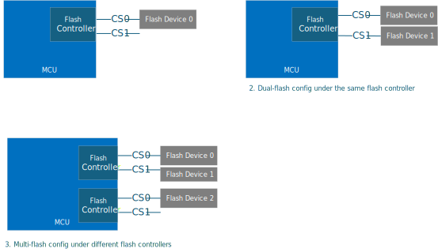
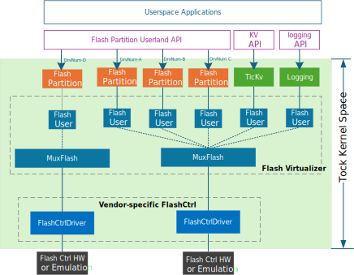
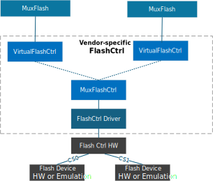

# Flash Controller

## Overview

The Flash Controller stack in the Caliptra MCU firmware is designed to provide efficient and reliable communication with flash devices, which is the foundation to enable flash-based boot flow.

We will primarily be targetting SPI flash controllers, so we will use that as our primary example throughout.

This document outlines the different SPI flash configurations being supported, the stack architecture, component interface and userspace API to interact with the SPI flash stack.

## SPI Flash Configurations

The SPI flash stack supports various configurations to cater to different use cases and hardware setups. The diagram below shows the flash configurations supported.

<p align="center">
    
</p>

**1. Single-Flash Configuration**
In this setup, a single SPI flash device is connected to the flash controller. Typically, the flash device is divided into two halves: the first half serves as the primary flash, storing the active running firmware image, while the second half is designated as the recovery flash, containing the recovery image. Additional partitions, such as a staging area for firmware updates, flash store for certificates and debug logging can also be incorporated into the primary flash.

**2. Dual-Flash Configuration**
In this setup, two SPI flash devices are connected to the same flash controller using different chip selects. This configuration provides increased storage capacity and redundancy. Typically, flash device 0 serves as the primary flash, storing the active running firmware image and additional partitions such as a staging area for firmware updates, flash store for certificates and debug logging. Flash device 1 is designated as the recovery flash, containing the recovery image.

**3. Multi-Flash Configuration**
In more complex systems, multiple flash controllers may be used, each with one or more SPI flash devices. This configuration provides flexibility and scalability. For example, a backup flash can be added to recover the SoC and provide more resiliency for the system.

## Architecture

The SPI flash stack design leverages TockOS's kernel space support for flash and associated virtualizer layers. The stack, from top to bottom, comprises the flash userland API, flash partition capsule, flash virtualizer and vendor-specific flash controller layer. SPI flash stack architecture with simplified flash controller layer is shown in the diagram below.

<p align="center">
    
</p>

- Flash Userland API
  - Provides syscall library for userspace applications to issue IO requests (read, write, erase) to flash devices. Userspace application will instantiate the syscall library with unique driver number for individual flash partition.

- Flash Partition Capsule
  - Defines the flash partition structure with offset and size, providing methods for reading, writing, and erasing arbitrary lengths of data within the partitions. Each partition is logically represented by a `FlashUser`, which leverages the existing flash virtualizer layer to ensure flash operations are serialized and managed correctly. It also implements `SyscallDriver` trait to interact with the userland API.

- Vendor-specific Flash controller Layer
  - Flash controller driver implements the `kernel::hil::flash::Flash` trait, which defines the standard interface (read, write, erase) for flash page-based operations.
    - Additional methods provided in the flash controller driver include:
      - Initializing the SPI flash device and configuring settings such as clock speed, address mode, and other parameters.
      - Checking the status of the flash device, such as whether it is busy or ready for a new operation.
      - Erasing larger regions of flash memory, such as sectors or blocks, in addition to individual pages.
      - Reading the device ID, manufacturer ID, or other identifying information from the flash device.
      - Retrieving information about the flash memory layout, such as the size of pages, sectors, and blocks from SFDP.
      - Performing advanced read/write operations using specific commands supported by the flash device.
  - A flash controller virtualizer `VirtualFlashCtrl` should be implemented to support the configuration of multiple flash devices connected to the same flash controller via different chip selects. The diagram below shows the stack to enable this scenario.

<p align="center">
    
</p>

## Common Interfaces

### Flash Userland API

It is defined in SPI flash syscall library to provide async interface (read, write, erase) to underlying flash devices.

```Rust
/// spi_flash/src/lib.rs
///
/// A structure representing an asynchronous SPI flash memory interface.
struct AsyncSpiFlash {
    // The driver number associated with this SPI flash interface.
    driver_num: u32,
}

/// Represents an asynchronous SPI flash memory interface.
///
/// This struct provides methods to interact with SPI flash memory in an asynchronous manner,
/// allowing for non-blocking read, write, and erase operations.
impl AsyncSpiFlash {
    /// Creates a new instance of `AsyncSpiFlash`.
    ///
    /// # Arguments
    ///
    /// * `driver_num` - The driver number associated with the SPI flash.
    fn new(driver_num: u32) -> Self {};

    /// Checks if the SPI flash exists.
    ///
    /// # Returns
    ///
    /// * `Ok(())` if the SPI flash exists.
    /// * `Err(ErrorCode)` if there is an error.
    fn exists() -> Result<(), ErrorCode> {};

    /// Reads an arbitrary number of bytes from the flash memory.
    ///
    /// This method reads `len` bytes from the flash memory starting at the specified `address`
    /// and stores them in the provided `buf`.
    ///
    /// # Arguments
    ///
    /// * `address` - The starting address to read from.
    /// * `len` - The number of bytes to read.
    /// * `buf` - The buffer to store the read bytes.
    ///
    /// # Returns
    ///
    /// * `Ok(())` if the read operation is successful.
    /// * `Err(ErrorCode)` if there is an error.
    async fn read(&self, address: usize, len: usize, buf: &mut [u8]) -> Result<(), ErrorCode>;

    /// Writes an arbitrary number of bytes to the flash memory.
    ///
    /// This method writes the bytes from the provided `buf` to the flash memory starting at the
    /// specified `address`.
    ///
    /// # Arguments
    ///
    /// * `address` - The starting address to write to.
    /// * `buf` - The buffer containing the bytes to write.
    ///
    /// # Returns
    ///
    /// * `Ok(())` if the write operation is successful.
    /// * `Err(ErrorCode)` if there is an error.
    async fn write(&self, address: usize, buf: &[u8]) -> Result<(), ErrorCode>;

    /// Erases an arbitrary number of bytes from the flash memory.
    ///
    /// This method erases `len` bytes from the flash memory starting at the specified `address`.
    ///
    /// # Arguments
    ///
    /// * `address` - The starting address to erase from.
    /// * `len` - The number of bytes to erase.
    ///
    /// # Returns
    ///
    /// * `Ok(())` if the erase operation is successful.
    /// * `Err(ErrorCode)` if there is an error.
    async fn erase(&self, address: usize, len: usize) -> Result<(), ErrorCode>;
}
```

### Flash partition capsule

```Rust
/// A structure representing a partition of a flash memory.
///
/// This structure allows for operations on a specific partition of the flash memory,
/// defined by a start address and a size.
///
/// # Type Parameters
/// - `F`: The type of the flash memory, which must implement the `Flash` trait.
///
/// # Fields
/// - `flash_user`: A reference to the `FlashUser` that provides access to the flash memory.
/// - `start_address`: The starting address of the flash partition.
/// - `size`: The size of the flash partition.
/// - `client`: An optional reference to a client that implements the `FlashPartitionClient` trait.
struct FlashPartition<F: Flash> {
    flash_user: &FlashUser<F>,
    start_address: usize,
    size: usize,
    client: OptionalCell<&dyn FlashPartitionClient>,
}

/// A partition of a flash memory device.
///
/// This struct represents a partition of a flash memory device, allowing
/// operations such as reading, writing, and erasing within the partition.
///
/// # Type Parameters
///
/// - `F`: A type that implements the `Flash` trait.
impl<F: Flash> FlashPartition<F> {
    /// Creates a new `FlashPartition`.
    ///
    /// # Arguments
    ///
    /// - `flash_user`: A reference to the `FlashUser` that owns the flash memory device.
    /// - `start_address`: The starting address of the partition within the flash memory device.
    /// - `size`: The size of the partition in bytes.
    ///
    /// # Returns
    ///
    /// A new `FlashPartition` instance.
    fn new(
        flash_user: &FlashUser<, F>,
        start_address: usize,
        size: usize,
    ) -> FlashPartition<F> {}

    /// Sets the client for the flash partition.
    ///
    /// # Arguments
    ///
    /// - `client`: A reference to an object that implements the `FlashPartitionClient` trait.
    fn set_client(&self, client: &dyn FlashPartitionClient) {}

    /// Reads data from the flash partition.
    ///
    /// # Arguments
    ///
    /// - `buffer`: A mutable reference to a buffer where the read data will be stored.
    /// - `offset`: The offset within the partition from which to start reading.
    /// - `length`: The number of bytes to read.
    ///
    /// # Returns
    ///
    /// A `Result` indicating success or an error code.
    fn read(
        &self,
        buffer: &'static mut [u8],
        offset: usize,
        length: usize,
    ) -> Result<(), ErrorCode> {}

    /// Writes data to the flash partition.
    ///
    /// # Arguments
    ///
    /// - `buffer`: A mutable reference to a buffer containing the data to be written.
    /// - `offset`: The offset within the partition at which to start writing.
    /// - `length`: The number of bytes to write.
    ///
    /// # Returns
    ///
    /// A `Result` indicating success or an error code.
    fn write(
        &self,
        buffer: &'static mut [u8],
        offset: usize,
        length: usize,
    ) -> Result<(), ErrorCode> {}

    /// Erases data from the flash partition.
    ///
    /// # Arguments
    ///
    /// - `offset`: The offset within the partition at which to start erasing.
    /// - `length`: The number of bytes to erase.
    ///
    /// # Returns
    ///
    /// A `Result` indicating success or an error code.
    fn erase(&self, offset: usize, length: usize) -> Result<(), ErrorCode> {}
}

/// Implementation of the `SyscallDriver` trait for the `FlashPartition` struct.
/// This implementation provides support for reading, writing, and erasing flash memory,
/// as well as allowing read/write and read-only buffers, and subscribing to callbacks.
impl<F: Flash> SyscallDriver for FlashPartition< F> {
    ///
    /// Handles commands from userspace.
    ///
    /// # Arguments
    ///
    /// * `command_number` - The command number to execute.
    /// * `arg1` - The first argument for the command.
    /// * `arg2` - The second argument for the command.
    /// * `process_id` - The ID of the process making the command.
    ///
    /// # Returns
    ///
    /// A `CommandReturn` indicating the result of the command.
    ///
    /// Commands:
    /// - `0`: Success (no operation).
    /// - `1`: Read operation. Reads `arg2` bytes from offset `arg1`.
    /// - `2`: Write operation. Writes `arg2` bytes to offset `arg1`.
    /// - `3`: Erase operation. Erases `arg2` bytes from offset `arg1`.
    /// - Any other command: Not supported.
    fn command(
        &self,
        command_number: usize,
        arg1: usize,
        arg2: usize,
        process_id: ProcessId,
    ) -> CommandReturn {};

    ///
    /// Allows a process to provide a read/write buffer.
    ///
    /// # Arguments
    ///
    /// * `process_id` - The ID of the process providing the buffer.
    /// * `readwrite_number` - The identifier for the buffer.
    /// * `buffer` - The buffer to be used for read/write operations.
    ///
    /// # Returns
    ///
    /// A `Result` indicating success or failure.
    ///
    /// Buffers:
    /// - `0`: Write buffer.
    /// - Any other buffer: Not supported.
    fn allow_readwrite(
        &self,
        process_id: ProcessId,
        readwrite_number: usize,
        buffer: Option<WriteableProcessBuffer>,
    ) -> Result<(), ErrorCode>;

    ///
    /// Allows a process to provide a read-only buffer.
    ///
    /// # Arguments
    ///
    /// * `process_id` - The ID of the process providing the buffer.
    /// * `readonly_number` - The identifier for the buffer.
    /// * `buffer` - The buffer to be used for read-only operations.
    ///
    /// # Returns
    ///
    /// A `Result` indicating success or failure.
    ///
    /// Buffers:
    /// - `0`: Read buffer.
    /// - Any other buffer: Not supported.
    fn allow_readonly(
        &self,
        process_id: ProcessId,
        readonly_number: usize,
        buffer: Option<ReadableProcessBuffer>,
    ) -> Result<(), ErrorCode>{}

    ///
    /// Subscribes a process to a callback.
    ///
    /// # Arguments
    ///
    /// * `subscribe_number` - The identifier for the callback.
    /// * `callback` - The callback to be subscribed.
    /// * `process_id` - The ID of the process subscribing to the callback.
    ///
    /// # Returns
    ///
    /// A `Result` containing the previous callback if successful, or an error code if not.
    ///
    /// Callbacks:
    /// - `0`: General callback.
    /// - Any other callback: Not supported.
    fn subscribe(
        &self,
        subscribe_number: usize,
        callback: Option<Callback>,
        process_id: ProcessId,
    ) -> Result<Callback, (Option<Callback>, ErrorCode)>;
}
```

### Flash Controller Driver Capsule

This module is vendor-specific. The common trait to be implemented is within `kernel::hil::flash::Flash`.