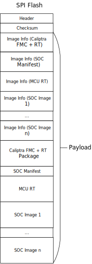

## SPI Flash Layout

Overall, the SPI Flash consists of a Header, Checksum and an Image Payload (which includes the image information and the image binary).

The specific images of the flash consists of the Caliptra FW, MCU RT, SOC Manifest, and other SOC images, if any.

*Note: All fields are little endian unless specified*

### Header

The Header section contains the metadata for the images stored in the flash.

| Field          | Size (bytes) | Description                                                                                                                              |
| -------------- | ------------ | ---------------------------------------------------------------------------------------------------------------------------------------- |
| Magic Number   | 4            | A unique identifier to mark the start of the header. The value must be 0x464C5348 ('FLSH' in ASCII)                                 |
| Header Version | 2            | The header version format, allowing for backward compatibility if the package format changes over time. (Current version is 0x0001) |
| Image Count    | 2            | The number of image stored in the flash. Each image will have its own image information section.                                    |

### Checksum

The checksum section contains integrity checksums for the header and the payload sections.

| Field            | Size (bytes) | Description                                                                                                                                                                                                                                                                                                                                                                             |
| ---------------- | ------------ | --------------------------------------------------------------------------------------------------------------------------------------------------------------------------------------------------------------------------------------------------------------------------------------------------------------------------------------------------------------------------------------- |
| Header Checksum  | 4            | The integrity checksum of the Header section. It is calculated starting at the first byte of the Header until the last byte of the Image Count field. For this specification, The CRC-32 algorithm with polynomial 0x04C11DB7 (as used by IEEE 802.3)  is used for checksum computation, processing one byte at a time with the least significant bit first.             |
| Payload Checksum | 4            | The integrity checksum of the payload section. It is calculated starting at the first byte of the first image information until the last byte of the last image. For this specification, The CRC-32 algorithm with polynomial 0x04C11DB7 (as used by IEEE 802.3)  is used for checksum computation, processing one byte at a time with the least significant bit first. |

### Image Information

The Image Information section is repeated for each image and provides detailed manifest data specific to that image.

| Field               | Size (bytes) | Descr                                                                                                                                                                                                                         |
| ------------------- | ------------ | ----------------------------------------------------------------------------------------------------------------------------------------------------------------------------------------------------------------------------- |
| Identifier          | 4            | Vendor selected unique value to distinguish between images.  0x0001: Caliptra FMC+RT  0x0002: SOC Manifest:  0x0003: MCU RT 0x1000-0xFFFF - Reserved for other Vendor-defined SOC images          |
| ImageLocationOffset | 4            | Offset in Bytes from byte 0 of the header to where the image content begins.                                                                                                                                                  |
| Size                | 4            | Size in bytes of the image. This is the actual size of the image without padding. The image itself as written to the flash should be 4-byte aligned and additional padding will be required to guarantee alignment. |

### Image

The images (raw binary data) are appended after the Image Information section, and should be in the same order to their corresponding Image Information.

| Field | Size (bytes) | Description                                                                                                                                                                                                      |
| ----- | ------------ | ---------------------------------------------------------------------------------------------------------------------------------------------------------------------------------------------------------------- |
| Data  | N            | Image content. Note: The image should be 4-byte aligned.  If the size of a firmware image is not a multiple of 4 bytes,  zero padding bytes should be added to meet the alignment requirement.  |

* Caliptra FMC and RT (refer to the [Caliptra Firmware Image Bundle Format](https://github.com/chipsalliance/caliptra-sw/blob/main-2.x/rom/dev/README.md#firmware-image-bundle))
* SOC Manifest (refer to the description of the [SOC Manifest](https://github.com/chipsalliance/caliptra-sw/blob/main-2.x/auth-manifest/README.md))
* MCU RT: This is the image binary of the MCU Realtime firmware
* Other SOC images (if any)
