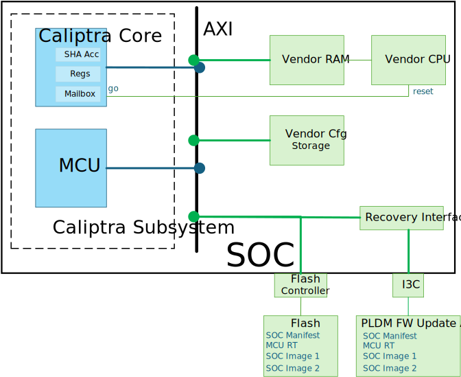
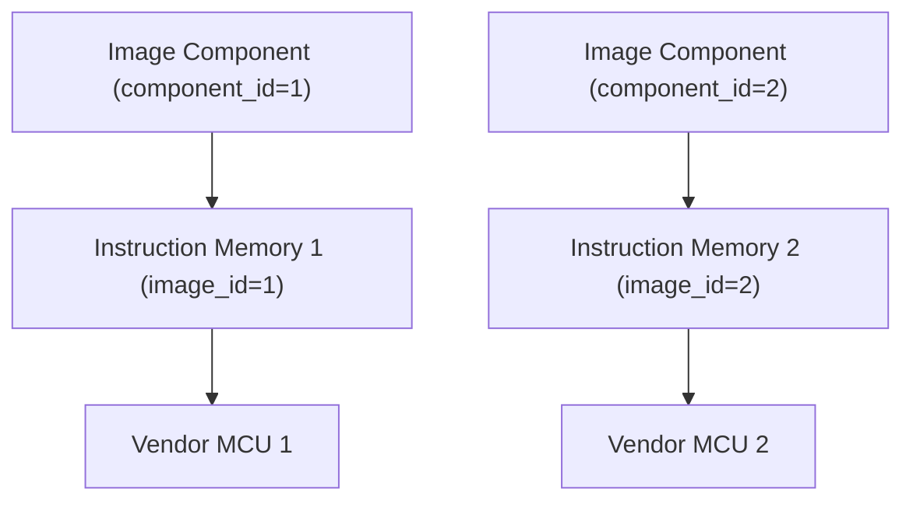
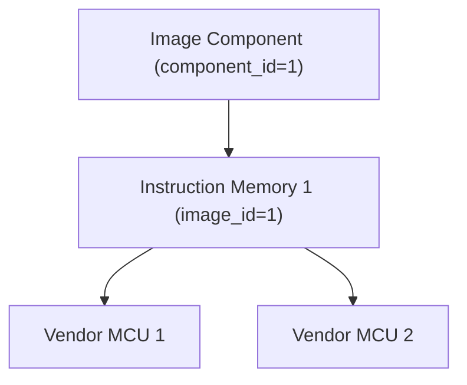
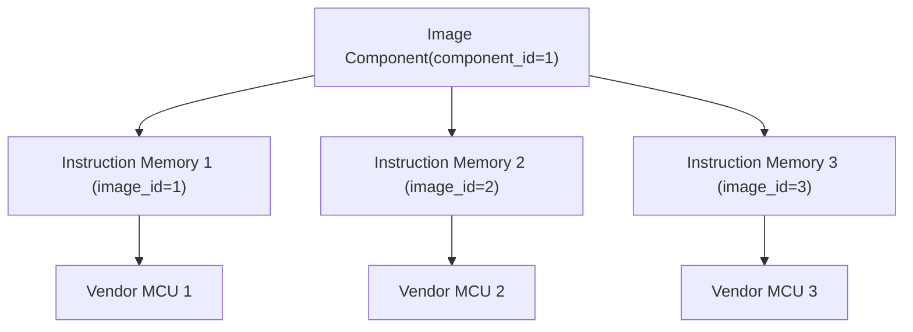
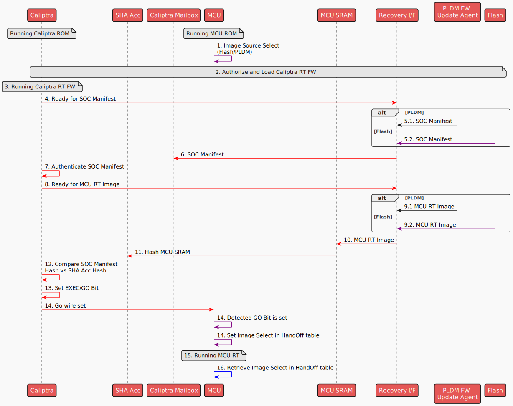
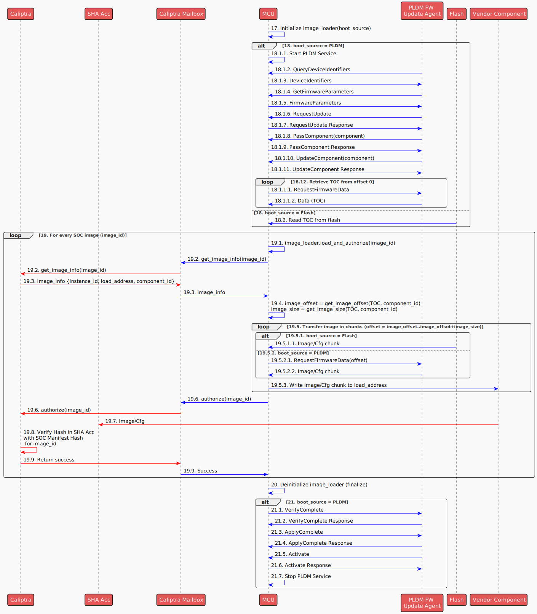

# Image Loading

## Overview

The Image Loading module is a component of the MCU Runtime SDK designed for managing SOC images. This module provides APIs for:

- Loading SOC images to target components. The SOC images could come from a [flash storage](./flash_layout.md) or from another platform capable of streaming images through PLDM T5 (e.g., a BMC Recovery Agent).
- Verifying and authenticating the SOC Images through the Caliptra Core. Images that are loaded to the target SOC components will be authenticated using a mailbox command to the Caliptra core and are verified against the measurements in the SOC Manifest.

The diagram below provides an **example** of how the Caliptra subsystem, integrated with custom SOC elements (highlighted in green), facilitates the loading of SOC images to vendor components.

Custom SOC elements:

* **External Flash** : A flash storage containing SOC manifest and the SOC images.
* **Vendor CPU**: A custom CPU that executes code from a coupled Vendor RAM
* **Vendor RAM**: RAM exclusively used by the Vendor CPU and is programmable via AXI bus.
* **Vendor Cfg Storage**: A volatile memory storage used to contain vendor specific configurations.
* **SOC Images** SOC Image 1 is a firmware for Vendor CPU and loaded to Vendor RAM. SOC Image 2 is a configuration binary to be loaded to Vendor Cfg Storage.
* **SOC Config** : A register accessible by the MCU ROM to select appropriate source (flash or PLDM) for loading the SOC images.
* **Caliptra 'Go' Wire** : A signal controlled by the Caliptra core routed to the reset line of the Vendor CPU.

<p align="center">
    
</p>

## Supported Topologies

### Definitions
* Image Component : The binary data (e.g. firmware, configuration) identified uniquely by a component_id.
* Image Location : The location where the image component is loaded (e.g. an instruction or data memory) identified by an image_id. The location should have an associated AXI address.

### Image and Instance Mapping
* Each image location will be associated to an image component in the SOC Manifest.

### Topology 1: One Image Component per Image Location

In this topology, each image location has its own component.
For example, 2 MCUs with their own instruction memories running 2 different firmware images.



Another configuration for this topology is when the component is shared across multiple processing elements.




### Topology 2: One Image for multiple instances


Image Loader supports architectures with a combination of these topologies.

## Image Loading Steps

The sequence diagram below shows the high level steps of loading MCU RT image and SOC images.

* *Red Arrows indicates actions taken by Caliptra RT*
* *Purple Arrows indicates actions taken by MCU ROM*
* *Blue Arrows indicates actions taken by MCU RT*
* *Black Arrows indicates actions taken by the PLDM FW Update Agent*

<p align="center">
    <!--- https://www.plantuml.com/plantuml/uml/ZPDHRzem4CVV_IbktSichM5qQxVoK9NHqbPgn0HKcxHMaqaEiEGuaNDXwpxzBWO33epr9R5plxlS_-p_PKdIKfLfyOhcc25aqfQYu6ygKOKq14SzgLL1LXw1BC5lGcHqsuLkaZY2r_lp8PPAJ_BVDUNN8Hdt7boGtpi160sxiO_-h3SXCiGaNw1zXhjMts7-GuXzlR-AeVyD7ir3aKf2wCxGa4keGo7SrxASkvXR2M5opgYhhkVGWM5bZ3ApzHSO3cBHWWtA_MuetZX0yEBun-kYieN6fml7j2Euo-GCOPHNDk4NQapeqRnnVs_L_RtTqy8x5-x0IGJTYkQvLNyGf4dXFfVfLbjZrhrNmOUeASBJmk-vLOlfquKVQWS-SXBAz1cckONHe0UnD6gA9GcfQJdB-d6ybN8QjQCGHLtYQhRkkPb8a7RIJ3Ef41xmhQrkL0VEGdfNn4Rvf-N8q91A966GTqZyvstnxaZ7owFxj_Zpg1sGBzD-pjeRQIRTaUuTmLVeVGCNFkPPjYTZV12t_4_mnZemepPtqCipDaOu7xQGAx4eOML_L_9G9Rve8oIu_dxTQzqCu8kY1ksDm9Vh9eTVoYAKI4slUEGA2HF259QrG9M7QFwpcudt5IZ33PjqC9q2oOb6qR1i-pGARJlshfteQbtvZ24agt21_oalBj6aLQR_0W00 -->
    
</p>

The following steps are done for every SOC image:

<p align="center">
    <!--- https://www.plantuml.com/plantuml/svg/bLP_Rzis4FrVd-BM0OEDTLhafSaoe4K31ra3B5WszySVIn4mqiac9fCQIQNBXdtt7IbHDaELIL4qbiZtxXrvzoY-reOfqssRx2kpmIt2bYcTjJJ6IzuoOU3PaZMyDOez0wR1luIGrPjJE2rBXw3dQJvSCjxSohyjoZ-7oClbEpT9l-74rIzdbt3-0Qx5kxPY1k5qZS8uh9qAmUSDqnitvvx2oVSeAgbWARUj53v6wT-oZAI_--FhswR3Zw_e-ISeZdEu4DnmMiK_27pBrdZJI5QXcjrAQMwqx5I9yonZZO7YnnpsHk5bdny0G1IPi0NzWvMjWCF12jKTBp6p13SomLZay5k7wluCBVIYehHvpL5fW4Z7XXXeF-GGCP8wXpdyZEQSg-qdfl2AARP5ywZCYnmYIbhdA8VVyQyEjUbhcuv__01DRvfgfzDxHbMvObgFLP-D5P-dvKuU49ycLnpaqAVtvOf54N9ZqKRArc4NTY-CudY7yFRN9THARa7MjKO31mwQq25sCUwbBzaPCsn8BxMyXMr2XvsHxjpXoLSkiop3HcDiXDwC3kgUehXkDQpQhQHs18gRPVsIgHZdKW4jLzt3Yc3EZ33hFSch-RJFY5VaWN5p-tF31Ftlp4OgClPUa3XAVrQvI9Jb6itDW1Qr78c-hj_0W2U-mkhZAt_-fVbUsADxTYXE7juHuLykj66YjEJdq2-fgXHg_Nntej7SVt5YuVQ4SRFFxkAXXmqzzd9SYX-oxH2Apwz53z2qoIF33qpWztlyn1udRnKJkaOrL9iBA3UT-5F3pASHP9Nd-s_VxhJcOrkpnlInY-aUzRZfNlLK8b_OuDylwtMVqaXq3d2mnMS_1mbxziHfTmwBzisMS6eVPP78KbIJXyHOZY48TSS7nGq-30H61bqN7WD95ntb43llKGCbgBtScBbdqbt4aOxtTY6oMQn1PzTxLBo-XpTKVTjommK7hiKdRZRkyBbaWjUeZSDS2wYb0f_FurO-SMTtfmJehYnHwvH9FMFLGxFT9aSsNHpOxpoVlh30hER23llhogAOxi_9lYHmuJV6VfiQz1_hgFqSU162es_rf08rssdRDayIE0omKVn9pWlYb8RVfIuQ13loi6JMFYYrryh8Dhp3MNkzfZ_sRlq_ -->
    
</p>

The following outlines the steps carried out by the MCU RT during the SOC boot process:

1. MCU ROM reads a SOC Configuration register (implementation specific) to determine the source of the images to load (Flash/PLDM).
2. Caliptra RT authorizes and loads Caliptra RT (refer to [Caliptra Subsystem boot flow](https://github.com/chipsalliance/Caliptra/blob/main/doc/Caliptra.md#subsystem-boot-flow) for the detailed steps).
3. Caliptra switches to Caliptra RT FW.
4. Caliptra RT indicates to Recovery I/F that it is ready for the SOC manifest image (refer to [Caliptra Subsystem Recovery Sequence](https://github.com/chipsalliance/Caliptra/blob/main/doc/Caliptra.md#caliptra-subsystem-recovery-sequence) for the detailed steps).
5. Retrieve SOC Manifest

   1. If image is coming from PLDM, PLDM FW Update Agent transfers SOC manifest to Recovery I/F
   2. If Image is coming from Flash, MCU ROM transfers SOC manifest from flash to Recovery I/F
6. Caliptra RT transfers SOC Manifest to Caliptra Mailbox (MB) SRAM
7. Caliptra RT will authenticate its image sitting in Caliptra MB SRAM
8. Caliptra RT indicates to Recovery I/F that it is ready for the next image that should be the MCU RT Image (refer to [Caliptra Subsystem Recovery Sequence](https://github.com/chipsalliance/Caliptra/blob/main/doc/Caliptra.md#caliptra-subsystem-recovery-sequence) for the detailed steps)..
9. Retrieve MCU RT Image

   1. If Image is coming from PLDM, PLDM FW Update Agent sends MCU RT Image to Recovery I/F (refer to [Caliptra Subsystem boot flow](https://github.com/chipsalliance/Caliptra/blob/main/doc/Caliptra.md#subsystem-boot-flow)).
   2. If Image is coming from Flash, MCU ROM transfers MCU RT Image to Recovery I/F
10. Caliptra RT FW will read the recovery interface registers over AXI manager interface and write the image to MCU SRAM aperture
11. Caliptra RT FW will instruct its SHA accelerator to hash the MCU RT Image in the MCU SRAM.
12. Caliptra RT FW will use this hash and verify it against the hash in the SOC manifest.
13. Once the digest is verified, Caliptra RT FW sets the [EXEC/GO bit](https://chipsalliance.github.io/caliptra-rtl/main/external-regs/?p=caliptra_top_reg.generic_and_fuse_reg.SS_GENERIC_FW_EXEC_CTRL%5B0%5D).
14. The EXEC/GO bit sets a Caliptra wire to MCU (as a consequence of setting the EXEC/GO bit in the previous step). When MCU detects this event, it sets a parameter using the FW HandOff table to indicate the image source (i.e. the image source where it booted from).
15. MCU switches to MCU RT
16. MCU RT retrieves the image source from HandOff table

For every image that needs to be loaded, user initiates a call to load an image identified by an image_id:

17. MCU RT application initializes the image loader based on the boot_source. The application need to specify the boot_source as Flash or PLDM.
18. Retrieve TOC
18.1 If boot_source = PLDM:
18.1.1 MCU starts the PLDM service.
18.1.2–18.1.3 PLDM Update agent queries device identifiers and receives a response.
Device Identifier is vendor specific and should correspond to the device identifier in the PLDM Package in the Update Agent.
18.1.4–18.1.5 PLDM Update agent requests and receives firmware parameters. The PLDM firmware parameter to be used should be for the streaming boot component (refer to the [PLDM Package documentation](./pldm_package.md))

| Field Name                                      | Description                                                                       | Value to Use                         |
| ----------------------------------------------- | --------------------------------------------------------------------------------- | ------------------------------------ |
| `ComponentActivationMethods`                  | Defines activation methods supported by the FD.                                   | `0x0000` (Automatic)               |
| `CapabilitiesDuringUpdate`                    | Capabilities of the firmware component during update.                             | `0x00000002` (Downgrade permitted) |
| `ActiveComponentVersionString`                | Describes the currently active version of the component.                          | None                                 |
| `PendingComponentVersionString`               | Describes the version of the component that is pending activation.                | None                                 |
| `ComponentIdentifier`                         | Unique ID for the component.                                                      | `0xFFFF`                           |
| `ComponentClassificationIndex`                | Used to distinguish identical component classifications with different instances. | `0x00`                             |
| `ActiveComponentComparisonStamp`              | Comparison stamp for active version.                                              | `0x00000000`                       |
| `ActiveComponentVersionStringType`            | String type for active version string.                                            | `0x01` (ASCII)                     |
| `ActiveComponentVersionStringLength`          | Length of the active version string.                                              | 0x00                                 |
| `ActiveComponentReleaseDate`                  | Release date of the active component in YYYYMMDD format.                          | `"00000000"`                       |
| `PendingComponentComparisonStamp`             | Comparison stamp for pending version.                                             | None                                 |
| `PendingComponentVersionStringType`           | String type for pending version string.                                           | `0x01` (ASCII)                     |
| `PendingComponentVersionStringLength`         | Length of the pending version string.                                             | 0x00                                 |
| `PendingComponentReleaseDate`                 | Release date of the pending version in YYYYMMDD format.                           | `"00000000"`                       |
| `ComponentCount`                              | Number of components on the FD.                                                   | `0x0001`                           |
| `ActiveComponentImageSetVersionStringType`    | Type for image set version string (active).                                       | `0x01` (ASCII)                     |
| `ActiveComponentImageSetVersionStringLength`  | Length of image set version string (active).                                      | `0x00`                             |
| `PendingComponentImageSetVersionStringType`   | Type for image set version string (pending).                                      | `0x01` (ASCII)                     |
| `PendingComponentImageSetVersionStringLength` | Length of image set version string (pending).                                     | `0x00`                             |
| `ActiveComponentImageSetVersionString`        | Version string of the active image set.                                           | None                                 |
| `PendingComponentImageSetVersionString`       | Version string of the pending image set.                                          | None                                 |

18.1.6–18.1.7 PLDM sends a RequestUpdate, MCU responds with approval.
18.1.8–18.1.9 PLDM sends component information using PassTableComponent request, MCU responds with success.
18.1.10–18.1.11 PLDM sends an UpdateComponent, MCU acknowledges.

18.1.12. Retrieve TOC (Table of Contents) via PLDM starting from offset 0 until the end of TOC
18.1.12.1 MCU send RequestFirmwareData
18.1.12.2 PLDM responds with the TOC chunk


18.2 If boot_source = Flash:
18.2.1 MCU reads the TOC directly from Flash.


For each SOC instance to be loaded and authorized:

19.1 MCU RT initiates to load the an image component for location for image_id=1 by executing image_loader.load_and_authorize(image_id).

19.2–19.3 MCU retrieves the image_info using Caliptra mailbox for the provided image_id. This should return the load_address and the corresponding component_id associated to the image_id.

19.4 MCU determines the image offset and length using the TOC and component_id.

19.5. Transfer image in chunks (from image_offset to image_offset + image_size):
19.5.1.1 If from Flash: Flash sends the image chunk to MCU.

19.5.2.1–19.5.2.2 If from PLDM:

MCU requests firmware data from PLDM.

PLDM responds with the image chunk.

19.5.3 MCU writes the image chunk to the appropriate component destination (e.g., Vendor RAM or Config) identified by the load_address.

19.6 After download is completed, MCU sends an authorize(instance_id) command to Caliptra via Mailbox.

19.7 Caliptra forwards the image to the SHA Accelerator.

19.8 Caliptra verifies the image hash in SHA Acc against the value in the SOC manifest.

19.9 On successful verification, Caliptra returns a success response via the Mailbox to the MCU

20 After all SOC instances' images are loaded, MCU RT application deinitializes the image loader.

21 If boot_source = PLDM, MCU finalizes the PLDM firmware update sequence.

21.1–21.2 MCU sends VerifyComplete, and PLDM Update agent responds.

21.3–21.4 MCU sends ApplyComplete, and PLDM Update agent responds.

21.5–21.6 PLDM Update agent issues an Activate, and MCU confirms.

21.7 MCU stops the PLDM service.


## Architecture

The following diagram presents the software stack architecture where the Image Loading module resides.

<p align="left">
    
</p>

At the top of the stack, the user application interacts with the Image Loading module through high-level APIs. The user application is responsible for initiating the image loading and verification.

The Image Loading module provides the interface to retrieve and parse the manifest from the flash storage, and transfer SOC images from the storage to the target destination.

### Application Interfaces

The APIs are presented as methods of the ImageLoader trait.

```rust


/// Trait defining the Image Loading module
pub trait ImageLoaderAPI {
    /// Loads the specified SoC image to a storage mapped to the AXI bus memory map.
    ///
    /// # Parameters
    /// image_id: The unsigned integer identifier for the image location
    ///
    /// # Returns
    /// - `Ok()`: Image has been loaded and authorized succesfully.
    /// - `Err(ErrorCode)`: Indication of the failure to load or authorize the image.
    async fn load_and_authorize(&self, image_id: u32) -> Result<(), ErrorCode>;


    /// Releases any resources held by ImageLoader
    /// Finalizes the PLDM Update and stops the PLDM service if started
    async fn finalize();

}


/// ImageLoader Implementation
pub struct ImageLoader {
    pub fn new(boot_source: ImageSource) -> Result<(), ErrorCode> {
        // if boot_source = Flash, read TOC from flash
        // if boot_source = PLDM, start PLDM service, and download TOC from offset 0
    }
}

impl ImageLoaderAPI for ImageLoader {
    // API Implementation
}

pub enum ImageSource {
   // Image is located in Flash
   Flash,
   // Image is retrieved via PLDM
   // The PLDM DeviceID to be used should be specified
   Pldm(DeviceId),
}


Example Usage:

/// Load image for instances 1 and 2 from flash
let image_loader = ImageLoader::new(ImageSource::Flash)?;
image_loader.load_and_authorize(1).await?;
image_loader.load_and_authorize(2).await?;
image_loader.finalize();

/// Load image for instances 3 and 4 from PLDM
let image_loader = ImageLoader::new(ImageSource::Pldm(DEVICE_ID))?;
image_loader.load_and_authorize(3).await?;
image_loader.load_and_authorize(4).await?;
image_loader.finalize();


```
