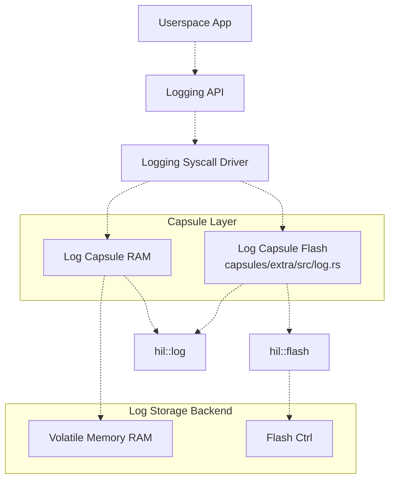

# Logging Stack

## Overview

This document describes the design of the logging stack for Caliptra MCU firmware. The logging stack provides a unified, extensible and robust mechanism for capturing, storing, and retrieving logs from both kernel/driver and userspace components. It supports multiple backends (RAM, flash, etc.), multiple log types and safe concurrent access.

## Generic Log Entry Format

Each log entry consists of a fixed-size header followed by variable-length data. The header provides metadata about the entry, while the data contains the log-specific payload.

*Table: generic log entry header*

| Field Name   | Type     | Size (bytes) | Description                                 |
|--------------|----------|--------------|---------------------------------------------|
| log_magic    | `u16`    | 2            | Start of entry marker                       |
| length       | `u16`    | 2            | Total length of the entry (header + data)   |
| entry_id     | `u32`    | 4            | Unique identifier for the log entry         |

*Table: generic log entry*

| Field Name   | Type     | Size (bytes) | Description                                 |
|--------------|----------|--------------|---------------------------------------------|
| log_magic    | `u16`    | 2            | Start of entry marker                       |
| length       | `u16`    | 2            | Total length of the entry (header + data)   |
| entry_id     | `u32`    | 4            | Unique identifier for the log entry         |
| data         | `[u8]`   | variable     | Log entry payload                           |

The `data` field may include additional structured information (such as severity, component, message index, timestamp) depending on the log type.

### Reference Format - Debug Log Entry Data

*Table: Reference DebugLogEntryData fields*
| Field Name  | Type   | Size (bytes) | Description                                                                                                    |
|-------------|--------|--------------|----------------------------------------------------------------------------------------------------------------|
| format      | `u16`  | 2            | Format of the log entry                                                                                        |
| severity    | `u8`   | 1            | Severity level of the entry (error, info, warning, etc.)                                                       |
| component   | `u8`   | 1            | System component that generated the entry                                                                      |
| msg_index   | `u8`   | 1            | Identifier for the entry message                                                                               |
| arg1        | `u32`  | 4            | Message-specific argument                                                                                      |
| arg2        | `u32`  | 4            | Message-specific argument                                                                                      |
| cycle_count | `u64`  | 8            | Elapsed processor cycles since boot.<br>Note: This is a raw cycle count for performance reasons. Converting to milliseconds requires dividing by the clock frequency, which can be done offline or by the log consumer if needed. |

All log entries are stored as a contiguous byte array in the backend storage.

## Backend Logging Storages

- **Flash Backend**
    - Stores log entries in a dedicated flash partition.
    - Ensures persistence across resets and power cycles.
    - Suitable for audit, crash, and security logs.
    - Partitioning is enforced using a [flash partition capsule](https://github.com/chipsalliance/caliptra-mcu-sw/blob/main/docs/src/flash_controller.md#flash-partition-capsule).

- **RAM Backend**
    - Implements a circular buffer in RAM.
    - Provides fast access, but is volatile (logs are lost on reset).
    - Primarily used for debug and runtime diagnostics.

- **Multiple Log Types**
    - Each log type (e.g., debug, TCG) can use a separate backend instance or partition.
    - The syscall driver and API accept a log type parameter to route requests to the appropriate backend.

## Architecture

The logging module leverages the [Tock Kernel Log HIL](https://docs.tockos.org/kernel/hil/log/index.html) to provide a unified and extensible logging API. It supports multiple storage backends, with initial implementations for both flash-based and RAM-based storage in MCU SDK.



### Key Components

- **Logging API**: provides a high-level, backend-agnostic interface for application to use logging module.
- **Logging Syscall Driver**: bridges userspace and kernel space, exposing logging operations to applications via Tock syscalls.
- **Log Capsules:** implement the `kernel::hil::log` interface for each backend storage type. Tock provides a capsule `capsules/extra/src/log.rs`for flash-based log storage, which can be used as-is. To add RAM support, a new capsule implementing the same HIL interface should be created. This modular design enables easy integration of new storage backends by simply implementing the required HIL and capsule, without modifying the core logging logic.
- **Tock Kernel Log HIL**: provides the abstraction for logging operations.

### Logging API

The logging API is defined by the `Logger` trait, which provides a uniform interface for log creation, flushing, clearing, size querying, and reading log contents.

```rust
/// Defines the API for logging information.
pub trait Logger {
    /// Add a new entry to the log.
    ///
    /// # Arguments
    /// * `entry` - A byte slice containing the log entry data (including header and payload).
    ///
    /// # Returns
    /// * `Ok(())` if the entry was successfully added.
    /// * `Err(LoggingError)` if the operation failed (e.g., insufficient space).
    fn create_entry(&mut self, entry: &[u8]) -> Result<(), LoggingError>;

    /// Flush the internal buffers to the underlying storage.
    ///
    /// Ensures that any buffered log data is written to persistent storage (if applicable).
    ///
    /// # Returns
    /// * `Ok(())` if the flush was successful.
    /// * `Err(LoggingError)` if the operation failed.
    fn flush(&mut self) -> Result<(), LoggingError>;

    /// Remove all data from the log.
    ///
    /// Clears all log entries from the backend storage.
    ///
    /// # Returns
    /// * `Ok(())` if the log was successfully cleared.
    /// * `Err(LoggingError)` if the operation failed.
    fn clear(&mut self) -> Result<(), LoggingError>;

    /// Get the amount of data currently stored in the log (including headers).
    ///
    /// # Returns
    /// * `Ok(usize)` with the total number of bytes currently stored.
    /// * `Err(LoggingError)` if the operation failed.
    fn get_size(&self) -> Result<usize, LoggingError>;

    /// Get the current contents of the log (raw log data, including headers).
    ///
    /// Copies up to `buffer.len()` bytes of log data starting from `offset` into `buffer`.
    ///
    /// # Arguments
    /// * `offset` - The starting byte offset within the log.
    /// * `buffer` - The buffer to fill with log data.
    ///
    /// # Returns
    /// * `Ok(usize)` with the number of bytes copied into the buffer.
    /// * `Err(LoggingError)` if the operation failed.
    fn read_contents(&self, offset: usize, buffer: &mut [u8]) -> Result<usize, LoggingError>;
}
```

This trait is implemented by all log backends (RAM, flash, etc.) and is used by both kernel/driver code and userspace via the syscall driver.

### Syscall Driver

Below is an example skeleton of a syscall driver implementation. This driver translates userspace commands into calls to the appropriate methods of the `Logger` trait.

```rust

pub const DRIVER_NUM: usize = 0xB0000; // Example driver number

pub struct LogSyscallDriver<'a> {
    logger: &'a dyn Logger,
    grant: Grant<LogGrantData>,
    // Other fields
}

pub struct LogGrantData {
    // Per-process state if needed
}

impl<'a> LogSyscallDriver<'a> {
    pub fn new(logger: &'a dyn Logger, grant: Grant<LogGrantData>) -> Self {
        LogSyscallDriver { logger, grant }
    }
}

impl<'a> SyscallDriver for LogSyscallDriver<'a> {
    fn command(
        &self,
        command_num: usize,
        arg1: usize,
        arg2: usize,
        process: AppId,
    ) -> CommandReturn {
        match command_num {
            0 => { /* create_entry */ }
            1 => { /* flush */ }
            2 => { /* clear */ }
            3 => { /* get_size */ }
            4 => { /* read_contents (not supported in this example) */ }
            _ => { /* unknown command */ }
        }
    }
}
```

### Permission Control

Permission control restricts log access to authorized components at both kernel and userspace levels:

- **Kernel/Driver Level**: Only trusted kernel capsules and drivers can access log backends. Privileged kernel code instantiates log capsules, which validate caller identity for sensitive operations.

- **Userspace Level**: The syscall driver enforces per-process, per-log-type access policies (read-only, write-only, full, or no access) defined in kernel configuration. Each syscall is checked against these policies; unauthorized requests are rejected.

**Permission Check Flow**:
1. Userspace issues a syscall.
2. Driver retrieves process identity and log type.
3. Permissions are checked.
4. If allowed, the operation proceeds; otherwise, an error is returned.

This ensures only authorized access and modification of log data.

### Kernel/Driver and Userspace Usage
- Kernel/Driver calls the `Logger` trait methods directly on the log capsule or syscall driver.
- Userspace issues syscalls that forwards the requests to corresponding log capsules.
