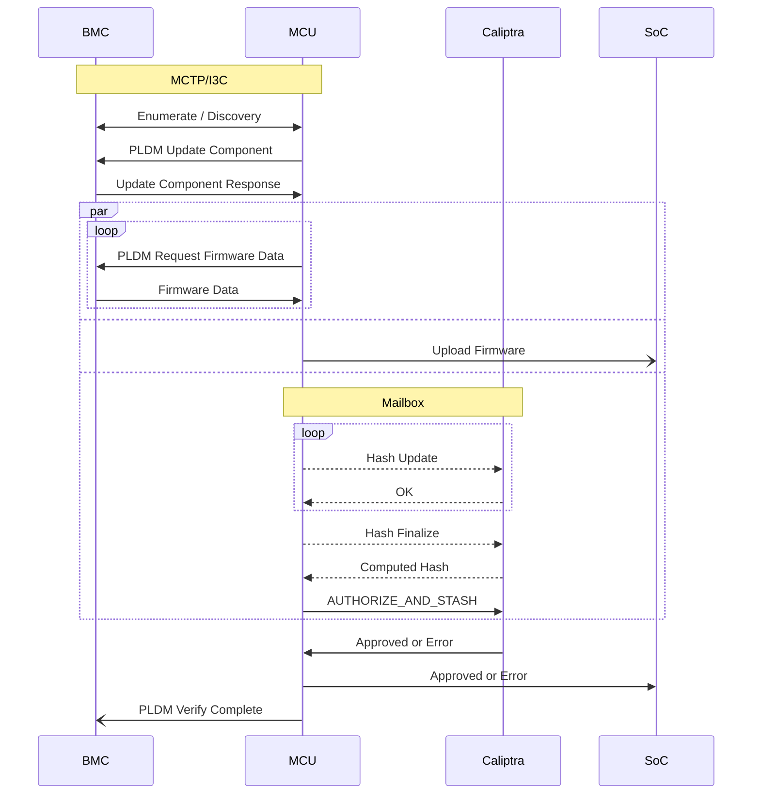
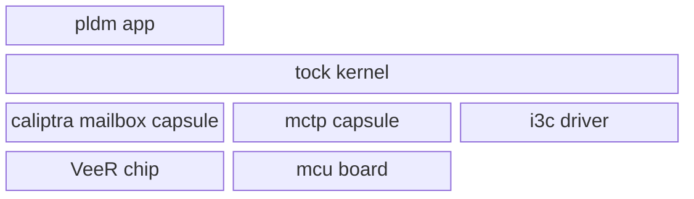
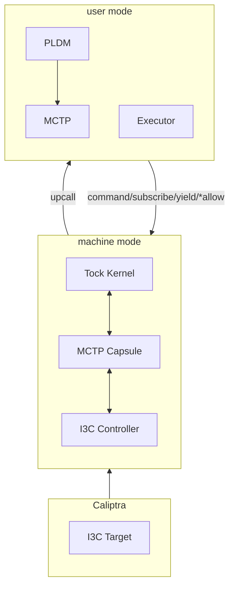

# MCU General Specification

TBD

### Main Sequence Diagram

```mermaid
sequenceDiagram
    participant BMC
    participant MCU
    participant Caliptra
    Note over BMC,MCU: MCTP/I3C
    BMC<<->>MCU: Enumerate / Discovery
    MCU->>BMC: PLDM Update Component
    BMC->>MCU: Update Component Response
    par
      loop
        MCU->>BMC: PLDM Request Firmware Data
        BMC->>MCU: Firmware Data
      end
    and
      MCU-)SoC: Upload Firmware
    and
      Note Over MCU,Caliptra: Mailbox
      loop
        MCU-->>Caliptra: Hash Update
        Caliptra-->>MCU: OK
      end
      MCU-->>Caliptra: Hash Finalize
      Caliptra-->>MCU: Computed Hash
      MCU->>Caliptra: AUTHORIZE_AND_STASH
    end
    Caliptra->>MCU: Approved or Error
    MCU->>SoC: Approved or Error
    MCU-)BMC: PLDM Verify Complete
```

## Architecture Diagram

```mermaid
block-beta
  columns 3
  pldm&nbsp;app space:2
  tock&nbsp;kernel:3
  caliptra&nbsp;mailbox&nbsp;capsule
  mctp&nbsp;capsule
  i3c&nbsp;driver
  VeeR&nbsp;chip
  mcu&nbsp;board
```

```mermaid
flowchart BT
    subgraph um[user mode]
    P[PLDM]-->C[MCTP]
    E[Executor]
    end
    subgraph mm[machine mode]
    T[Tock Kernel]
    M[MCTP  Capsule]
    T <--> M
    M <--> I[I3C Controller]
    end
    subgraph Caliptra
    I2[I3C Target]
    end
    Caliptra --> mm
    um --->|command/subscribe/yield/*allow| mm
    mm --->|upcall| um
```
