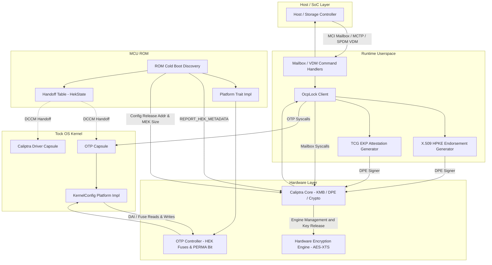
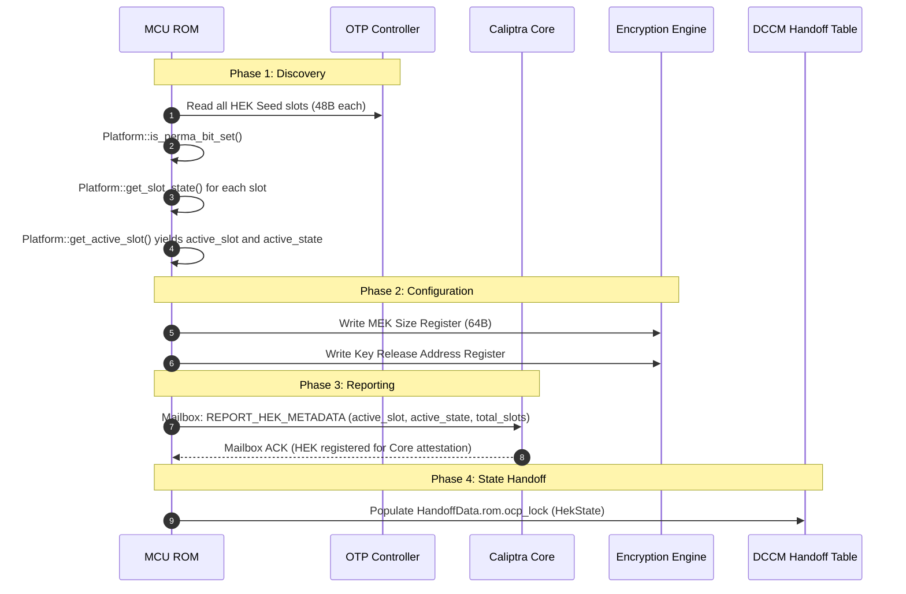
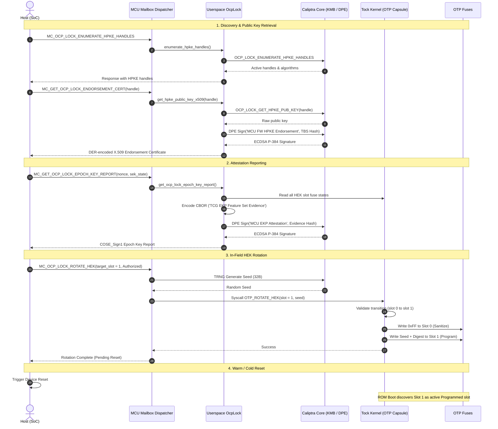

# OCP LOCK Integrator Guide

OCP LOCK (Layered Open-source Cryptographic Key management) is a specification for secure key management for Data-At-Rest protection in self-encrypting storage devices. Within the Caliptra Subsystem (SS), Caliptra MCU acts as the Key Management Block (KMB) controller, coordinating with Caliptra Core and the vendor-implemented Hardware Encryption Engine.

This guide provides technical details for integrators to implement, customize, and configure OCP LOCK functionality across all firmware layers—from ROM cold boot discovery to Tock OS Kernel drivers and Runtime userspace services—while maintaining compliance with the OCP LOCK and TCG Epoch Key Provisioning (EKP) specifications.

---

## Architecture Overview

OCP LOCK establishes a hardware-anchored key hierarchy to protect Media Encryption Keys (MEKs) and Media Protection Keys (MPKs). The Caliptra MCU serves as the trusted orchestrator responsible for:

1. **Hard Epoch Key (HEK) Management**: Discovering, programming, rotating, and sanitizing HEK seeds in One-Time Programmable (OTP) fuses.
2. **Hardware Encryption Engine Configuration**: Configuring key release destinations and MEK sizes during boot.
3. **Core KMB Communication**: Interfacing with Caliptra Core for HPKE key management, MEK derivation, and MPK wrapping.
4. **Attestation & Endorsement**: Generating X.509 endorsement certificates for HPKE public keys and signed COSE_Sign1 Epoch Key Reports for attestation.
5. **Host & In-Field Operations**: Serving authorized mailbox commands for in-field key rotation and permanent lock operations.



---

## Core Subsystem Responsibilities

| Subsystem Layer | Primary Responsibilities |
|---|---|
| **MCU ROM** (`romtime::ocp_lock`) | • Reads HEK seed fuses from OTP during cold boot.<br>• Determines slot states and selects the active HEK slot using the `Platform` trait.<br>• Programs encryption engine registers (MEK size, key release target address).<br>• Dispatches `REPORT_HEK_METADATA` mailbox command to Caliptra Core.<br>• Writes `HekState` into DCCM `HandoffData` for the runtime kernel. |
| **MCU Kernel** (`capsules::otp`) | • Provides kernel-level OTP access control and syscall drivers.<br>• Validates slot transition policies (sequential rotation, slot bounds).<br>• Enforces the single-rotation-per-boot lifecycle constraint (`has_rotated`).<br>• Performs atomic HEK sanitization (0xFF write) and new seed + digest programming via `KernelConfig`.<br>• Enforces permanent lock policy (`PERMA_HEK_EN`). |
| **MCU Runtime Userspace** (`caliptra-libapi`) | • Exposes async `OcpLock` client for KMB operations (MEK/MPK generation, derivation, rotation).<br>• Constructs and signs X.509 v3 endorsement certificates for KMB HPKE public keys.<br>• Formats and signs TCG EKP Epoch Key Reports wrapped in standard `COSE_Sign1` structures.<br>• Integrates with DPE context signing (`CaliptraDpeSigner`). |
| **Host Mailbox Interface** (`mcu-mbox-lib`) | • Dispatches authorized host commands (`MC_OCP_LOCK_ROTATE_HEK`, `MC_OCP_LOCK_SET_PERMA_HEK`).<br>• Dispatches public key queries and attestation requests (`MC_GET_OCP_LOCK_ENDORSEMENT_CERT`, `MC_OCP_LOCK_ENUMERATE_HPKE_HANDLES`, `MC_GET_OCP_LOCK_EPOCH_KEY_REPORT`, `MC_DPE_SIGNER_CONTEXT_CERT`). |

---

## Compliance & Hardware Specifications

### OTP Fuse Layout

Integrators must provision between 4 (`MIN_HEK_SLOTS`) and 8 (`MAX_HEK_SLOTS`) HEK seed slots in OTP memory:

- **Slot Size**: 48 bytes (12 x 32-bit words / 384 bits) per slot.
  - **Words 0..7 (32 bytes / 256 bits)**: HEK Seed raw bytes.
  - **Words 8..9 (8 bytes / 64-bit dword)**: 64-bit OTP Digest, calculated over the 32-byte seed using `caliptra_mcu_otp_digest(seed, OTP_DIGEST_IV, OTP_DIGEST_CONST)`.
  - **Words 10..11 (8 bytes / 64-bit dword)**: Zeroization (ZER) / Sanitization marker.
- **Permanent Lock Fuse**: `PERMA_HEK_EN` fuse (3-bit value, `0x7` indicates set). When set, all future HEK rotations are permanently prohibited.

### HEK Seed States

HEK seed states are defined in accordance with the TCG EKP specification (`caliptra_mcu_romtime::ocp_lock::HekSeedState`):

| State | Value | Description |
|---|---|---|
| `Unused` | `0x0` | Fuses are blank (all `0x00`). The slot is available for programming. |
| `Programmed` | `0x1` | Contains a valid seed and digest. Ready to be used for key derivation. |
| `ProgrammedPendingReset` | `0x2` | Seed programmed in the current session; pending reset to become active. |
| `ProgrammedCorrupted` | `0x3` | Seed data or digest is corrupted or invalid. |
| `Permanent` | `0x4` | The `PERMA_HEK_EN` bit is set; HEK is no longer rotatable and is now a constant value. |
| `Sanitized` | `0x5` | Slot has been zeroized (all `0xFF`). Key material is unrecoverable. |
| `SanitizedPendingReset` | `0x6` | Slot sanitized in current session; pending reset to update active index. |
| `SanitizedCorrupted` | `0x7` | Sanitization pattern is inconsistent or corrupted. |

---

## 1. ROM Cold Boot Integration

During cold boot, MCU ROM evaluates the available HEK slots, configures the hardware encryption engine, notifies Caliptra Core, and passes the discovered state to the runtime kernel.

### The `Platform` Trait

Integrators implement the `Platform` trait in `caliptra_mcu_romtime::ocp_lock::Platform`:

```rust
pub trait Platform {
    /// Returns the total number of HEK Seed slots available in OTP (4..=8).
    fn get_total_slots(&self) -> usize;

    /// Checks if the permanent HEK lock fuse is set.
    fn is_perma_bit_set(&self, otp: &crate::otp::Otp) -> Result<bool, Error>;

    /// Returns the current state of a specific HEK Seed slot.
    fn get_slot_state(
        &mut self,
        otp: &crate::otp::Otp,
        perma_bit: &PermaBitStatus,
        slot: usize,
        seed: &[u8; 48],
    ) -> Result<HekSeedState, Error>;

    /// Determines the active HEK slot based on platform policy (e.g. first Programmed slot).
    fn get_active_slot(
        &mut self,
        otp: &crate::otp::Otp,
        perma_bit: &PermaBitStatus,
        seeds: &HekSeeds,
    ) -> Result<usize, Error>;
}
```

### `RomConfig` Setup

The ROM configuration bundles hardware registers and platform callbacks:

```rust
pub struct RomConfig<'a> {
    pub key_release_addr: u64,             // Physical MMIO destination for key release
    pub mek_size: u32,                     // MEK size in bytes (default: 64)
    pub platform: Option<&'a mut dyn Platform>,
}
```

### ROM Boot Flow Sequence



---

## 2. MCU Kernel Integration (Tock OS Driver)

The Tock OS kernel OTP capsule (`caliptra_mcu_capsules_runtime::otp::Otp`) controls low-level fuse programming and guards key rotation transitions.

### The `KernelConfig` Trait

Platform-specific fuse programming and slot validation logic are implemented via `KernelConfig` (`caliptra_mcu_romtime::ocp_lock::KernelConfig`):

```rust
pub trait KernelConfig: Send + Sync {
    /// Returns the physical byte offset in OTP for a given HEK slot.
    fn get_hek_slot_offset(&self, slot: usize) -> Result<usize, Error>;

    /// Sanitizes (zeroizes) a HEK slot by writing all 1s (0xFF) to seed, digest, and ZER granules.
    fn sanitize_hek_slot(&self, otp: &crate::otp::Otp, slot: usize) -> Result<(), Error>;

    /// Programs a target HEK slot with a new 32-byte seed and 64-bit OTP digest.
    fn program_hek_slot(
        &self,
        otp: &crate::otp::Otp,
        slot: usize,
        seed: &[u8; 32],
        digest: u64,
    ) -> Result<(), Error>;

    /// Validates if transitioning from active_slot to target_slot is permissible.
    fn validate_hek_transition(
        &self,
        active_slot: usize,
        target_slot: usize,
        total_slots: usize,
    ) -> Result<(), Error>;

    /// Checks if the permanent lock fuse is set.
    fn is_perma_bit_set(&self, otp: &crate::otp::Otp) -> Result<bool, Error>;

    /// Checks if all bytes in a slot are 0xFF (sanitized).
    fn is_hek_slot_zeroized(&self, otp: &crate::otp::Otp, slot: usize) -> Result<bool, Error>;
}
```

A standard reference implementation is available at [`platforms/common/src/ocp_lock_platform.rs`](../../platforms/common/src/ocp_lock_platform.rs) (`RuntimeOcpLockPlatform`).

### Board Initialization (`board.rs`)

During kernel startup, the board initializes the `OcpLockContext` from the ROM handoff table and injects it into the `OtpComponent`:

```rust
#[cfg(feature = "ocp-lock")]
let ocp_lock_ctx = handoff.as_ref().map(|ho| {
    let state = caliptra_mcu_capsules_runtime::otp::OcpLockState {
        total_slots: ho.rom.ocp_lock.hek_state.total_slots,
        active_slot: ho.rom.ocp_lock.hek_state.active_slot,
    };
    caliptra_mcu_capsules_runtime::otp::OcpLockContext::new(
        state,
        &caliptra_mcu_platforms_common::ocp_lock_platform::RUNTIME_OCP_LOCK_PLATFORM,
    )
});

let otp = caliptra_mcu_components::otp::OtpComponent::new(
    board_kernel,
    caliptra_mcu_capsules_runtime::otp::DRIVER_NUM,
    #[cfg(feature = "ocp-lock")]
    ocp_lock_ctx,
    &peripherals.otp,
).finalize(kernel::static_buf!(caliptra_mcu_capsules_runtime::otp::Otp));
```

### Kernel Syscalls & Lifecycle Constraints

The OTP driver capsule exposes the following commands to userspace:

- **`OTP_GET_HEK_METADATA`**: Returns `(total_slots, active_slot)`.
- **`OTP_ROTATE_HEK`**:
  - **Single-Rotation Guard**: The kernel tracks `has_rotated: Cell<bool>`. Only **one** rotation is permitted per boot cycle. Repeated calls return `ErrorCode::ALREADY`.
  - **Permanent Lock Guard**: If `is_perma_bit_set()` returns `true`, rotation is a no-op that succeeds without modifying fuses.
  - **Transition Validation**: Calls `validate_hek_transition(active_slot, target_slot, total_slots)`.
  - **Atomic Programming**: First sanitizes the active slot (`sanitize_hek_slot`), then programs the target slot with the provided seed and computed digest (`program_hek_slot`).

---

## 3. MCU Runtime Userspace Integration (`caliptra-libapi`)

Userspace applications use the `OcpLock` struct defined in `caliptra_mcu_libapi_caliptra::ocp_lock` for KMB operations, certificate generation, and attestation reporting.

### Integrator Configuration: `RuntimeConfig`

The integrator must implement the `RuntimeConfig` trait in their userspace application to provide platform identity parameters:

```rust
pub trait RuntimeConfig: Send + Sync {
    /// Returns the 20-byte serial number for generated X.509 endorsement certificates.
    /// NOTE: Do not include leading zeros.
    fn endorsement_cert_serial_number(&self) -> &[u8; 20];

    /// Indicates whether TCG EKP mode is active on this platform.
    fn ekp_mode_active(&self) -> bool {
        false
    }
}
```

Example implementation in application code:

```rust
pub struct AppRuntimeConfig;

impl caliptra_mcu_romtime::ocp_lock::RuntimeConfig for AppRuntimeConfig {
    fn endorsement_cert_serial_number(&self) -> &[u8; 20] {
        &[0x7F; 20]
    }
    fn ekp_mode_active(&self) -> bool {
        true
    }
}

pub static APP_RUNTIME_CONFIG: AppRuntimeConfig = AppRuntimeConfig;
```

### KMB Passthrough APIs

The `OcpLock` client forwards requests to Caliptra Core over the internal mailbox interface:

```rust
let mailbox = Mailbox::new();
let ocp_lock = OcpLock::new(&mailbox, &APP_RUNTIME_CONFIG);

// 1. Query supported algorithms
let alg_resp = ocp_lock.get_algorithms().await?;

// 2. Enumerate active HPKE handles
let mut handles_resp = OcpLockEnumerateHpkeHandlesResp::default();
ocp_lock.enumerate_hpke_handles(&mut handles_resp).await?;

// 3. Rotate HPKE keys
let rotate_resp = ocp_lock.rotate_hpke_key(&mut rotate_req).await?;

// 4. MEK / MPK Operations
let mek_resp = ocp_lock.generate_mek().await?;
let derive_resp = ocp_lock.derive_mek(&mut derive_req).await?;
let mpk_resp = ocp_lock.generate_mpk(&mut mpk_req).await?;
```

---

## 4. Attestation & Endorsement Services

### X.509 HPKE Endorsement Certificate (`get_hpke_public_key_x509`)

To allow external entities to encrypt sensitive key material for the device, Caliptra MCU generates standard X.509 v3 certificates endorsing KMB HPKE public keys. The certificate is signed by the MCU Firmware DPE context (`CaliptraDpeSigner` with label `b"MCU FW HPKE Endorsement"`).

```rust
let signer = CaliptraDpeSigner::new(&mailbox);
let mut cert_buf = [0u8; OcpLock::MAX_ENDORSEMENT_CERT_SIZE];

let cert_len = ocp_lock
    .get_hpke_public_key_x509(&hpke_handle, &mut cert_buf, &signer)
    .await?;
```

#### Certificate Structure & Cryptographic Profile

- **Subject DN**: `CN = Caliptra MCU OCP LOCK Endorsement`
- **Issuer DN**: `CN = DPE Leaf` (verifiable via `MC_DPE_SIGNER_CONTEXT_CERT`)
- **Serial Number**: Supplied by `RuntimeConfig::endorsement_cert_serial_number()`
- **Supported Asymmetric Key Algorithms (SPKI OIDs)**:
  - **ECDH P-384**: `1.2.840.10045.2.1` (`id-ecPublicKey`) `
    - **Curve Param**: 1.3.132.0.34` (P384)
  - **ML-KEM-1024**: `2.16.840.1.101.3.4.4.3` (`ID_ALG_ML_KEM_1024`)
  - **Hybrid ML-KEM-1024 + ECDH P-384**: `1.3.6.1.5.5.7.6.63` (`ID_ALG_HYBRID_MLKEM_1024_ECDH_P384`)
- **X.509 Extensions**:
  - **TCG HPKE Identifiers** (`OID 2.23.133.21.1.1`, non-critical): Sequence containing `(KEM ID, KDF ID, AEAD ID)`.
  - **Basic Constraints** (`OID 2.5.29.19`, critical): `CA = false`.
  - **Key Usage** (`OID 2.5.29.15`, critical): `keyEncipherment` (bit 2).
- **Signature**: ECDSA with SHA-384 over the TBS certificate DER.

### TCG EKP Attestation Report (`get_ocp_lock_epoch_key_report`)

For EKP attestation verification, the MCU generates signed Epoch Key Reports adhering to the TCG EKP specification.

```rust
let mut report_buf = [0u8; MAX_RESP_DATA_SIZE];
let report_len = ocp_lock
    .get_ocp_lock_epoch_key_report(&nonce, sek_state, &signer, &mut report_buf)
    .await?;
```

#### Report Format & Evidence Payload

The evidence payload is formatted as a CBOR Map (`TCG EKP Feature Set Evidence`, Version `1.00`):

| Map Key | Field | Type | Description |
|---|---|---|---|
| `0` | `claim_map_label` | Text | `"TCG EKP Feature Set Evidence"` |
| `1` | `version` | Text | `"1.00"` |
| `2` | `nonce` | Bytes | 32-byte freshness nonce from requester |
| `3` | `ekp_allowed` | Bool | Value from `RuntimeConfig::ekp_mode_active()` |
| `4` | `max_hek_sanitizations` | Uint | Total HEK slots in OTP (`total_slots`) |
| `5` | `remaining_hek_sanitizations`| Uint | Count of slots in `Programmed` or `Unused` state |
| `6` | `hek_state` | Uint | Active HEK seed state (`HekSeedState`) |
| `7` | `sek_state` | Uint | Supplied Storage Encryption Key (SEK) state |
| `8` | `hek_state_list` | Array | Array of states (`HekSeedState`) for all slots |

The CBOR evidence is wrapped in a standard COSE `Sig_Structure`, signed with SHA-384 using `CaliptraDpeSigner` (label `b"MCU EKP Attestation"`), and encapsulated in a standard `COSE_Sign1` structure.

---

## 5. External Mailbox & Common Commands

The MCU exposes the following external mailbox and common commands to the host and external management agents (MCI Mailbox, MCTP VDM, SPDM VDM):

| Command Name | Command ID / Subcommand | Auth Required | Description |
|---|---|---|---|
| `MC_OCP_LOCK_ROTATE_HEK` | `MC_OCP_LOCK` (`0x0000_0013`) + `0x4F4C_5248` ("OLRH") | Yes | Requests in-field rotation to the next HEK slot. Generates a 32-byte RNG seed from Caliptra Core, sanitizes the current slot, and programs the target slot. |
| `MC_OCP_LOCK_SET_PERMA_HEK` | `MC_OCP_LOCK` (`0x0000_0013`) + `0x4F4C_5350` ("OLSP") | Yes | Sets the permanent lock fuse (`PERMA_HEK_EN`). Validates that all other slots are sanitized before blowing the fuse. |
| `MC_GET_OCP_LOCK_ENDORSEMENT_CERT` | `MC_OCP_LOCK` (`0x0000_0013`) + `0x4F4C_4543` ("OLEC") | No | Returns the DER-encoded X.509 endorsement certificate for a specified `HpkeHandle`. |
| `MC_OCP_LOCK_ENUMERATE_HPKE_HANDLES`| `MC_OCP_LOCK` (`0x0000_0013`) + `0x4F4C_4548` ("OLEH") | No | Queries Caliptra Core and returns all active HPKE handles. |
| `MC_GET_OCP_LOCK_EPOCH_KEY_REPORT` | `MC_OCP_LOCK` (`0x0000_0013`) + `0x4F4C_4552` ("OLER") | No | Generates and returns a signed `COSE_Sign1` Epoch Key Report with freshness nonce. |
| `MC_DPE_SIGNER_CONTEXT_CERT` | `0x4D44_5343` ("MDSC") | No | Retrieves the DPE signer context leaf certificate that acts as the signing issuer for endorsement certs and EKP reports. |

---

## 6. End-to-End System Flow



---

## 7. Integrator Checklist

To integrate OCP LOCK into a custom platform:

1. **Implement ROM `Platform`**: Define `Platform` in your platform's ROM crate to query OTP fuses, check the perma bit, and select the active slot.
2. **Configure `RomConfig`**: Set `key_release_addr` to your encryption engine's physical register address and `mek_size` (typically 64) in your ROM board setup.
3. **Configure Kernel `KernelConfig`**: Implement `KernelConfig` or use the common `RuntimeOcpLockPlatform` in your board configuration.
4. **Instantiate OTP Capsule**: In `platforms/<board>/runtime/src/board.rs`, read `handoff.rom.ocp_lock.hek_state`, instantiate `OcpLockContext`, and pass it to `OtpComponent`.
5. **Implement `RuntimeConfig`**: In userspace `main.rs`, define your `RuntimeConfig` providing a 20-byte serial number without leading zeros and enabling `ekp_mode_active` if desired.
6. **Register Mailbox Handlers**: In `caliptra_cmd_handler`, delegate the OCP LOCK commands to `OcpLock` methods with `CaliptraDpeSigner`.
7. **Verify with Integration Tests**: Run `cargo test -p caliptra-mcu-tests-integration runtime::test_ocp_lock` to validate end-to-end rotation, endorsement certificates, and attestation reports.

---

## References

- [OCP LOCK Specification](https://github.com/chipsalliance/Caliptra/tree/main/doc/ocp_lock)
- [TCG Epoch Key Provisioning (EKP) Specification](https://trustedcomputinggroup.org)
- [Caliptra Subsystem Hardware Specification](https://github.com/chipsalliance/caliptra-ss/blob/main/docs/CaliptraSSHardwareSpecification.md)
