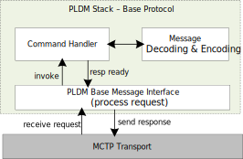
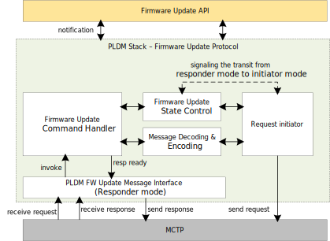
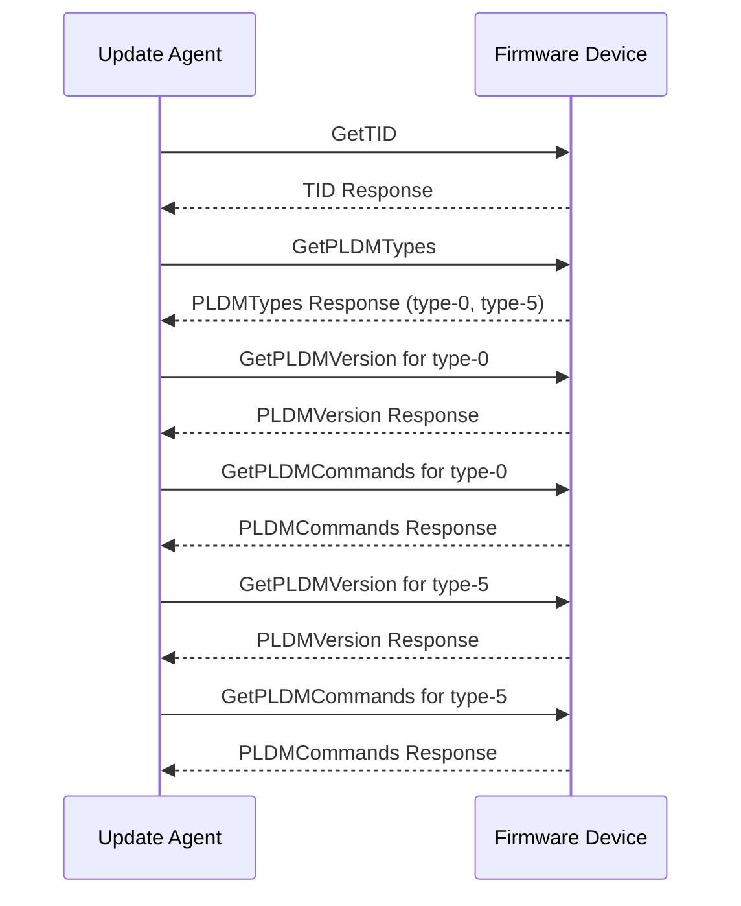
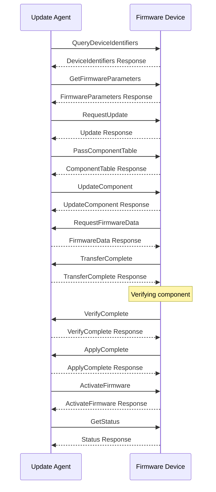
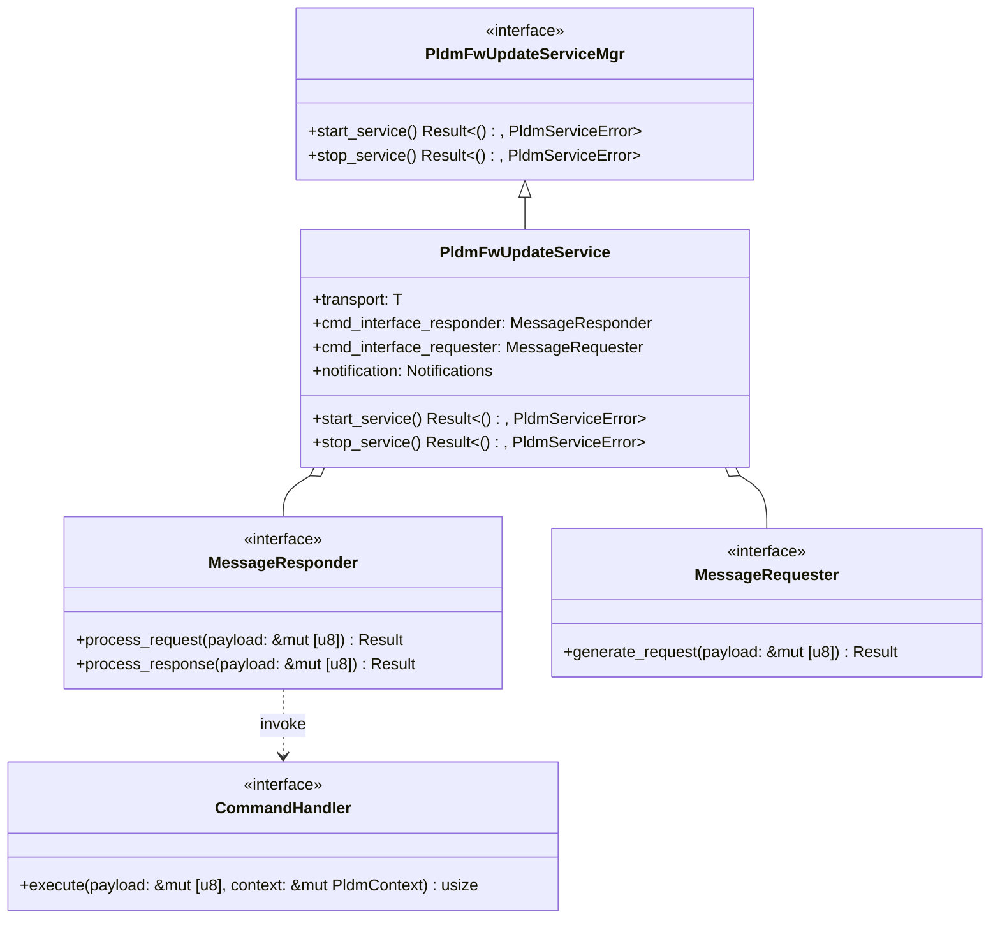

# PLDM Stack

## Overview

The Platform Level Data Model (PLDM) is a suite of specifications that define a common data model and message formats for communication between management controllers and managed devices. It is designed to standardize the way devices communicate in a platform management environment, enabling interoperability and simplifying the management of hardware components. In the context of Caliptra MCU, [PLDM Base Protocol](https://www.dmtf.org/sites/default/files/standards/documents/DSP0240_1.1.0.pdf) and [PLDM for Firmware Update Protocol](https://www.dmtf.org/sites/default/files/standards/documents/DSP0267_1.3.0.pdf) are supported by the PLDM stack to facilitate the following use cases:

- **PLDM message control and discovery**: This feature enables the device to be discovered by the platform management controller (typically a BMC) following MCTP enumeration. It forms the foundation for running other PLDM protocols.

- **Streaming boot remainder firmware**: The PLDM firmware update protocol defines standardized messages and data structures for obtaining firmware code and data. The MCU leverages it to stream boot the remainder firmware, which is any vendor-specific SoC or other firmware. There are several customized amendments to the PLDM firmware update specification to enable streaming boot and automatic activation. Details are available in the OCP whitepaper, [Flashless Boot using OCP, PCIe, and DMTF Standards](https://docs.google.com/document/d/1cjdgcKgOzcug5bBoK6k2Mw2mvsQJElp8bs0ec_xLZHc/edit?usp=sharing).

- **Impactless firmware update**: PLDM firmware update over MCTP is a well-established approach for firmware updates, supporting multiple firmware components within a single package. Updates can be applied to a subset of components supported by the Firmware Device (FD), which is a valuable property to enable impactless updates. Details can be found in the [firmware update spec](https://github.com/chipsalliance/caliptra-mcu-sw/blob/main/docs/src/firmware_update.md).

## Architecture

The PLDM stack in MCU runtime is a modular implementation that supports the PLDM base protocol as a responder and the PLDM firmware update protocol as a Firmware Device (FD). It operates in the userspace of MCU runtime and interacts with the MCTP transport layer to handle communication.

### PLDM Stack for Base Protocol



- **PLDM service**
  - Listens for incoming PLDM requests.
  - Extracts the command opcode from the request and invokes the corresponding handler to process.
  - Sends the response via the MCTP transport layer.
- **Command handler**
  - Interacts with the message decoding library to decode the request.
  - Executes the command.
  - Encodes the response by interacting with the message encoding library.

## PLDM Stack for Firmware Update Protocol



- **PLDM service**
  - Listens for incoming firmware update requests and responses.
  - Extracts the command opcode from the request or response and invokes the corresponding handler to process.
  - Sends the response via the MCTP transport layer.

- **Firmware update service**
  - Firmware update command handler
    - Decodes the request or response.
    - Executes the appropriate actions based on the command and interacts with the state machine to trigger the state transition.
    - Encodes responses by interacting with the message encoding library.

  - Firmware update state control
    - Maintains the current state of the firmware update process.
    - Provides mechanisms to transition between different states, ensuring the correct sequence of operations.
    - Interacts with the firmware update service to manage state transitions based on the stage of the update process and signals the request initiator to process the outgoing request.

  - Request initiator
    - Listens for the signal from state control to process the outgoing request.
    - Interacts with the message encoding library to encode the request.

### PLDM Base Protocol Sequence

The table below shows the command codes of the base protocol that are supported by the PLDM stack as a responder.

| Command Name       | Command Code | Direction | Requirement |
|--------------------|--------------|-----------|-------------|
| `GetTID`           | `0x02`       | UA -> FD  | Mandatory   |
| `GetPLDMVersion`   | `0x03`       | UA -> FD  | Mandatory   |
| `GetPLDMTypes`     | `0x04`       | UA -> FD  | Mandatory   |
| `GetPLDMCommands`  | `0x05`       | UA -> FD  | Mandatory   |
| `SetTID`           | `0x01`       | UA -> FD  | Optional    |

The diagram below shows the PLDM message control and discovery sequence.


### PLDM Firmware Update Protocol Sequence

The table below shows the inventory commands and firmware update commands supported by the PLDM stack as FD.

| Command Name                   | Command Code | Direction | Requirement |
|--------------------------------|--------------|-----------|-------------|
| `QueryDeviceIdentifiers`       | `0x01`       | UA -> FD  | Mandatory   |
| `GetFirmwareParameters`        | `0x02`       | UA -> FD  | Mandatory   |
| `RequestUpdate`                | `0x10`       | UA -> FD  | Mandatory   |
| `PassComponentTable`           | `0x13`       | UA -> FD  | Mandatory   |
| `UpdateComponent`              | `0x14`       | UA -> FD  | Mandatory   |
| `RequestFirmwareData`          | `0x15`       | FD -> UA  | Mandatory   |
| `TransferComplete`             | `0x16`       | FD -> UA  | Mandatory   |
| `VerifyComplete`               | `0x17`       | FD -> UA  | Mandatory   |
| `ApplyComplete`                | `0x18`       | FD -> UA  | Mandatory   |
| `GetMetaData`                  | `0x19`       | FD -> UA  | Mandatory   |
| `ActivateFirmware`             | `0x1A`       | UA -> FD  | Mandatory   |
| `GetStatus`                    | `0x1B`       | UA -> FD  | Mandatory   |
| `CancelUpdateComponent`        | `0x1C`       | UA -> FD  | Mandatory   |
| `CancelUpdate`                 | `0x1D`       | UA -> FD  | Mandatory   |

The diagram below shows a complete PLDM firmware update sequence:


## Interface

The PLDM stack is designed as a library that supports the PLDM base protocol as a responder and the PLDM firmware update protocol as a Firmware Device (FD). The diagram below shows the interface and components inside the stack. `PldmFwUpdateServiceMgr` serves as the interface between the PLDM stack and upper-level APIs, such as Firmware Update and Streaming Boot.



```Rust
/// Trait representing a PLDM Firmware Update Service Manager.
///
/// This trait defines the necessary methods to start and stop the PLDM firmware update service.
///
/// # Methods
///
/// * `start_service` - Asynchronously starts the PLDM firmware update service.
///    This method creates an async task to listen for and process incoming requests.
/// * `stop_service` - Asynchronously stops the PLDM firmware update service.
///
/// # Errors
///
/// Both methods return a `Result` which, on error, contains a `PldmServiceError`.
pub trait PldmFwUpdateServiceMgr {
    async fn start_service(&self) -> Result<(), PldmServiceError>;
    async fn stop_service(&self) -> Result<(), PldmServiceError>;
}
pub struct PldmServiceError(pub NonZeroU32);

/// Represents a PLDM Firmware Update Service.
///
/// This struct is responsible for handling the PLDM firmware update process
/// using the specified transport, message responder, and message requester.
///
/// # Type Parameters
///
/// * `T` - A type that implements the `Mctp` trait, representing the transport layer.
/// * `U` - A type that implements the `MessageResponder` trait, representing the command interface responder.
/// * `R` - A type that implements the `MessageRequester` trait, representing the command interface requester.
/// * `N` - A type that implements the `Notifications` trait, representing the notification interface.
///
/// # Fields
///
/// * `transport` - The transport layer used for communication.
/// * `cmd_interface_responder` - The command interface responder.
/// * `cmd_interface_requester` - The command interface requester.
/// *  `notification` - The notification interface to upper API.
/// * `other fields` - Additional fields required for the service.
pub struct PldmFwUpdateService<T: Mctp, U: MessageResponder, R: MessageRequester, N: Notifications> {
    transport: T,
    cmd_interface_responder: U,
    cmd_interface_requester: R,
    notifications: N,
    // other fields
}

/// Trait representing the notification interface for the PLDM firmware update service.
///
/// This trait defines the necessary methods that will be called by the `PldmFwUpdateService`
/// to notify the upper-level API of specific events during the firmware update process.
pub trait Notifications {
    fn on_request_update_received(&self, payload: &[u8]) -> Result<(), ErrCode>;
    fn on_image_verify(&self, payload: &[u8]) -> Result<(), ErrCode>;
    fn on_image_apply(&self, payload: &[u8]) -> Result<(), ErrCode>;
    fn on_update_component_received(&self, payload: &[u8]) -> Result<(), ErrCode>;
    fn on_activate_firmware_received(&self, payload: &[u8]) -> Result<(), ErrCode>;
}

impl PldmFwUpdateServiceMgr for PldmFwUpdateService {
    async fn start_service(&self) -> Result<(), PldmServiceError> {};
    async fn stop_service(&self) -> Result<(), PldmServiceError> {};
}

/// Trait representing a message responder that can process requests and responses asynchronously.
///
/// # Required Methods
///
/// - `process_request(&self, payload: &mut [u8]) -> Result<usize, MessageHandlerError>`:
///   Processes an incoming request message.
///   - `payload`: A mutable reference to the payload data to be processed.
///   - Returns a `Result` containing the size of the processed data or a `MessageHandlerError`.
///
/// - `process_response(&self, payload: &mut [u8]) -> Result<usize, MessageHandlerError>`:
///   Processes an incoming response message.
///   - `payload`: A mutable reference to the payload data to be processed.
///   - Returns a `Result` containing the size of the processed data or a `MessageHandlerError`.
///
/// # Errors
///
/// Both methods return a `Result` which, on failure, contains a `MessageHandlerError`.
pub trait MessageResponder: Send + Sync {
    async fn process_request(&self, payload: &mut [u8]) -> Result<usize, MessageHandlerError>;
    async fn process_response(&self, payload: &mut [u8]) -> Result<usize, MessageHandlerError>;
}

/// Trait representing a message requester that can generate requests asynchronously.
pub trait MessageRequester: Send + Sync {
    /// Asynchronously generates a request with the given payload.
    ///
    /// # Arguments
    ///
    /// * `payload` - A mutable reference to a byte slice that will be used to generate the request.
    ///
    /// # Returns
    ///
    /// A `Result` containing the size of the generated request on success, or a `MessageHandlerError` on failure.
    async fn generate_request(&self, payload: &mut [u8]) -> Result<usize, MessageHandlerError>;
}
pub struct MessageHandlerError(pub NonZeroU32);

/// Trait representing a command handler that can execute commands asynchronously.
///
/// # Required Methods
///
/// - `execute(&self, payload: &mut [u8], context: &mut PldmContext) -> usize`:
///   Executes a command with the given payload and context.
///   - `payload`: A mutable reference to the payload data to be processed.
///   - `context`: A mutable reference to the PLDM context.
///   - Returns the size of the processed data.
pub trait CommandHandler: Send + Sync {
    async fn execute(&self, payload: &mut [u8], context: &mut PldmContext) -> usize;
}

/// Represents a PLDM Command Interface Responder.
///
/// This struct is responsible for handling the PLDM command interface
/// by maintaining a collection of command handlers and the PLDM context.
///
/// # Fields
///
/// * `handlers` - A heapless hash table that maps command codes to their respective command handlers.
/// * `context` - The PLDM context used for processing commands.
/// * `other fields` - Additional fields required for the command interface responder.
pub struct CmdInterfaceResponder<'a, const N: usize> {
    handlers: heapless::FnvIndexMap<u8, &'a dyn CommandHandler, N>,
    context: PldmContext,
    // Other fields
}

pub struct CmdInterfaceRequester<'a, const N: usize> {
    handlers: heapless::FnvIndexMap<u8, &'a dyn CommandHandler, N>,
    // Other fields
}

```
