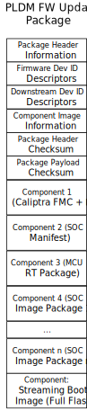

## PLDM Update Package

This section describes the PLDM Update Package used for Caliptra streaming boot and firmware update.

The update package follows the [DMTF Firmware Update Specification v.1.3.0](https://www.dmtf.org/sites/default/files/standards/documents/DSP0267_1.3.0.pdf).

The PLDM FW Update Package contains:

1. Caliptra FMC (First Mutable Code) and RT (Runtime) Image Bundle
2. The SOC Manifest for the MCU RT image and other SOC Images
3. The MCU RT image
4. Other SOC Images, if any
5. A full image of the flash containing all images (see [SPI Flash Layout Documentation](https://github.com/chipsalliance/caliptra-mcu-sw/blob/main/docs/src/flash_layout.md))

*Note: All fields are little endian unless specified*

### Package Header Information

| Field                       | Size     | Definition                                                                                                                                                                                                                                             |
| --------------------------- | -------- | ------------------------------------------------------------------------------------------------------------------------------------------------------------------------------------------------------------------------------------------------------ |
| PackageHeaderIdentifier     | 16       | Set to 7B291C996DB64208801B0202E6463C78 (v1.3.0 UUID) This field is Big Endian.                                                                                                                                                                   |
| PackageHeaderFormatRevision | 1        | Set to 0x04 (v1.3.0 header format revision)                                                                                                                                                                                                            |
| PackageHeaderSize           | 2        | The total byte count of this header structure, including fields within the Package Header Information, Firmware Device Identification Area, Downstream Device Identification Area,  Component Image Information Area, and Checksum sections. |
| PackageReleaseDateTime      | 13       | The date and time when this package was released. Refer to the PLDM Base Specification for field format definition.                                                                                                                               |
| ComponentBitmapBitLength    | 2        | Number of bits used to represent the bitmap in the ApplicableComponents field for a matching device. This value is a multiple of 8 and is large enough to contain a bit for each component in the package.                                        |
| PackageVersionStringType    | 1        | The type of string used in the PackageVersionString field. Refer to [DMTF Firmware Update Specification v.1.3.0](https://www.dmtf.org/sites/default/files/standards/documents/DSP0267_1.3.0.pdf) Table 33 for values.                               |
| PackageVersionStringLength  | 1        | Length, in bytes, of the PackageVersionString field.                                                                                                                                                                                                   |
| PackageVersionString        | Variable | Package version information, up to 255 bytes. Contains a variable type string describing the version of this firmware update package.                                                                                                             |

### Firmware Device ID Descriptor

| Field                                | Size     | Definition                                                                                                                                                                                                                                                                                                                                                                              |
| ------------------------------------ | -------- | --------------------------------------------------------------------------------------------------------------------------------------------------------------------------------------------------------------------------------------------------------------------------------------------------------------------------------------------------------------------------------------- |
| RecordLength                         | 2        | The total length in bytes for this record. The length includes the RecordLength, DescriptorCount, DeviceUpdateOptionFlags,  ComponentImageSetVersionStringType, ComponentSetVersionStringLength,  FirmwareDevicePackageDataLength, ApplicableComponents,  ComponentImageSetVersionString, RecordDescriptors,  and FirmwareDevicePackageData fields.            |
| DescriptorCount                      | 1        | The number of descriptors included within the RecordDescriptors field for this record.                                                                                                                                                                                                                                                                                                  |
| DeviceUpdateOptionFlags              | 4        | 32-bit field where each bit represents an update option.  bit1 is set to 1 (Support Flashless/Streaming Boot)  For other options, refer to DeviceUpdateOptionFlags description in [DMTF Firmware Update Specification v.1.3.0](https://www.dmtf.org/sites/default/files/standards/documents/DSP0267_1.3.0.pdf).                                                      |
| ComponentImageSetVersionStringType   | 1        | The type of string used in the ComponentImageSetVersionString field. Refer to [DMTF Firmware Update Specification v.1.3.0](https://www.dmtf.org/sites/default/files/standards/documents/DSP0267_1.3.0.pdf) Table 33 for values.                                                                                                                                                      |
| ComponentImageSetVersionStringLength | 1        | Length, in bytes, of the ComponentImageSetVersionString.                                                                                                                                                                                                                                                                                                                                |
| FirmwareDevicePackageDataLength      | 2        | Length in bytes of the FirmwareDevicePackageData field. If no data is provided, set to 0x0000.                                                                                                                                                                                                                                                                                     |
| ReferenceManifestLength              | 4        | Length in bytes of the ReferenceManifestData field. If no data is provided, set to 0x00000000.                                                                                                                                                                                                                                                                                     |
| ApplicableComponents                 | Variable | Bitmap indicating which firmware components apply to devices matching this Device Identifier record.  A set bit indicates the Nth component in the payload is applicable to this device.  bit 0: Caliptra FMC + RT bit 1: SOC Manifest bit 2 : MCU RT bit 3 to n: Reserved for other SOC images bit n+1: Full SPI Flash image used in streaming boot |
| ComponentImageSetVersionString       | Variable | Component Image Set version information, up to 255 bytes. Describes the version of component images applicable to the firmware device indicated in this record.                                                                                                                                                                                                                    |
| RecordDescriptors                    | Variable | These descriptors are defined by the vendor (i.e. integrators of Caliptra ROT) Refer to [DMTF Firmware Update Specification v.1.3.0](https://www.dmtf.org/sites/default/files/standards/documents/DSP0267_1.3.0.pdf) Table 7 for details of these fields and the values that can be selected.                                                                                       |
| FirmwareDevicePackageData            | Variable | Optional data provided within the firmware update package for the FD during the update process. If FirmwareDevicePackageDataLength is 0x0000, this field contains no data.                                                                                                                                                                                                         |
| ReferenceManifestData                | Variable | Optional data field containing a Reference Manifest for the firmware update. If present, it describes the firmware update provided by this package.  If ReferenceManifestLength is 0x00000000, this field contains no data.                                                                                                                                                   |

### Downstream Device ID Descriptor

There are no Downstream Device ID records for this package

| Field                         | Size | Definition |
| ----------------------------- | ---- | ---------- |
| DownstreamDeviceIDRecordCount | 1    | 0          |

### Component Image Information

| Field                     | Size     | Definition                                                                                    |
| ------------------------- | -------- | --------------------------------------------------------------------------------------------- |
| ComponentImageCount       | 2        | Count of individually defined component images contained within this firmware update package. |
| ComponentImageInformation | Variable | Contains details for each component image within this firmware update package.                |

### Component Image Information Record

| Field                              | Size     | Definition                                                                                                                                                                                                                                                                                                |
| ---------------------------------- | -------- | --------------------------------------------------------------------------------------------------------------------------------------------------------------------------------------------------------------------------------------------------------------------------------------------------------- |
| ComponentClassification            | 2        | 0x000A :For Caliptra FMC+RT  (Firmware) 0x0001: For SOC Manifest  (Other) 0x000A: For MCU RT: (Firmware) For other SOC images, Refer to [DMTF Firmware Update Specification v.1.3.0](https://www.dmtf.org/sites/default/files/standards/documents/DSP0267_1.3.0.pdf) Table 32 for values. |
| ComponentIdentifier                | 2        | Unique value selected by the FD vendor to distinguish between component images. 0x0001: Caliptra FMC+RT  0x0002: SOC Manifest:  0x0003: MCU RT 0x1000-0xFFFF - Reserved for other Vendor-defined SOC images                                                                         |
| ComponentComparisonStamp           | 4        | Value used as a comparison in determining if a firmware component is down-level or up-level. When ComponentOptions bit 1 is set, this field should use a comparison stamp format (e.g., MajorMinorRevisionPatch).  If not set, use 0xFFFFFFFF.                                                  |
| ComponentOptions                   | 2        | Refer to ComponentOptions definition in[DMTF Firmware Update Specification v.1.3.0](https://www.dmtf.org/sites/default/files/standards/documents/DSP0267_1.3.0.pdf)                                                                                                                                          |
| RequestedComponentActivationMethod | 2        | Refer to RequestedComponentActivationMethoddefinition in[DMTF Firmware Update Specification v.1.3.0](https://www.dmtf.org/sites/default/files/standards/documents/DSP0267_1.3.0.pdf)                                                                                                                         |
| ComponentLocationOffset            | 4        | Offset in bytes from byte 0 of the package header to where the component image begins.                                                                                                                                                                                                                    |
| ComponentSize                      | 4        | Size in bytes of the Component image.                                                                                                                                                                                                                                                                     |
| ComponentVersionStringType         | 1        | Type of string used in the ComponentVersionString field. Refer to[DMTF Firmware Update Specification v.1.3.0](https://www.dmtf.org/sites/default/files/standards/documents/DSP0267_1.3.0.pdf) Table 33 for values.                                                                                          |
| ComponentVersionStringLength       | 1        | Length, in bytes, of the ComponentVersionString.                                                                                                                                                                                                                                                          |
| ComponentVersionString             | Variable | Component version information, up to 255 bytes. Contains a variable type string describing the component version.                                                                                                                                                                                         |
| ComponentOpaqueDataLength          | 4        | Length in bytes of the ComponentOpaqueData field. If no data is provided, set to 0x00000000.                                                                                                                                                                                                              |
| ComponentOpaqueData                | Variable | Optional data transferred to the FD/FDP during the firmware update                                                                                                                                                                                                                                        |
|                                    |          |                                                                                                                                                                                                                                                                                                           |

## Checksum

| Field                  | Size | Definition                                                                                                                                                                                                                                                                                                                                                                                                                                          |
| ---------------------- | ---- | --------------------------------------------------------------------------------------------------------------------------------------------------------------------------------------------------------------------------------------------------------------------------------------------------------------------------------------------------------------------------------------------------------------------------------------------------- |
| PackageHeaderChecksum  | 4    | The integrity checksum of the PLDM Package Header. It is calculated starting at the first byte of the PLDM Firmware Update Header and includes all bytes of the package header structure except for the bytes in this field and the PackagePayloadChecksum field. The CRC-32 algorithm with polynomial `0x04C11DB7` (as used by IEEE 802.3) is used for checksum computation, processing one byte at a time with the least significant bit first. |
| PackagePayloadChecksum | 4    | The integrity checksum of the PLDM Package Payload. It is calculated starting at the first byte immediately following this field and includes all bytes of the firmware package payload structure, including any padding between component images. The CRC-32 algorithm with polynomial `0x04C11DB7` (as used by IEEE 802.3) is used for checksum computation, processing one byte at a time with the least significant bit first.               |

## Component 1 - Caliptra FMC + RT

This is the package bundle for the Caliptra FMC + RT defined in [Caliptra Firmware Image Bundle Format](https://github.com/chipsalliance/caliptra-sw/blob/main-2.x/rom/dev/README.md#firmware-image-bundle))

## Component 2 - SOC Manifest

This is the SOC Manifest defined in [SOC Manifest](https://github.com/chipsalliance/caliptra-sw/blob/main-2.x/auth-manifest/README.md).

It provides the signature verification and specific data needed to decode the image.

## Component 3 - MCU RT

This is the Image binary of the MCU Realtime firmware.

## Component 4 to n - SOC Images

These are reserved for vendor SOC images, if any.

## Component n + 1 - Full SPI Flash image

This component contains the full flash image as defined in the [SPI Flash Layout Documentation](https://github.com/chipsalliance/caliptra-mcu-sw/blob/main/docs/src/flash_layout.md) from the Header section until the end of the images section. This is can be used for loading all the images at once for streaming boot.
