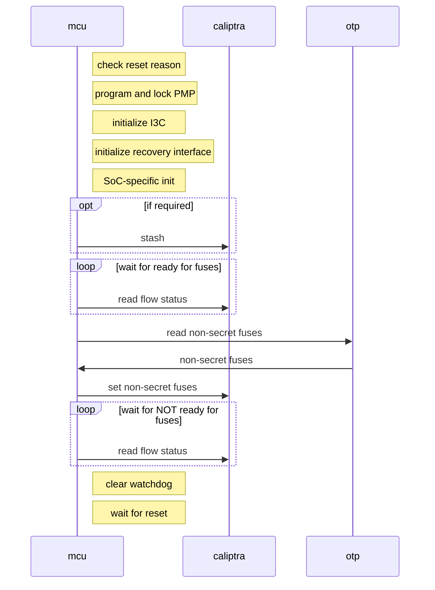

# ROM Specification

The ROM is executed when the MCU starts.

The ROM's main responsibilities to the overall Caliptra subsystem are to:

* Send non-secret fuses to Caliptra core
* Initialize I3C and the firmware recovery interface
* Jump to firmware

It can also handle any other custom SoC-specific initialization that needs to happen early.

## Boot Flows

There are three main boot flows that needs to execute for its role in the Caliptra subsystem:

* Cold Boot Flow
* Firmware Update Flow
* Warm Reset Flow

These are selected based on the MCI `RESET_REASON` register that is set by hardware whenver the MCU is reset.

### Cold Boot Flow

1. Check the MCI `RESET_REASON` register for MCU status (it should be in cold boot mode)
1. Program and lock PMP registers
1. Initialize I3C registers according to the [initialization sequence](https://chipsalliance.github.io/i3c-core/initialization.html).
1. Initialize I3C recovery interface [initialization sequence](https://chipsalliance.github.io/i3c-core/recovery_flow.html).
1. Anything SoC-specific can happen here
    1. Stash to Caliptra if required (i.e., if any security-sensitive code is loaded, such as PLL programming or configuration loading)
1. Read Caliptra SoC `FLOW_STATUS` register to wait for Caliptra Ready for Fuses state
1. Read non-secret fuse registers from creator SW OTP partition in OpenTitan OTP controller. The list of fuses and their sizes are reproduced here, but the authoritative fuse map is contained in [the main Caliptra specification](https://github.com/chipsalliance/Caliptra/blob/main/doc/Caliptra.md#fuse-map).
    * `KEY MANIFEST PK HASH`: 384 bits
    * `ECC REVOCATION (KEY MANIFEST PK HASH MASK)`: 4 bits
    * `OWNER PK HASH`: 384 bits
    * `FMC KEY MANIFEST SVN`: 32 bits
    * `RUNTIME SVN`: 128 bits
    * `ANTI-ROLLBACK DISABLE`: 1 bits
    * `IDEVID CERT IDEVID ATTR`: 768 bits
    * `IDEVID MANUF HSM IDENTIFIER`: 128 bits
    * `LIFE CYCLE`: 2 bits
    * `LMS REVOCATION`: 32 bits
    * `MLDSA REVOCATION`: 4 bits
    * `SOC STEPPING ID`: 16 bits
    * `MANUF_DEBUG_UNLOCK_TOKEN`: 128 bits
1. Write fuse data to Caliptra SoC interface fuse registers.
1. Poll on Caliptra `FLOW_STATUS` registers for Caliptra to deassert the Ready for Fuses state.
1. Clear the watchdog timer
1. Wait for reset to trigger firmware update flow.

The main Caliptra ROM and runtime will continue executing and push the MCU runtime firmware to its SRAM, set the MCI register stating that the firmware is ready, and reset the MCU.

### Firmware Update Flow

1. Check the MCI `RESET_REASON` register for MCU status (it should be in firmware update mode)
1. Program and lock PMP registers
1. Anything SoC-specific can happen here
    1. Do stash if required
1. Jump to runtime firmware

### Warm Reset Flow

This is currently the same as the firmware update flow.

### Failures

On any fatal or non-fatal failure, MCU ROM can use the MCI registers `FW_ERROR_FATAL` and `FW_ERROR_NON_FATAL` to assert the appropriate errors.

In addition, SoC-specific failure handling may occur.

There will also be a watchdog timer running to ensure that the MCU is reset if not the ROM flow is not progressing properly.