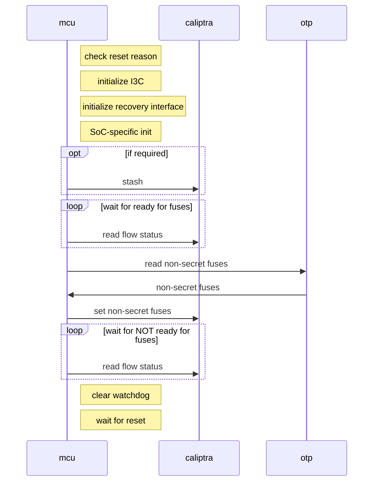
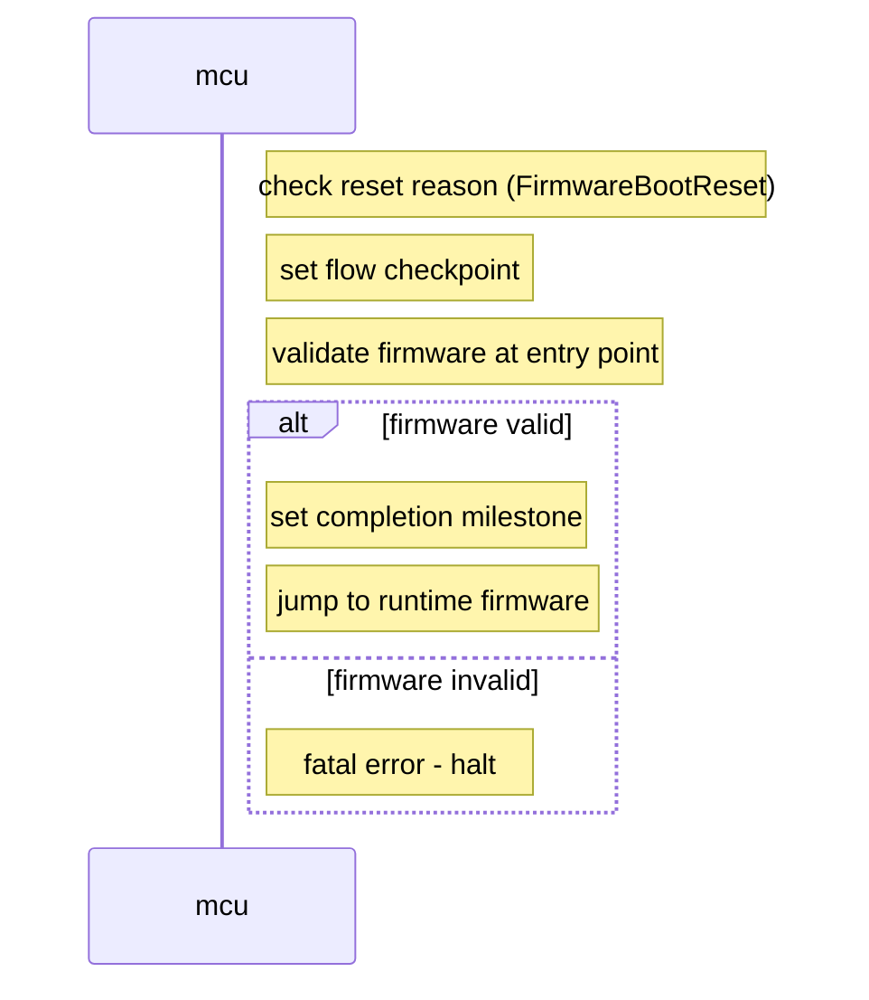
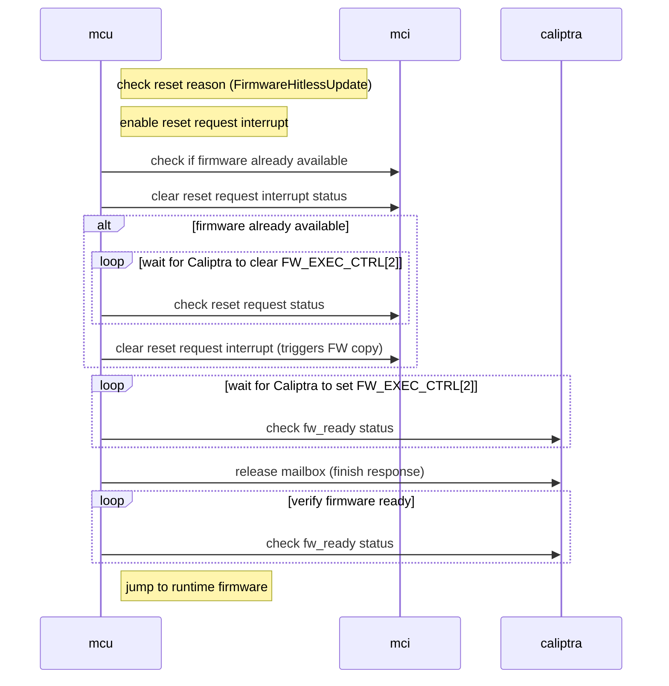
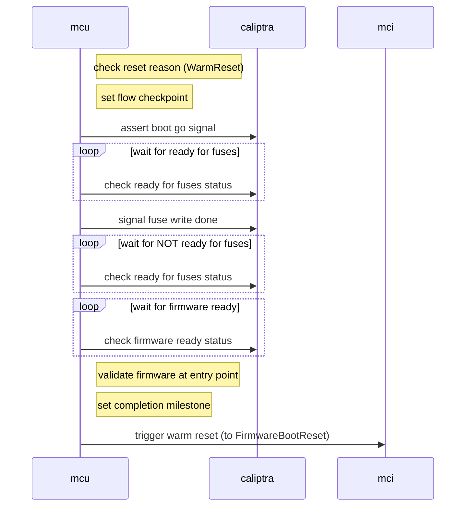

# Reference ROM Specification

The reference ROM is executed when the MCU starts.

The ROM's main responsibilities to the overall Caliptra subsystem are to:

* Send non-secret fuses to Caliptra core
* Initialize I3C and the firmware recovery interface
* Jump to firmware

It can also handle any other custom SoC-specific initialization that needs to happen early.

## Boot Flows

There are three main boot flows that needs to execute for its role in the Caliptra subsystem:

* Cold Boot Flow
* Firmware Update Flow
* Warm Reset Flow

These are selected based on the MCI `RESET_REASON` register that is set by hardware whenver the MCU is reset.

### Cold Boot Flow

1. Check the MCI `RESET_REASON` register for MCU status (it should be in cold boot mode)
1. Initialize I3C registers according to the [initialization sequence](https://chipsalliance.github.io/i3c-core/initialization.html).
1. Initialize I3C recovery interface [initialization sequence](https://chipsalliance.github.io/i3c-core/recovery_flow.html).
1. Anything SoC-specific can happen here
    1. Stash to Caliptra if required (i.e., if any security-sensitive code is loaded, such as PLL programming or configuration loading)
1. Read Caliptra SoC `FLOW_STATUS` register to wait for Caliptra Ready for Fuses state
1. Read non-secret fuse registers from creator SW OTP partition in OpenTitan OTP controller. The list of fuses and their sizes are reproduced here, but the authoritative fuse map is contained in [the main Caliptra specification](https://github.com/chipsalliance/Caliptra/blob/main/doc/Caliptra.md#fuse-map).
    * `KEY MANIFEST PK HASH`: 384 bits
    * `ECC REVOCATION (KEY MANIFEST PK HASH MASK)`: 4 bits
    * `OWNER PK HASH`: 384 bits
    * `FMC KEY MANIFEST SVN`: 32 bits
    * `RUNTIME SVN`: 128 bits
    * `ANTI-ROLLBACK DISABLE`: 1 bits
    * `IDEVID CERT IDEVID ATTR`: 768 bits
    * `IDEVID MANUF HSM IDENTIFIER`: 128 bits
    * `LIFE CYCLE`: 2 bits
    * `LMS REVOCATION`: 32 bits
    * `MLDSA REVOCATION`: 4 bits
    * `SOC STEPPING ID`: 16 bits
    * `MANUF_DEBUG_UNLOCK_TOKEN`: 128 bits
1. Write fuse data to Caliptra SoC interface fuse registers.
1. Poll on Caliptra `FLOW_STATUS` registers for Caliptra to deassert the Ready for Fuses state.
1. Clear the watchdog timer
1. Wait for reset to trigger firmware update flow.

The main Caliptra ROM and runtime will continue executing and push the MCU runtime firmware to its SRAM, set the MCI register stating that the firmware is ready, and reset the MCU.

### Firmware Boot Flow

This flow is used to boot the MCU into the MCU Runtime Firmware following either a cold or warm reset. It ensures that the runtime firmware is properly loaded and ready for execution.

1. Check the MCI `RESET_REASON` register for MCU status (it should be in firmware boot reset mode `FirmwareBootReset`)
1. Set flow checkpoint to indicate firmware boot flow has started
1. Validate that firmware was actually loaded by checking the firmware entry point is not zero
1. Set flow milestone to indicate firmware boot flow completion
1. Jump directly to runtime firmware at the configured SRAM offset

### Hitless Firmware Update Flow

Hitless Update Flow is triggered when MCU runtime FW requests an update of the MCU FW by sending the `ACTIVATE_FIRMWARE` mailbox command to Caliptra. Upon receiving the mailbox command, Caliptra will initialize the MCU reset sequence causing the MCU to boot to ROM and run the Hitless Firmware Update Flow.

1. Check the MCI `RESET_REASON` register for reset status (it should be in hitless firmware update mode `FirmwareHitlessUpdate`).
1. Enable the `notif_cptra_mcu_reset_req_sts` interrupt.
1. Check if firmware is already available by reading the interrupt status
1. Clear `notif_cptra_mcu_reset_req_sts` interrupt status
1. If firmware is available:
    1. Wait for Caliptra to clear FW_EXEC_CTRL[2]. This will be indicated when `notif_cptra_mcu_reset_req_sts` interrupt status bit is set
    1. Clear the `notif_cptra_mcu_reset_req_sts` interrupt. This triggers Caliptra to copy MCU FW from the staging area to MCU SRAM.
1. Wait for Caliptra to set FW_EXEC_CTRL[2].
1. Release Caliptra mailbox. Hitless Update is triggered by a mailbox command from MCU to Caliptra which causes it to reboot to ROM, therefore the mailbox needs to be released after the update is complete.
1. Jump to runtime firmware at the configured SRAM offset

### Warm Reset Flow

Warm Reset Flow occurs when the subsystem reset is toggled while `powergood` is maintained high. This is allowed when MCU and Caliptra already loaded their respective mutable firmware, prior to the warm reset. MCU and Caliptra FW will not be reloaded in this flow.

1. Check the MCI `RESET_REASON` register for reset status (it should be in warm reset mode `WarmReset`)
1. Assert Caliptra boot go signal to bring Caliptra out of reset.
1. Wait for Caliptra to be ready for fuses (even though fuses won't be rewritten)
1. Signal fuse write done to Caliptra to complete the fuse handshake protocol
1. Wait for Caliptra to deassert ready for fuses state
1. Wait for Caliptra to indicate that MCU firmware is ready in SRAM
1. Validate that firmware was actually loaded by checking the firmware entry point is not zero
1. Set flow checkpoint and milestone to indicate warm reset flow completion
1. Trigger a warm reset to transition to `FirmwareBootReset` flow which will jump to the firmware

### Failures

On any fatal or non-fatal failure, MCU ROM can use the MCI registers `FW_ERROR_FATAL` and `FW_ERROR_NON_FATAL` to assert the appropriate errors.

In addition, SoC-specific failure handling may occur.

There will also be a watchdog timer running to ensure that the MCU is reset if not the ROM flow is not progressing properly.