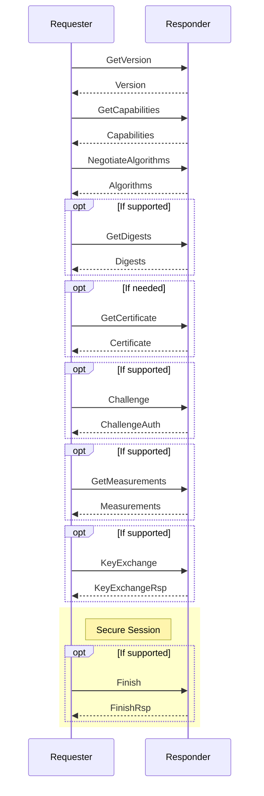

# SPDM
The Security Protocol and Data Model (SPDM) is a protocol designed to ensure secure communication between hardware components by focusing on mutual authentication and the establishment of secure channels over potentially insecure media. SPDM enables devices to verify each other's identities and configurations, leveraging X.509v3 certificates to ensure cryptographic security. Designed for interoperability, it can work across various transport and physical media, often utilizing the Management Component Transport Protocol (MCTP). This protocol is especially valuable in environments where secure hardware communication is crucial, such as data centers and enterprise systems.

## Specifications:
| Specification                                   | Document Link |
|-------------------------------------------------|---------------|
| Security Protocol and Data Model                | [DSP0274](https://www.dmtf.org/sites/default/files/standards/documents/DSP0274_1.3.2.pdf)  |
| Secured Messages using SPDM                     | [DSP0277](https://www.dmtf.org/sites/default/files/standards/documents/DSP0277_1.2.0.pdf)  |
| SPDM over MCTP Binding Specification            | [DSP0275](https://www.dmtf.org/sites/default/files/standards/documents/DSP0275_1.0.2.pdf)  |
| Secured Messages using SPDM over MCTP Binding   | [DSP0276](https://www.dmtf.org/sites/default/files/standards/documents/DSP0276_1.2.0.pdf)  |

## SPDM Protocol Sequence


## Class Diagram

```plaintext
                   +----------------+
                   | MCTP Transport |
                   +--------+-------+
                            ^
                          processRequest() / sendResponse()
                            |
+--------------------+      |
| SPDM Responder     |<-----+
+--------------------+
| - transcriptMgr    |  processSecureMessage()
| - sessionMgr       |------------------------+
+--------------------+                        |
| + processRequest() |                        |
| + sendResponse()   |                        |
+--------------------+                        |
           |                                  |
           |                                  |
           v                                  v
+--------------------+                +--------------------+
| Transcript Manager |<---------------| Secure Session Mgr |
+--------------------+                +--------------------+
| + Trait Methods    |                | + TraitMethods     |
+--------------------+                | - transcriptMgr    |
                                      +--------------------+
```

## SPDM Responder
The Responder is responsible for receiving and processing requests from the Requestor. It authenticates the Requestor's identity, attests its own state and configuration, and establishes a secure communication channel. The Responder uses cryptographic techniques, such as validating X.509v3 certificates, to ensure the integrity and confidentiality of the exchanged data.

### Responder supported messages
The SPDM Responder supports the following messages:

| Message                | Description                                                                     |
|------------------------|---------------------------------------------------------------------------------|
| VERSION                | Retrieves version information                                                   |
| CAPABILITIES           | Retrieves SPDM capabilities                                                     |
| ALGORITHMS             | Retrieves the negotiated algorithms                                             |
| DIGESTS                | Retrieves digest of the certificate chains                                      |
| CERTIFICATE            | Retrieves certificate chains                                                    |
| MEASUREMENTS           | Retrieves measurements of elements such as intenral state                       |
| KEY_EXCHANGE_RSP       | Retrieves the responder's public key information                                |
| FINISH_RSP             | Provide key confirmation, bind the identity of each party to the exchanged keys |
| END_SESSION_ACK        | End session acknowledgment                                                      |
| ERROR                  | Error message                                                                   |


### Responder Interface
```Rust
pub struct SpdmResponder<T: MctpTransport, U: SpdmTranscriptManager, V: SpdmSecureSessionManager> {
    transport: T,
    transcript_manager: U,
    session_manager: V,
    data_buffer: [u8; MAX_SPDM_MESSAGE_SIZE],
}

impl<T: MctpTransport, U: SpdmTranscriptManager, V: SpdmSecureSessionManager> SpdmResponder<T, U, V> {
    pub fn new(transport: T, transcript_manager: U, session_manager: V) -> Self {
        SpdmResponder {
            transport,
            transcript_manager,
            session_manager,
            data_buffer: [0; MAX_SPDM_MESSAGE_SIZE],
        }
    }

    pub async fn handle_request(&mut self, request_info: u32) {
        // request_info: Bits[16:23] Message Type [SPDM | Secure SPDM]
    }
}

```

## Transcript Manager
The Transcript Manager is for managing the transcript and the transcript hash. The transcript is a sequential concatenation of prescribed full messages or message fields. The transcript hash is the cryptographic hash of this transcript, computed using the negotiated hash algorithm. This component ensures the integrity and authenticity of SPDM communications by managing these essential elements.

### Transcript Manager Interface
```Rust
pub trait SpdmTranscriptManager {
    /// Set the hash algorithm. The algorithm can be set only once.
    ///
    /// # Parameters
    /// - `hash_algo`: Hash algorithm to set.
    ///
    /// # Returns
    /// - `Result<(), SpdmError>`: Returns `Ok(())` if the hash algorithm was set, or an error code.
    fn set_hash_algo(&self, hash_algo: HashType) -> Result<(), SpdmError>;

    /// Set the SPDM negotiated version to be used for communication.
    ///
    /// # Parameters
    /// - `spdm_version`: SPDM negotiated version.
    fn set_spdm_version(&self, spdm_version: u8);

    /// Update the transcript with a message.
    ///
    /// # Parameters
    /// - `context_type`:        Transcript context to update.
    /// - `message`:             Message to add to the transcript.
    /// - `use_session_context`: Use session context to update an SPDM session transcript.
    /// - `session_idx`:         SPDM session index.
    ///
    /// # Returns
    /// - `Result<(), SpdmError>`: 
    /// Returns `Ok(())` if the message was added to the transcript successfully, or an error code.
    async fn update(
        &self,
        context_type: SpdmTranscriptManagerContextType, // [VCA, M1M2, L1L2, TH]
        message: &[u8],
        use_session_context: bool,
        session_idx: u8,
    ) -> Result<(), SpdmError>;

    /// Get the hash based on the hash type. The hashing operation is finished if `finish_hash` is set
    /// to `true`. In that case, an additional call to update will start a new hashing operation.
    /// If `finish_hash` is set to `false`, the hash is not finalized and can be updated with additional
    /// calls to update.
    ///
    /// # Parameters
    /// - `context_type`:        Transcript context type to get the hash from.
    /// - `finish_hash`:         Flag to indicate to finish the hash.
    /// - `use_session_context`: Use session context to update an SPDM session transcript.
    /// - `session_idx`:         SPDM session index.
    /// - `hash`:                Buffer to copy the hash to.
    ///
    /// # Returns
    /// - `Result<Vec<u8>, SpdmError>`: Returns the hash if the operation was successful, or an error code.
    fn get_hash(
        &self,
        context_type: SpdmTranscriptManagerContextType, // [VCA, M1M2, L1L2, TH]
        finish_hash: bool,
        use_session_context: bool,
        session_idx: u8,
        hash: &mut [u8]
    ) -> Result<(), SpdmError>;

    /// Reset a transcript context.
    ///
    /// # Parameters
    /// - `context_type`:        Transcript context to reset.
    /// - `use_session_context`: Use session context to update an SPDM session transcript.
    /// - `session_idx`:         SPDM session index.
    fn reset_transcript(
        &self,
        context_type: SpdmTranscriptManagerContextType, // [VCA, M1M2, L1L2, TH]
        use_session_context: bool,
        session_idx: u8,
    );
}
```

## SPDM Secure Session Manager
The SPDM Secure Session Manager is responsible for managing secure sessions within the SPDM protocol framework. It provides mechanisms to create, release, and retrieve secure sessions. The manager can set and query the state of a session, ensuring secure communication between devices. It generates necessary cryptographic keys, including shared secrets, handshake keys, and data keys, through asynchronous methods. Additionally, it verifies the integrity and optionally decrypts secure messages, and encodes messages with appropriate security measures. The manager also tracks session validity and can reset session states and identifiers as needed, ensuring robust and secure session management.

### Secure Session Manager Interface
```Rust
pub trait SpdmSecureSessionManager {
    /// Create a new SPDM secure session.
    ///
    /// # Parameters
    /// - `session_id`:      Session Id for the session.
    /// - `is_requester`:    True if the session is for the requester, false otherwise.
    /// - `connection_info`: SPDM connection info.
    ///
    /// # Returns
    /// - `Option<&SpdmSecureSession>`: 
    ///    A pointer to the created SPDM secure session or `None` if the session could not be created.
    fn create_session(
        &self,
        session_id: u32,
        is_requester: bool,
        connection_info: &SpdmConnectionInfo,
    ) -> Result<&SpdmSecureSession, SpdmError>;


    /// Release an SPDM secure session.
    ///
    /// # Parameters
    /// - `session_id`: Session Id for the session.
    fn release_session(&self, session_id: u32);

    /// Get an SPDM secure session.
    ///
    /// # Parameters
    /// - `session_id`: Session Id for the session.
    ///
    /// # Returns
    /// - `Option<&SpdmSecureSession>`: A pointer to the SPDM secure session or `None` if the session does not exist.
    fn get_session(& self, session_id: u32) -> Option<& SpdmSecureSession>;

    /// Set the session state for an SPDM secure session.
    ///
    /// # Parameters
    /// - `session_id`:    Session Id for the session.
    /// - `session_state`: Session state to set.
    fn set_session_state(&self, session_id: u32, session_state: SpdmSecureSessionState);

    /// Reset the Session Manager.
    fn reset(&self);

    /// Generate the shared secret from peer and local public keys.
    ///
    /// # Parameters
    /// - `session`:            SPDM session info.
    /// - `peer_pub_key_point`: Peer public key in point format.
    /// - `local_public_key`: Generated local public key in point format on return.
    ///
    /// # Returns
    /// - `Result<(), SpdmError>`:
    ///    Returns the local public key in point format if the shared secret is generated successfully, or an error code.
    fn generate_shared_secret(
        &self,
        session: &SpdmSecureSession,
        peer_pub_key_point: &EccPointPublicKey,
        local_public_key: &mut [u8]
    ) -> Result<(), SpdmError>;

    /// Generate handshake keys for an SPDM secure session.
    ///
    /// # Parameters
    /// - `session`: Secure Session.
    ///
    /// # Returns
    /// - `Result<(), SpdmError>`: Returns `Ok(())` if the handshake keys are generated successfully, or an error code.
    async fn generate_session_handshake_keys(&self, session: &mut SpdmSecureSession) -> Result<(), SpdmError>;

    /// Generate data keys for an SPDM secure session.
    ///
    /// # Parameters
    /// - `session`: SPDM Secure Session.
    ///
    /// # Returns
    /// - `Result<(), SpdmError>`: Returns `Ok(())` if the data keys are generated successfully, or an error code.
    async fn generate_session_data_keys(&self, session: &mut SpdmSecureSession) -> Result<(), SpdmError>;

    /// Query if the last session is active.
    ///
    /// # Returns
    /// - `bool`: True if the last session is active, false otherwise.
    fn is_last_session_id_valid(&self) -> bool;

    /// Get the last session id.
    ///
    /// # Returns
    /// - `u32`: Last session id.
    fn get_last_session_id(&self) -> u32;

    /// Reset the last session id validity.
    fn reset_last_session_id_validity(&self);

    /// Decode a secure message. This includes MAC verification and optionally decryption.
    ///
    /// # Parameters
    /// - `request`: SPDM request message to be decoded.
    ///
    /// # Returns
    /// - `Result<(), SpdmError>`: Returns `Ok(())` if the secure message is decoded successfully, or an error code.
    async fn decode_secure_message(&self, request: &mut [u8]) -> Result<(), SpdmError>;

    /// Encode a secure message. This includes MAC generation and optionally encryption.
    ///
    /// # Parameters
    /// - `response`: SPDM response message to be encoded.
    ///
    /// # Returns
    /// - `Result<(), SpdmError>`: Returns `Ok(())` if the secure message is encoded successfully, or an error code.
    async fn encode_secure_message(&self, response: &mut [u8]) -> Result<(), SpdmError>;
}
```