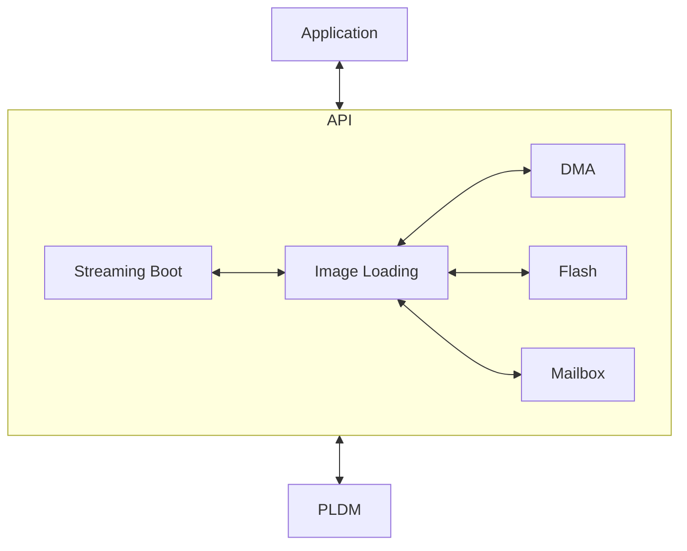
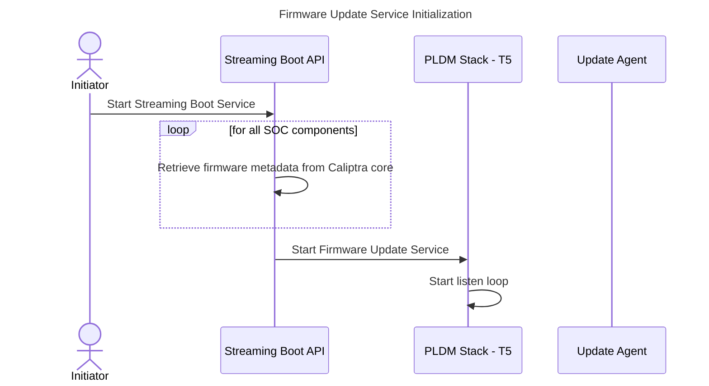
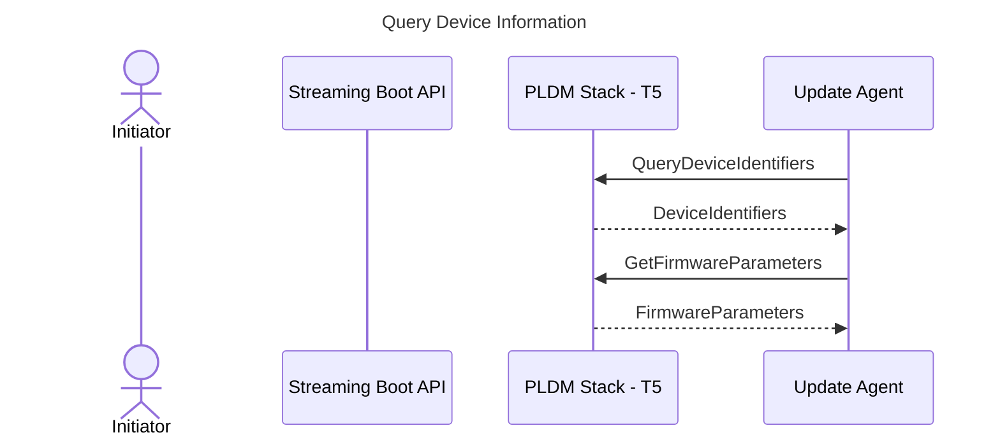
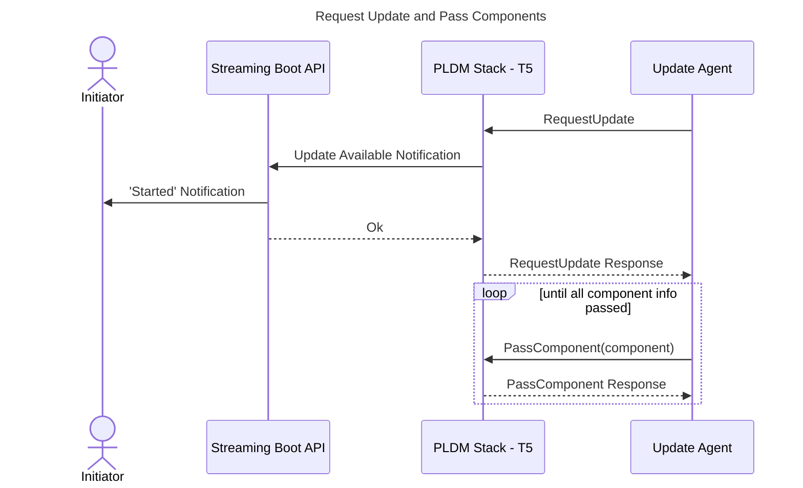
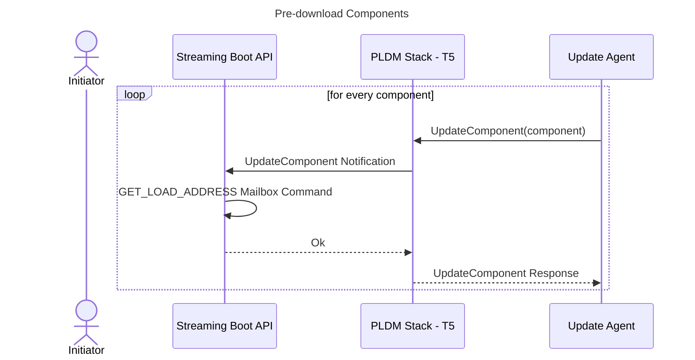
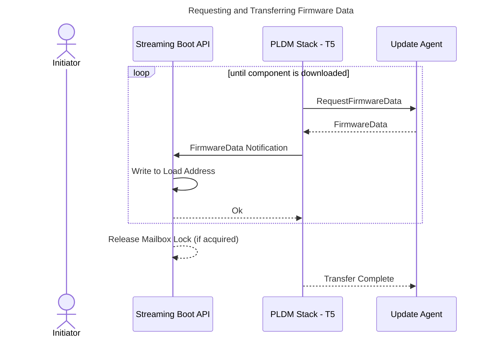
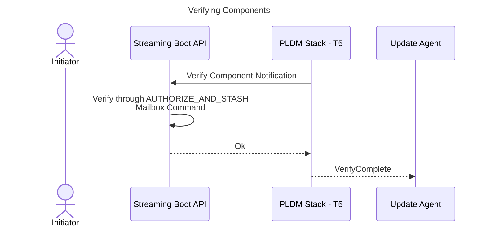
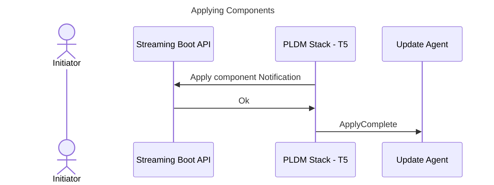
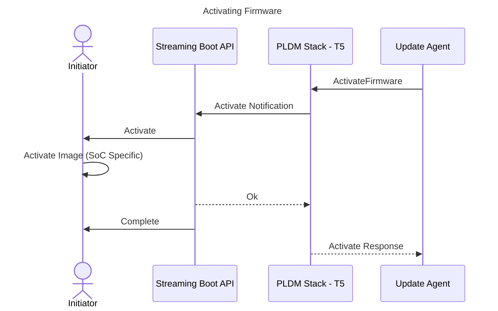

# Streaming Boot

## Overview

The purpose of the streaming boot service is to stream and load images from the PLDM - T5 update agent (e.g. BMC) to the custom SoC components. 

## Architecture

The MCU PLDM stack handles PLDM firmware messages from an external Firmware Update Agent. The stack generates upstream notifications to the Streaming Boot API to handle application-specific actions such as writing firmware chunks to the SoC Image Load Address through the Image Loading API.



## PLDM Firmware Download Sequence




### **Query Device Information**



### **Request Update and Pass Components**



### **Pre-download Components**



### **Requesting and Transferring Firmware Data**



### **Verifying Components**



### **Applying Components**

In PLDM - T5, this step is for writing the image to a permanent storage, but for streaming boot, this action is not needed. The only action needed is to inform the update agent of the ApplyComplete message.



### **Activating Firmware**



## Streaming Boot Steps

Note that these steps are performed by MCU RT.

1. After MCU RT boots up and while the SoC Components are held on reset, the main application will call start streaming boot through the Streaming Boot API. The application will need to specify the image_ids of the SoC Image that are intended to be streamed. MCU RT should query the information from Caliptra core needed to construct the DeviceIdentifies and FirmwareParameters messages as defined by DMTF DSP0267 1.3.0 specification. For Streaming Boot, the FirmwareParameters should only contain the components for the SoC Images. Streaming Boot API will ignore non-SoC Image components.
2. API will be notified by PLDM stack if firmware image is available for update (i.e. streaming boot).
3. API will be notified by PLDM stack which component is being downloaded using the UpdateComponent Notification. If the image is not a SoC Image, an error code should be returned to the Stack. If the component is a SoC Image, then the load address will be retrieved from the SoC Manifest stored in the Caliptra Core using a mailbox command.
4. FirmwareData notification will be notified by the PLDM stack to the API for every chunk of firmware received. This includies the data,size and the chunk offset. The chunk will be written to the load address determined from step 3.
5. Once all firmware chunks are downloaded, the PLDM stack will notify the API to verify the component the MCU will send the AUTHORIZE_AND_STASH command with an indication that the image to be verified is in the load area.
Note: The AUTHORIZE_AND_STASH command should compute the SHA of the image through the SHA-Acc by streaming the image from the load address to the SHA Acc through DMA. The computed SHA will then be compared against the SHA in the SoC Manifest for the particular image.
6. After verification, PLDM Stack will notify API to apply the image. Since there is no need to copy the image to another location, there are no actions for the MCU, and should return OK to the stack.
7. When Update Agent sends the 'ActivateFirmware' command, the API will send the application an 'Activate' notification, the application should then handle the downloaded image. This is SoC specific logic and may involve setting the corresponding Go bit in Caliptra register to start the SoC Component responsible for the image.


## Interfaces

```rust
pub trait StreamingBoot {

    /// Start streaming boot.
    /// 
    /// # Returns
    /// Returns a future that will remain unset until the service is stopped.
    /// Ok(()) - The service has been terminated successfully.
    /// Err(ErrorCode) - The service has been terminated with an error.
    async fn start(&self) -> Result<(), ErrorCode>;

    /// Register a callback to be called when a streaming boot event occurs.
    /// 
    /// # Arguments
    /// callback - The callback to be called when a streaming boot event occurs.
    fn register_callback(&self, callback: StreamingBootCallback);


}

/// Define the callback function signature for streaming boot events.
/// Returns Ok(()) if the notification is handled successfully, otherwise an error code.
pub type StreamingBootCallback = fn(StreamingBootNotification) -> Result<(),ErrorCode>;

pub enum StreamingBootNotification<'a>{
    // Streaming Boot API determines a SoC image is available for download
    Started,

    // The SoC image has been downloaded and ready for activation
    Activate,

    // Streaming Boot has been completed
    Complete,

    // Streaming Boot has been canceled
    Canceled,

}
```
