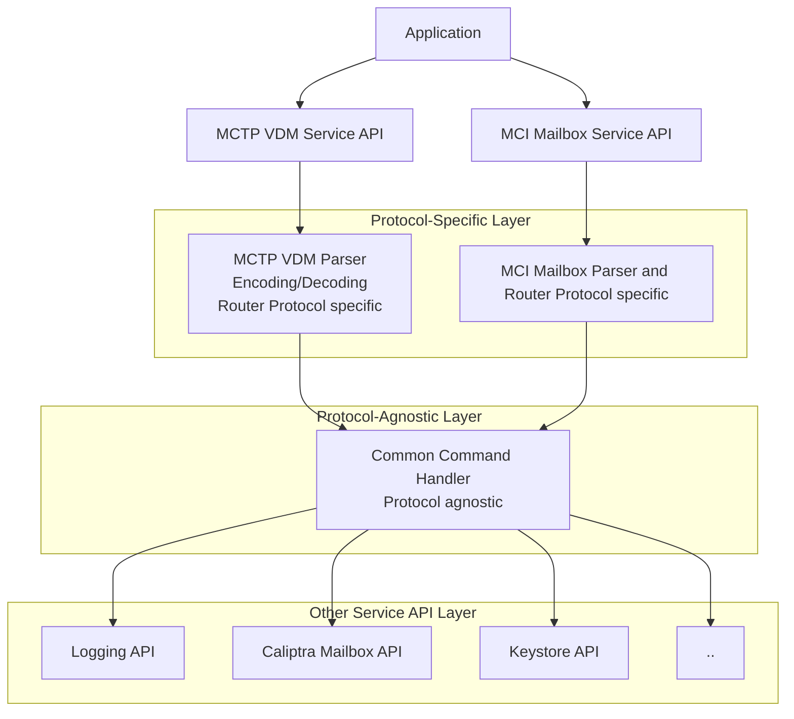

## Unified Handling of External Commands

The Caliptra MCU firmware provides two external command interfaces: [MCTP VDM external commands](external_mctp_vdm_cmds.md) and [MCI Mailbox commands](external_mailbox_cmds.md). Although these interfaces operate over different protocols, they deliver overlapping functionality to external clients.

<span style="font-size: 0.9em;">
<em>Table: Overlapping commands between MCTP VDM and MCI mailbox</em>
</span>

| **MCTP VDM Command**              | **MCI Mailbox Command**                | **Description**                                         |
|-----------------------------------|----------------------------------------|---------------------------------------------------------|
| Firmware Version                  | MC_FIRMWARE_VERSION                    | Retrieves the version of the firmware.                  |
| Device Capabilities               | MC_DEVICE_CAPABILITIES                 | Retrieves device capabilities.                          |
| Device ID                         | MC_DEVICE_ID                           | Retrieves the device ID.                                |
| Device Information                | MC_DEVICE_INFO                         | Retrieves device information.                           |
| Export CSR                        | MC_EXPORT_IDEV_CSR                     | Exports the IDEVID CSR.                                 |
| Import Certificate                | MC_IMPORT_IDEV_CERT                    | Imports the IDevID certificate.                         |
| Get Log                           | MC_GET_LOG                             | Retrieves the internal log.                             |
| Clear Log                         | MC_CLEAR_LOG                           | Clears the log in the RoT subsystem.                    |
| Request Debug Unlock              | MC_PRODUCTION_DEBUG_UNLOCK_REQ         | Requests debug unlock in a production environment.       |
| Authorize Debug Unlock Token      | MC_PRODUCTION_DEBUG_UNLOCK_TOKEN       | Sends the debug unlock token for authorization.         |

To ensure consistent command behavior and maximize code reuse, we define a protocol-agnostic command handler trait with unified command IDs and input/output types. Both MCTP VDM and MCI mailbox frontends parse their protocol, map to the unified command and call the same backend handler, ensuring code reuse and consistent behavior.

- **Architecture**

- **Interface**

```Rust
/// A trait for handling protocol-agnostic commands asynchronously.
///
/// Implementors of this trait can process commands identified by [`UnifiedCommandId`],
/// using the provided input and output buffers, and return a [`Result`] indicating
/// success or a [`CommandError`].
#[async_trait]
pub trait UnifiedCommandHandler {
    /// Handles a unified command asynchronously.
    ///
    /// # Arguments
    ///
    /// * `command` - The identifier of the command to handle.
    /// * `input` - The input data and protocol information for the command.
    /// * `output` - The output buffer and protocol information for the command response.
    ///
    /// # Returns
    ///
    /// * `Ok(())` if the command was handled successfully.
    /// * `Err(CommandError)` if an error occurred during command handling.
    async fn handle_command<'a>(
        &self,
        command: UnifiedCommandId,
        input: CommandInput<'a>,
        output: CommandOutput<'a>,
    ) -> Result<(), CommandError>;
}

/// Adapter for handling MCTP VDM protocol commands using a UnifiedCommandHandler.
///
/// This struct parses MCTP VDM messages, maps them to unified commands, and delegates
/// handling to the provided UnifiedCommandHandler implementation. The same buffer is
/// used for both request and response payloads.
pub struct MctpVdmAdapter<H: UnifiedCommandHandler + Send + Sync> {
    handler: H,
}

impl<H: UnifiedCommandHandler + Send + Sync> MctpVdmAdapter<H> {
    /// Creates a new MctpVdmAdapter with the given unified command handler.
    pub fn new(handler: H) -> Self {
        Self { handler }
    }

    /// Handles an incoming MCTP VDM message asynchronously.
    ///
    /// Parses the message, maps it to a UnifiedCommandId, and invokes the handler.
    /// The same buffer is used for both request and response.
    /// Returns the response length or an error.
    pub async fn handle_vdm_message<'a>(
        &self,
        buf: &'a mut [u8],
        req_len: usize,
    ) -> Result<usize, CommandError> {
    }
}

/// Identifiers for all supported unified commands.
///
/// Each variant represents a distinct command that can be handled by a [`UnifiedCommandHandler`].
#[derive(Debug, Clone, Copy, PartialEq, Eq, Hash)]
pub enum UnifiedCommandId {
    /// Query the firmware version.
    FirmwareVersion,
    /// Query the device capabilities.
    DeviceCapabilities,
    /// Query the device ID.
    DeviceId,
    /// Query device information.
    DeviceInformation,
    /// Export a Certificate Signing Request (CSR).
    ExportCsr,
    /// Import a certificate.
    ImportCertificate,
    /// Query the state of a certificate.
    GetCertificateState,
    /// Retrieve device logs.
    GetLog,
    /// Clear device logs.
    ClearLog,
    // ... add more as needed
}

/// Input data and protocol information for a unified command.
///
/// The input buffer is provided as a byte slice, along with the protocol used.
pub struct CommandInput<'a> {
    /// Input data buffer.
    pub data: &'a [u8],
    /// Protocol used for the command.
    pub protocol: CommandProtocol,
}

/// Output data and protocol information for a unified command.
///
/// The output buffer is provided as a mutable byte slice, along with the protocol used
/// and the length of the valid output data.
pub struct CommandOutput<'a> {
    /// Output data buffer.
    pub data: &'a mut [u8],
    /// Protocol used for the command.
    pub protocol: CommandProtocol,
    /// Length of valid data written to the output buffer.
    pub len: usize,
}

/// Supported protocols for unified commands.
///
/// Indicates the protocol over which the command is received or sent.
#[derive(Debug, Clone, Copy)]
pub enum CommandProtocol {
    /// Management Component Transport Protocol (MCTP).
    Mctp,
    /// Management Controller Interface Mailbox (MCI MBX).
    MciMbx,
}

/// Errors that can occur during unified command handling.
///
/// Used as the error type in [`UnifiedCommandHandler::handle_command`].
#[derive(Debug)]
pub enum CommandError {
    /// The command is not recognized or supported.
    InvalidCommand,
    /// The input data is invalid or malformed.
    InvalidInput,
    /// An internal error occurred during command handling.
    InternalError,
    /// The command is not supported in the current context.
    NotSupported,
    /// The handler is busy and cannot process the command at this time.
    Busy,
    // Protocol-specific errors can be added here
}
```